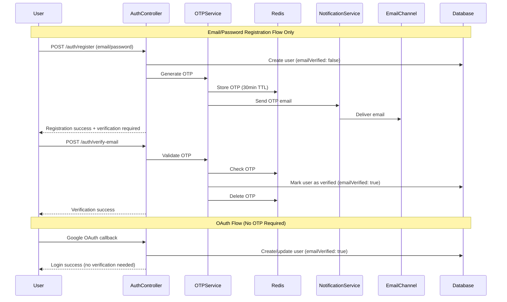

# Design Document

## Overview

The email OTP verification system adds a security layer to the existing authentication flow by requiring users to verify their email addresses using a 6-digit One-Time Password (OTP). This system integrates with the current NestJS application architecture, leveraging Redis for OTP storage, the existing notification system for email delivery, and Prisma for user verification status tracking.

## Architecture

### High-Level Flow



### Integration Points

1. **Authentication Module**: Extends email/password registration flow with verification checks
2. **Notification System**: Leverages existing email infrastructure for OTP delivery
3. **Redis**: Stores OTPs with automatic expiration
4. **Database**: Tracks user verification status via new `emailVerified` field
5. **Guards**: New verification guard to protect routes requiring verified users
6. **OAuth Flows**: OAuth users bypass OTP verification (email pre-verified by provider)

## Components and Interfaces

### Core Services

#### EmailOTPService
```typescript
interface EmailOTPService {
  generateOTP(userId: string, email: string): Promise<string>
  verifyOTP(userId: string, otp: string): Promise<boolean>
  resendOTP(userId: string): Promise<void>
  isUserVerified(userId: string): Promise<boolean>
}
```

#### OTPStorageService
```typescript
interface OTPStorageService {
  storeOTP(userId: string, otp: string, ttl: number): Promise<void>
  getOTP(userId: string): Promise<string | null>
  deleteOTP(userId: string): Promise<void>
  getRemainingTTL(userId: string): Promise<number>
}
```

### DTOs

#### VerifyEmailDto
```typescript
class VerifyEmailDto {
  @IsString()
  @Length(6, 6)
  @IsNumberString()
  otp: string;
}
```

#### ResendOTPDto
```typescript
class ResendOTPDto {
  @IsEmail()
  email: string;
}
```

### Guards

#### EmailVerificationGuard
```typescript
@Injectable()
class EmailVerificationGuard implements CanActivate {
  canActivate(context: ExecutionContext): Promise<boolean>
}
```

### Decorators

#### RequireEmailVerification
```typescript
const RequireEmailVerification = () => UseGuards(EmailVerificationGuard);
```

## Data Models

### Database Schema Changes

```sql
-- Add email verification fields to User table
ALTER TABLE users ADD COLUMN email_verified BOOLEAN DEFAULT FALSE;
ALTER TABLE users ADD COLUMN email_verified_at TIMESTAMP NULL;
ALTER TABLE users ADD COLUMN verification_token_sent_at TIMESTAMP NULL;

-- Add index for verification queries
CREATE INDEX idx_users_email_verified ON users(email_verified);
```

### Redis Schema

```typescript
// OTP Storage Pattern
interface OTPRecord {
  key: `otp:${userId}`;
  value: {
    otp: string;
    email: string;
    attempts: number;
    createdAt: string;
  };
  ttl: 1800; // 30 minutes
}

// Rate Limiting Pattern
interface RateLimitRecord {
  key: `otp_rate_limit:${userId}`;
  value: number; // attempt count
  ttl: 3600; // 1 hour
}
```

## Error Handling

### Custom Exceptions

```typescript
class EmailVerificationRequiredException extends HttpException {
  constructor() {
    super('Email verification required', HttpStatus.FORBIDDEN);
  }
}

class InvalidOTPException extends HttpException {
  constructor() {
    super('Invalid or expired OTP', HttpStatus.BAD_REQUEST);
  }
}

class OTPRateLimitException extends HttpException {
  constructor(retryAfter: number) {
    super(`Too many OTP requests. Try again in ${retryAfter} seconds`, HttpStatus.TOO_MANY_REQUESTS);
  }
}
```

### Error Response Format

```typescript
interface OTPErrorResponse {
  statusCode: number;
  message: string;
  error: string;
  details?: {
    remainingAttempts?: number;
    retryAfter?: number;
    canResend?: boolean;
  };
}
```

## Testing Strategy

### Unit Tests
- OTP generation and validation logic
- Rate limiting functionality
- Redis storage operations
- Email notification integration
- Guard behavior verification

### Integration Tests
- Complete registration → verification flow
- OTP expiration handling
- Rate limiting enforcement
- Email delivery verification
- Database state consistency

### E2E Tests
- User registration with email verification
- Login attempts with unverified accounts
- OTP resend functionality
- Verification success scenarios
- Error handling flows

## Security Considerations

### OTP Security
- 6-digit numeric codes (1 in 1,000,000 chance)
- 30-minute expiration window
- Single-use tokens (deleted after verification)
- Rate limiting: 3 OTP requests per hour per user

### Rate Limiting Strategy
```typescript
interface RateLimitConfig {
  otpGeneration: {
    maxAttempts: 3;
    windowMs: 3600000; // 1 hour
  };
  otpVerification: {
    maxAttempts: 5;
    windowMs: 900000; // 15 minutes
  };
}
```

### Audit Logging
- OTP generation events
- Verification attempts (success/failure)
- Rate limit violations
- Email delivery status

## Configuration

### Environment Variables
```typescript
interface OTPConfig {
  OTP_EXPIRATION_MINUTES: number; // Default: 30
  OTP_LENGTH: number; // Default: 6
  OTP_RATE_LIMIT_ATTEMPTS: number; // Default: 3
  OTP_RATE_LIMIT_WINDOW_MS: number; // Default: 3600000
  REDIS_URL: string;
  EMAIL_OTP_TEMPLATE_ID: string;
}
```

### Module Configuration
```typescript
@Module({
  imports: [
    RedisModule.forRoot({
      config: {
        url: process.env.REDIS_URL,
      },
    }),
    NotificationsModule,
  ],
  providers: [
    EmailOTPService,
    OTPStorageService,
    EmailVerificationGuard,
  ],
  exports: [EmailOTPService],
})
export class EmailVerificationModule {}
```

## Integration with Existing Features

### Google OAuth Integration
- OAuth users bypass OTP verification entirely (email already verified by provider)
- OAuth registration flow sets `emailVerified: true` automatically
- No OTP generation or verification required for OAuth users

### Tenant Registration Flow
- Tenant admin must verify email before tenant activation
- Tenant status linked to admin verification status
- Invitation system respects verification requirements

### Notification System Integration
- Uses existing email templates and providers
- Leverages tenant-specific email configurations
- Integrates with notification preferences and audit logging

### Permission System Integration
- New permission: `verify:email` for admin override capabilities
- Verification status checked in permission guards
- Admin users can bypass verification for testing (with proper permissions)

## Performance Considerations

### Redis Optimization
- Connection pooling for high-throughput scenarios
- Batch operations for multiple OTP operations
- Monitoring Redis memory usage and key expiration

### Database Optimization
- Indexed queries on verification status
- Efficient user lookup patterns
- Minimal database writes during verification flow

### Email Delivery
- Asynchronous email sending via existing queue system
- Retry mechanisms for failed deliveries
- Template caching for improved performance

## Monitoring and Observability

### Metrics to Track
- OTP generation rate
- Verification success/failure rates
- Email delivery success rates
- Rate limiting trigger frequency
- Average verification completion time

### Logging Strategy
- Structured logging with correlation IDs
- Security event logging for audit trails
- Performance metrics for optimization
- Error tracking for troubleshooting

### Health Checks
- Redis connectivity
- Email service availability
- OTP generation performance
- Database verification query performance