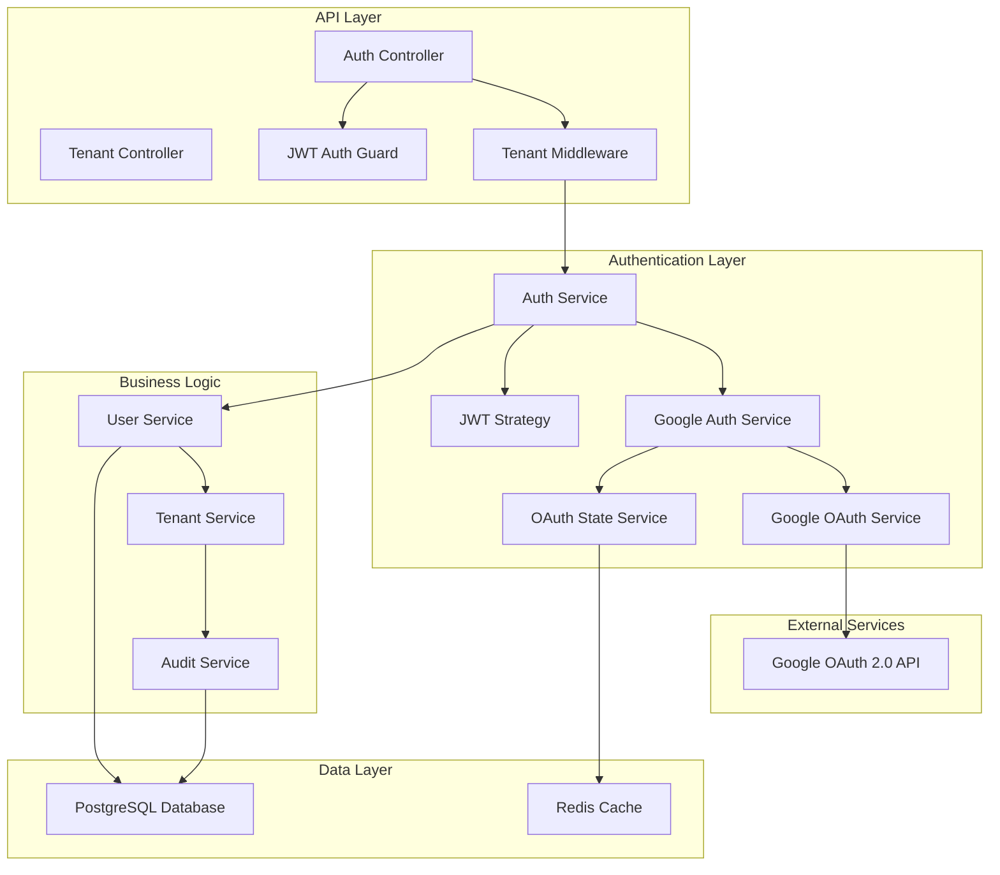

# Design Document

## Overview

This document outlines the technical design for extending the existing NestJS multi-tenant B2B platform with Google Sign-In capabilities. The implementation adds OAuth 2.0 authentication as an optional method while maintaining full backward compatibility with the current email/password authentication system. The design ensures multi-tenant isolation, secure account linking/unlinking, and per-tenant configuration control.

## Architecture

### High-Level System Architecture



### Authentication Flow Architecture

The system supports three distinct authentication flows:

1. **Email/Password Authentication** (Existing - Unchanged)
2. **Google Sign-In** (New)
3. **Account Linking/Unlinking** (New)

## Components and Interfaces

### 1. Database Schema Extensions

#### Users Table Extensions
```sql
ALTER TABLE users ADD COLUMN google_id VARCHAR(255) UNIQUE;
ALTER TABLE users ADD COLUMN google_linked_at TIMESTAMP;
ALTER TABLE users ADD COLUMN auth_methods TEXT[] DEFAULT ARRAY['password'];

CREATE INDEX idx_users_google_id ON users(google_id);
```

#### Tenants Table Extensions
```sql
ALTER TABLE tenants ADD COLUMN google_sso_enabled BOOLEAN DEFAULT FALSE;
ALTER TABLE tenants ADD COLUMN google_auto_provision BOOLEAN DEFAULT FALSE;
```

#### Authentication Events Table (Extend existing audit)
```sql
ALTER TABLE notification_audit_logs ADD COLUMN auth_method VARCHAR(50);
```

### 2. New Service Components

#### GoogleAuthService
```typescript
@Injectable()
export class GoogleAuthService {
  constructor(
    private readonly prisma: PrismaService,
    private readonly jwtService: JwtService,
    private readonly tenantService: TenantService,
    private readonly auditService: AuditService,
  ) {}

  async validateTenantGoogleSSO(tenantId: string): Promise<Tenant> {
    const tenant = await this.prisma.tenant.findUnique({
      where: { id: tenantId },
      select: { 
        id: true, 
        googleSsoEnabled: true, 
        googleAutoProvision: true,
        name: true 
      },
    });

    if (!tenant) {
      throw new NotFoundException('Tenant not found');
    }

    return tenant;
  }

  async authenticateWithGoogle(profile: GoogleProfile, tenantId: string): Promise<{ accessToken: string }> {
    // Validate tenant configuration
    const tenant = await this.validateTenantGoogleSSO(tenantId);
    
    if (!tenant.googleSsoEnabled) {
      throw new ForbiddenException('Google SSO is not enabled for this tenant');
    }

    // Check if user exists by Google ID
    let user = await this.prisma.user.findUnique({
      where: { googleId: profile.id },
      include: { roles: { include: { role: true } } },
    });

    if (user) {
      // Existing Google user - verify tenant matches
      if (user.tenantId !== tenantId) {
        throw new UnauthorizedException('User belongs to different tenant');
      }
    } else {
      // Check if user exists by email in this tenant
      user = await this.prisma.user.findUnique({
        where: {
          email_tenantId: {
            email: profile.email,
            tenantId: tenantId,
          },
        },
        include: { roles: { include: { role: true } } },
      });

      if (user) {
        // Auto-link existing user
        await this.linkGoogleAccountInternal(user.id, profile);
      } else if (tenant.googleAutoProvision) {
        // Create new user
        user = await this.createUserFromGoogle(profile, tenantId);
      } else {
        throw new UnauthorizedException('User not found and auto-provisioning is disabled');
      }
    }

    // Generate JWT token
    const payload: JwtPayload = {
      userId: user.id,
      tenantId: user.tenantId,
      roles: user.roles.map(ur => ur.role.id),
    };

    const accessToken = this.jwtService.sign(payload);

    // Log authentication event
    await this.auditService.logAuthEvent({
      userId: user.id,
      tenantId: user.tenantId,
      action: 'google_login',
      authMethod: 'google',
      success: true,
    });

    return { accessToken };
  }

  async createUserFromGoogle(profile: GoogleProfile, tenantId: string): Promise<User> {
    const user = await this.prisma.user.create({
      data: {
        email: profile.email,
        firstName: profile.firstName,
        lastName: profile.lastName,
        tenantId: tenantId,
        googleId: profile.id,
        googleLinkedAt: new Date(),
        authMethods: ['google'],
        password: '', // Empty password for Google-only users
      },
      include: { roles: { include: { role: true } } },
    });

    return user;
  }

  async linkGoogleAccount(userId: string, profile: GoogleProfile): Promise<void> {
    // Get current user
    const user = await this.prisma.user.findUnique({
      where: { id: userId },
    });

    if (!user) {
      throw new NotFoundException('User not found');
    }

    // Verify email matches
    if (user.email !== profile.email) {
      throw new BadRequestException('Google email must match your account email');
    }

    // Check if Google ID is already linked to another user
    const existingGoogleUser = await this.prisma.user.findUnique({
      where: { googleId: profile.id },
    });

    if (existingGoogleUser && existingGoogleUser.id !== userId) {
      throw new ConflictException('Google account is already linked to another user');
    }

    await this.linkGoogleAccountInternal(userId, profile);
  }

  private async linkGoogleAccountInternal(userId: string, profile: GoogleProfile): Promise<void> {
    await this.prisma.user.update({
      where: { id: userId },
      data: {
        googleId: profile.id,
        googleLinkedAt: new Date(),
        authMethods: {
          push: 'google',
        },
      },
    });

    // Log linking event
    await this.auditService.logAuthEvent({
      userId: userId,
      action: 'google_link',
      authMethod: 'google',
      success: true,
    });
  }

  async unlinkGoogleAccount(userId: string): Promise<void> {
    const user = await this.prisma.user.findUnique({
      where: { id: userId },
      select: { authMethods: true, googleId: true },
    });

    if (!user) {
      throw new NotFoundException('User not found');
    }

    if (!user.googleId) {
      throw new BadRequestException('Google account is not linked');
    }

    // Ensure user has at least one other auth method
    const otherAuthMethods = user.authMethods.filter(method => method !== 'google');
    if (otherAuthMethods.length === 0) {
      throw new BadRequestException('Cannot unlink Google account - no other authentication methods available');
    }

    await this.prisma.user.update({
      where: { id: userId },
      data: {
        googleId: null,
        googleLinkedAt: null,
        authMethods: otherAuthMethods,
      },
    });

    // Log unlinking event
    await this.auditService.logAuthEvent({
      userId: userId,
      action: 'google_unlink',
      authMethod: 'google',
      success: true,
    });
  }

  async getUserAuthMethods(userId: string): Promise<string[]> {
    const user = await this.prisma.user.findUnique({
      where: { id: userId },
      select: { authMethods: true },
    });

    if (!user) {
      throw new NotFoundException('User not found');
    }

    return user.authMethods;
  }
}
```

#### GoogleProfile Interface
```typescript
interface GoogleProfile {
  id: string;
  email: string;
  firstName?: string;
  lastName?: string;
  picture?: string;
}
```

#### DTOs for Google OAuth
```typescript
export class GoogleCallbackDto {
  @IsString()
  @IsNotEmpty()
  code: string;

  @IsString()
  @IsNotEmpty()
  state: string;

  @IsString()
  @IsNotEmpty()
  tenantId: string;
}

export class GoogleLinkCallbackDto {
  @IsString()
  @IsNotEmpty()
  code: string;

  @IsString()
  @IsNotEmpty()
  state: string;
}

export class UpdateGoogleSettingsDto {
  @IsBoolean()
  @IsOptional()
  googleSsoEnabled?: boolean;

  @IsBoolean()
  @IsOptional()
  googleAutoProvision?: boolean;
}
```

### 3. Modern OAuth Implementation (Without Passport)

Based on current NestJS best practices, we'll implement Google OAuth using direct HTTP calls and Google's official libraries instead of Passport.js for better control and modern approach.

#### Google OAuth Service
```typescript
@Injectable()
export class GoogleOAuthService {
  private oauth2Client: OAuth2Client;

  constructor(private configService: ConfigService) {
    this.oauth2Client = new OAuth2Client(
      this.configService.get('GOOGLE_CLIENT_ID'),
      this.configService.get('GOOGLE_CLIENT_SECRET'),
      this.configService.get('GOOGLE_CALLBACK_URL'),
    );
  }

  generateAuthUrl(state?: string): string {
    return this.oauth2Client.generateAuthUrl({
      access_type: 'offline',
      scope: ['email', 'profile'],
      state: state, // CSRF protection
    });
  }

  async verifyIdToken(idToken: string): Promise<GoogleProfile> {
    try {
      const ticket = await this.oauth2Client.verifyIdToken({
        idToken,
        audience: this.configService.get('GOOGLE_CLIENT_ID'),
      });

      const payload = ticket.getPayload();
      if (!payload) {
        throw new Error('Invalid token payload');
      }

      return {
        id: payload.sub,
        email: payload.email!,
        firstName: payload.given_name,
        lastName: payload.family_name,
        picture: payload.picture,
      };
    } catch (error) {
      throw new UnauthorizedException('Invalid Google token');
    }
  }

  async exchangeCodeForTokens(code: string): Promise<{ idToken: string; accessToken: string }> {
    try {
      const { tokens } = await this.oauth2Client.getToken(code);
      
      if (!tokens.id_token || !tokens.access_token) {
        throw new Error('Missing tokens in response');
      }

      return {
        idToken: tokens.id_token,
        accessToken: tokens.access_token,
      };
    } catch (error) {
      throw new UnauthorizedException('Failed to exchange code for tokens');
    }
  }
}
```

#### State Management Service
```typescript
@Injectable()
export class OAuthStateService {
  constructor(private redisService: RedisService) {}

  async generateState(userId?: string): Promise<string> {
    const state = crypto.randomBytes(32).toString('hex');
    const stateData = {
      timestamp: Date.now(),
      userId: userId || null,
    };

    // Store state in Redis with 10-minute expiration
    await this.redisService.setex(`oauth_state:${state}`, 600, JSON.stringify(stateData));
    
    return state;
  }

  async validateState(state: string, expectedUserId?: string): Promise<boolean> {
    try {
      const stateDataStr = await this.redisService.get(`oauth_state:${state}`);
      if (!stateDataStr) {
        return false;
      }

      const stateData = JSON.parse(stateDataStr);
      
      // Check if state is expired (10 minutes)
      if (Date.now() - stateData.timestamp > 600000) {
        await this.redisService.del(`oauth_state:${state}`);
        return false;
      }

      // For linking flow, validate user ID matches
      if (expectedUserId && stateData.userId !== expectedUserId) {
        return false;
      }

      // Clean up used state
      await this.redisService.del(`oauth_state:${state}`);
      return true;
    } catch (error) {
      return false;
    }
  }
}
```

### 4. Controller Extensions

#### New Auth Controller Endpoints
```typescript
@Controller('auth')
export class AuthController {
  constructor(
    private readonly authService: AuthService,
    private readonly googleAuthService: GoogleAuthService,
    private readonly googleOAuthService: GoogleOAuthService,
    private readonly oauthStateService: OAuthStateService,
  ) {}

  // Existing login method remains unchanged
  
  @Public()
  @Get('google')
  async googleAuth(@Headers('x-tenant-id') tenantId?: string) {
    if (!tenantId) {
      throw new BadRequestException('Tenant ID is required');
    }

    // Verify tenant has Google SSO enabled
    const tenant = await this.googleAuthService.validateTenantGoogleSSO(tenantId);
    if (!tenant.googleSsoEnabled) {
      throw new ForbiddenException('Google SSO is not enabled for this tenant');
    }

    // Generate state for CSRF protection
    const state = await this.oauthStateService.generateState();
    
    // Generate Google OAuth URL
    const authUrl = this.googleOAuthService.generateAuthUrl(state);
    
    return { authUrl, state };
  }

  @Public()
  @Post('google/callback')
  async googleAuthCallback(@Body() callbackDto: GoogleCallbackDto) {
    const { code, state, tenantId } = callbackDto;

    // Validate state parameter
    const isValidState = await this.oauthStateService.validateState(state);
    if (!isValidState) {
      throw new UnauthorizedException('Invalid or expired state parameter');
    }

    // Exchange code for tokens
    const { idToken } = await this.googleOAuthService.exchangeCodeForTokens(code);
    
    // Verify and extract profile from ID token
    const googleProfile = await this.googleOAuthService.verifyIdToken(idToken);
    
    // Handle authentication
    const result = await this.googleAuthService.authenticateWithGoogle(googleProfile, tenantId);
    
    return result;
  }

  @Get('google/link')
  @UseGuards(JwtAuthGuard)
  async googleLink(@CurrentUser() user: User) {
    // Generate state with user ID for linking flow
    const state = await this.oauthStateService.generateState(user.id);
    
    // Generate Google OAuth URL for linking
    const authUrl = this.googleOAuthService.generateAuthUrl(state);
    
    return { authUrl, state };
  }

  @Post('google/link/callback')
  @UseGuards(JwtAuthGuard)
  async googleLinkCallback(@CurrentUser() user: User, @Body() callbackDto: GoogleLinkCallbackDto) {
    const { code, state } = callbackDto;

    // Validate state parameter with user ID
    const isValidState = await this.oauthStateService.validateState(state, user.id);
    if (!isValidState) {
      throw new UnauthorizedException('Invalid or expired state parameter');
    }

    // Exchange code for tokens
    const { idToken } = await this.googleOAuthService.exchangeCodeForTokens(code);
    
    // Verify and extract profile from ID token
    const googleProfile = await this.googleOAuthService.verifyIdToken(idToken);
    
    // Link Google account to user
    await this.googleAuthService.linkGoogleAccount(user.id, googleProfile);
    
    return { message: 'Google account linked successfully' };
  }

  @Post('google/unlink')
  @UseGuards(JwtAuthGuard)
  async googleUnlink(@CurrentUser() user: User) {
    await this.googleAuthService.unlinkGoogleAccount(user.id);
    return { message: 'Google account unlinked successfully' };
  }

  @Get('me/auth-methods')
  @UseGuards(JwtAuthGuard)
  async getAuthMethods(@CurrentUser() user: User) {
    const authMethods = await this.googleAuthService.getUserAuthMethods(user.id);
    return { authMethods };
  }
}
```

#### Tenant Controller Extensions
```typescript
@Controller('tenants')
export class TenantController {
  @Get(':id/settings/google')
  @UseGuards(JwtAuthGuard, AdminRoleGuard)
  async getGoogleSettings(@Param('id') tenantId: string) {
    const tenant = await this.tenantService.findById(tenantId);
    return {
      googleSsoEnabled: tenant.googleSsoEnabled,
      googleAutoProvision: tenant.googleAutoProvision,
    };
  }

  @Patch(':id/settings/google')
  @UseGuards(JwtAuthGuard, AdminRoleGuard)
  async updateGoogleSettings(
    @Param('id') tenantId: string,
    @Body() updateDto: UpdateGoogleSettingsDto,
  ) {
    return this.tenantService.updateGoogleSettings(tenantId, updateDto);
  }
}
```

## Data Models

### Extended User Model
```typescript
interface User {
  id: string;
  email: string;
  password: string; // Nullable for Google-only users
  firstName?: string;
  lastName?: string;
  tenantId: string;
  googleId?: string; // New field
  googleLinkedAt?: Date; // New field
  authMethods: string[]; // New field: ['password', 'google']
  createdAt: Date;
  updatedAt: Date;
}
```

### Extended Tenant Model
```typescript
interface Tenant {
  id: string;
  name: string;
  subdomain?: string;
  googleSsoEnabled: boolean; // New field
  googleAutoProvision: boolean; // New field
  createdAt: Date;
  updatedAt: Date;
}
```

### Authentication Event Model
```typescript
interface AuthenticationEvent {
  id: string;
  userId: string;
  tenantId: string;
  action: string; // 'login', 'link', 'unlink'
  authMethod: string; // 'password', 'google'
  ipAddress?: string;
  userAgent?: string;
  metadata?: any;
  createdAt: Date;
}
```

## Error Handling

### Error Types and Responses

#### OAuth Flow Errors
```typescript
class GoogleOAuthError extends Error {
  constructor(message: string, public code: string) {
    super(message);
  }
}

// Error codes:
// - OAUTH_CANCELLED: User cancelled OAuth flow
// - OAUTH_FAILED: OAuth flow failed
// - INVALID_STATE: State parameter mismatch (CSRF protection)
// - TENANT_NOT_FOUND: Cannot determine tenant from email domain
// - SSO_DISABLED: Google SSO disabled for tenant
// - AUTO_PROVISION_DISABLED: Auto-provisioning disabled and user doesn't exist
```

#### Account Linking Errors
```typescript
class AccountLinkingError extends Error {
  constructor(message: string, public code: string) {
    super(message);
  }
}

// Error codes:
// - EMAIL_MISMATCH: Google email doesn't match user email
// - ALREADY_LINKED: Google account already linked to another user
// - CANNOT_UNLINK: Cannot unlink - would leave user without auth method
// - GOOGLE_ID_NOT_FOUND: User doesn't have linked Google account
```

### Error Response Format
```typescript
interface ErrorResponse {
  statusCode: number;
  message: string;
  error: string;
  code?: string; // Custom error code for frontend handling
  timestamp: string;
  path: string;
}
```

## Testing Strategy

### Unit Tests
- **GoogleAuthService**: Test profile validation, user creation, linking/unlinking logic
- **GoogleOAuthService**: Test token exchange, ID token verification, URL generation
- **OAuthStateService**: Test state generation, validation, and cleanup
- **Auth Controller**: Test new endpoint logic and error handling
- **Tenant Service**: Test Google settings management

### Integration Tests
- **OAuth Flow**: End-to-end Google sign-in flow testing
- **Account Linking**: Test linking/unlinking flows with database interactions
- **Multi-tenant Isolation**: Verify tenant boundaries are maintained
- **Error Scenarios**: Test various failure modes and error responses

### E2E Tests
- **Complete Authentication Flows**: Test full OAuth flows via API endpoints
- **Security Testing**: Test CSRF protection, token validation, rate limiting
- **Multi-tenant Scenarios**: Test authentication across different tenants
- **Error Handling**: Test various failure scenarios and error responses

### Test Data Setup
```typescript
// Test fixtures for different scenarios
const testScenarios = {
  newGoogleUser: {
    googleProfile: { id: 'google123', email: 'new@company.com' },
    tenant: { googleSsoEnabled: true, googleAutoProvision: true },
  },
  existingUserLinking: {
    user: { email: 'existing@company.com', authMethods: ['password'] },
    googleProfile: { id: 'google456', email: 'existing@company.com' },
  },
  ssoDisabled: {
    tenant: { googleSsoEnabled: false },
    googleProfile: { id: 'google789', email: 'user@company.com' },
  },
};
```

## Security Considerations

### OAuth 2.0 Security
- **State Parameter**: Generate cryptographically secure state parameter for CSRF protection
- **HTTPS Only**: All OAuth callbacks must use HTTPS
- **Token Storage**: Store refresh tokens in HTTP-only, Secure, SameSite cookies
- **Token Expiration**: Short-lived access tokens (15 min), longer refresh tokens (7 days)

### Multi-tenant Security
- **Tenant Validation**: Verify user belongs to correct tenant on every request
- **Cross-tenant Prevention**: Prevent account linking across tenants
- **Domain Validation**: Validate email domains against tenant configuration

### Rate Limiting
```typescript
// Rate limiting configuration
const rateLimits = {
  googleAuth: { limit: 10, ttl: 60000 }, // 10 attempts per minute
  accountLinking: { limit: 5, ttl: 300000 }, // 5 attempts per 5 minutes
  adminSettings: { limit: 20, ttl: 60000 }, // 20 requests per minute
};
```

### Audit Logging
```typescript
interface AuditEvent {
  action: 'google_login' | 'google_link' | 'google_unlink' | 'settings_update';
  userId?: string;
  tenantId: string;
  ipAddress: string;
  userAgent: string;
  success: boolean;
  errorCode?: string;
  metadata?: any;
  timestamp: Date;
}
```

## Module Configuration

### Auth Module Updates
```typescript
@Global()
@Module({
  imports: [
    DatabaseModule,
    TenantModule,
    JwtModule.registerAsync({
      imports: [ConfigModule],
      global: true,
      useFactory: (configService: ConfigService) => ({
        secret: configService.get<string>('config.jwt.secret'),
        signOptions: {
          expiresIn: configService.get<string>('config.jwt.expiresIn'),
        },
      }),
      inject: [ConfigService],
    }),
  ],
  controllers: [AuthController],
  providers: [
    AuthService,
    GoogleAuthService,
    GoogleOAuthService,
    OAuthStateService,
  ],
  exports: [AuthService, GoogleAuthService],
})
export class AuthModule {}
```

### Dependencies
```json
{
  "dependencies": {
    "google-auth-library": "^9.0.0",
    "googleapis": "^126.0.1"
  }
}
```

## Configuration Management

### Environment Variables
```bash
# Google OAuth Configuration
GOOGLE_CLIENT_ID=your-client-id.apps.googleusercontent.com
GOOGLE_CLIENT_SECRET=your-client-secret
GOOGLE_CALLBACK_URL=https://api.yourdomain.com/auth/google/callback
GOOGLE_LINK_CALLBACK_URL=https://api.yourdomain.com/auth/google/link/callback

# Existing JWT configuration (unchanged)
JWT_SECRET=your-jwt-secret
JWT_EXPIRATION=15m
REFRESH_TOKEN_EXPIRATION=7d
```

### Configuration Validation
```typescript
@Injectable()
export class GoogleConfigService {
  constructor(private configService: ConfigService) {
    this.validateConfiguration();
  }

  private validateConfiguration() {
    const requiredVars = [
      'GOOGLE_CLIENT_ID',
      'GOOGLE_CLIENT_SECRET',
      'GOOGLE_CALLBACK_URL',
      'GOOGLE_LINK_CALLBACK_URL',
    ];

    for (const varName of requiredVars) {
      if (!this.configService.get(varName)) {
        throw new Error(`Missing required environment variable: ${varName}`);
      }
    }
  }
}
```

## Performance Considerations

### Caching Strategy
- **Google Profile Cache**: Cache Google profile data for 5 minutes to reduce API calls
- **Tenant Settings Cache**: Cache tenant Google settings for 10 minutes
- **User Auth Methods Cache**: Cache user auth methods for 5 minutes

### Database Optimization
- **Indexes**: Add indexes on `google_id`, `auth_methods` columns
- **Query Optimization**: Use efficient queries for tenant lookup by email domain
- **Connection Pooling**: Ensure proper database connection pooling for OAuth callbacks

### Monitoring and Metrics
```typescript
interface GoogleAuthMetrics {
  googleSignInAttempts: number;
  googleSignInSuccesses: number;
  googleSignInFailures: number;
  accountLinkingAttempts: number;
  accountLinkingSuccesses: number;
  oauthCallbackLatency: number;
  tenantLookupLatency: number;
}
```

## Migration Strategy

### Database Migration
```sql
-- Migration: Add Google authentication fields
BEGIN;

-- Add new columns to users table
ALTER TABLE users ADD COLUMN google_id VARCHAR(255) UNIQUE;
ALTER TABLE users ADD COLUMN google_linked_at TIMESTAMP;
ALTER TABLE users ADD COLUMN auth_methods TEXT[] DEFAULT ARRAY['password'];

-- Add new columns to tenants table
ALTER TABLE tenants ADD COLUMN google_sso_enabled BOOLEAN DEFAULT FALSE;
ALTER TABLE tenants ADD COLUMN google_auto_provision BOOLEAN DEFAULT FALSE;

-- Add auth_method column to audit logs
ALTER TABLE notification_audit_logs ADD COLUMN auth_method VARCHAR(50);

-- Create indexes
CREATE INDEX idx_users_google_id ON users(google_id);
CREATE INDEX idx_users_auth_methods ON users USING GIN(auth_methods);

-- Update existing users to have 'password' auth method
UPDATE users SET auth_methods = ARRAY['password'] WHERE auth_methods IS NULL;

COMMIT;
```

### Rollback Plan
```sql
-- Rollback migration if needed
BEGIN;

-- Remove added columns
ALTER TABLE users DROP COLUMN IF EXISTS google_id;
ALTER TABLE users DROP COLUMN IF EXISTS google_linked_at;
ALTER TABLE users DROP COLUMN IF EXISTS auth_methods;

ALTER TABLE tenants DROP COLUMN IF EXISTS google_sso_enabled;
ALTER TABLE tenants DROP COLUMN IF EXISTS google_auto_provision;

ALTER TABLE notification_audit_logs DROP COLUMN IF EXISTS auth_method;

-- Drop indexes
DROP INDEX IF EXISTS idx_users_google_id;
DROP INDEX IF EXISTS idx_users_auth_methods;

COMMIT;
```

## Deployment Considerations

### Feature Flags
```typescript
@Injectable()
export class FeatureFlags {
  isGoogleAuthEnabled(): boolean {
    return this.configService.get('FEATURE_GOOGLE_AUTH_ENABLED', 'false') === 'true';
  }

  isGoogleLinkingEnabled(): boolean {
    return this.configService.get('FEATURE_GOOGLE_LINKING_ENABLED', 'false') === 'true';
  }
}
```

### Gradual Rollout
1. **Phase 1**: Deploy with feature flags disabled
2. **Phase 2**: Enable for internal testing tenant
3. **Phase 3**: Enable for beta tenants
4. **Phase 4**: Full rollout to all tenants

### Health Checks
```typescript
@Controller('health')
export class HealthController {
  @Get('google-auth')
  async checkGoogleAuth() {
    try {
      // Verify Google OAuth configuration
      const isConfigured = this.googleConfigService.isConfigured();
      return { status: 'ok', configured: isConfigured };
    } catch (error) {
      return { status: 'error', message: error.message };
    }
  }
}
```