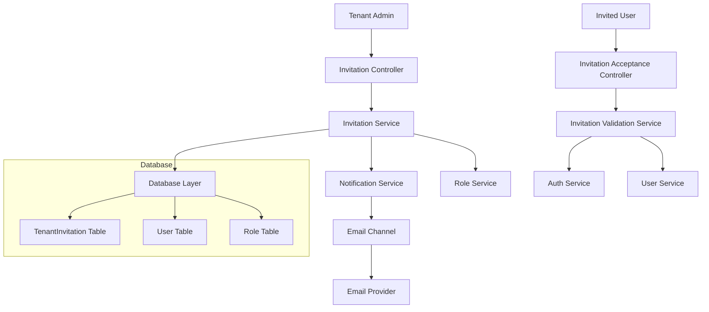

# Design Document

## Overview

The Tenant Invitation System enables tenant administrators to invite users to join their organization through secure email invitations. The system integrates with the existing authentication, role management, and notification infrastructure to provide a seamless onboarding experience. Invitations include role assignments, expiration controls, and support both Google OAuth and password-based authentication flows.

## Architecture

### High-Level Components



### Data Flow

1. **Invitation Creation Flow**
   - Admin creates invitation with email, roles, and expiration
   - System generates secure token and stores invitation
   - Email notification sent with invitation URL
   - Audit log created for invitation activity

2. **Invitation Acceptance Flow**
   - User clicks invitation URL with token
   - System validates token and expiration
   - User redirected to authentication options
   - Upon successful auth, user created and roles assigned
   - Invitation marked as accepted

## Components and Interfaces

### Database Schema

```sql
-- New table for tenant invitations
CREATE TABLE tenant_invitations (
  id VARCHAR(30) PRIMARY KEY DEFAULT cuid(),
  tenant_id VARCHAR(30) NOT NULL REFERENCES tenants(id) ON DELETE CASCADE,
  email VARCHAR(255) NOT NULL,
  token VARCHAR(255) UNIQUE NOT NULL,
  invited_by VARCHAR(30) NOT NULL REFERENCES users(id) ON DELETE CASCADE,
  expires_at TIMESTAMP NOT NULL,
  accepted_at TIMESTAMP NULL,
  cancelled_at TIMESTAMP NULL,
  status VARCHAR(20) NOT NULL DEFAULT 'pending',
  created_at TIMESTAMP DEFAULT NOW(),
  updated_at TIMESTAMP DEFAULT NOW(),
  
  INDEX idx_tenant_invitations_tenant_id (tenant_id),
  INDEX idx_tenant_invitations_token (token),
  INDEX idx_tenant_invitations_email (email),
  INDEX idx_tenant_invitations_status (status),
  INDEX idx_tenant_invitations_expires_at (expires_at),
  UNIQUE KEY unique_pending_invitation (tenant_id, email, status)
);

-- Junction table for invitation role assignments
CREATE TABLE tenant_invitation_roles (
  invitation_id VARCHAR(30) NOT NULL REFERENCES tenant_invitations(id) ON DELETE CASCADE,
  role_id VARCHAR(30) NOT NULL REFERENCES roles(id) ON DELETE CASCADE,
  
  PRIMARY KEY (invitation_id, role_id),
  INDEX idx_invitation_roles_invitation_id (invitation_id),
  INDEX idx_invitation_roles_role_id (role_id)
);
```

### Core Interfaces

```typescript
// Invitation entity interface
interface TenantInvitation {
  id: string;
  tenantId: string;
  email: string;
  token: string;
  invitedBy: string;
  expiresAt: Date;
  acceptedAt?: Date;
  cancelledAt?: Date;
  status: InvitationStatus;
  createdAt: Date;
  updatedAt: Date;
  roles: Role[];
  inviter: User;
}

// Invitation status enum
enum InvitationStatus {
  PENDING = 'pending',
  ACCEPTED = 'accepted',
  EXPIRED = 'expired',
  CANCELLED = 'cancelled'
}

// DTOs for API operations
interface CreateInvitationDto {
  email: string;
  roleIds: string[];
  expiresAt?: Date;
  message?: string;
}

interface InvitationAcceptanceDto {
  token: string;
  authMethod: 'google' | 'password';
  password?: string;
  firstName?: string;
  lastName?: string;
}
```

### Service Layer Architecture

#### InvitationService
- **Purpose**: Core business logic for invitation management
- **Responsibilities**:
  - Create and validate invitations
  - Generate secure tokens
  - Manage invitation lifecycle
  - Handle role assignments
  - Rate limiting and security checks

#### InvitationValidationService
- **Purpose**: Token validation and security
- **Responsibilities**:
  - Validate invitation tokens
  - Check expiration status
  - Prevent replay attacks
  - Audit security events

#### InvitationNotificationService
- **Purpose**: Email communication
- **Responsibilities**:
  - Send invitation emails
  - Handle email template rendering
  - Manage delivery tracking
  - Send reminder notifications

### Controller Layer

#### InvitationController
```typescript
@Controller('invitations')
@UseGuards(JwtAuthGuard, PermissionsGuard)
export class InvitationController {
  @Post()
  @Permissions('create:invitation')
  async createInvitation(@Body() dto: CreateInvitationDto);
  
  @Get()
  @Permissions('read:invitation')
  async getInvitations(@Query() filters: InvitationFilterDto);
  
  @Post(':id/resend')
  @Permissions('update:invitation')
  async resendInvitation(@Param('id') id: string);
  
  @Delete(':id')
  @Permissions('delete:invitation')
  async cancelInvitation(@Param('id') id: string);
}
```

#### InvitationAcceptanceController
```typescript
@Controller('invitation-acceptance')
export class InvitationAcceptanceController {
  @Get(':token')
  @Public()
  async validateInvitation(@Param('token') token: string);
  
  @Post(':token/accept')
  @Public()
  async acceptInvitation(
    @Param('token') token: string,
    @Body() dto: InvitationAcceptanceDto
  );
}
```

## Data Models

### Prisma Schema Extensions

```prisma
model TenantInvitation {
  id          String            @id @default(cuid())
  tenantId    String
  email       String
  token       String            @unique
  invitedBy   String
  expiresAt   DateTime
  acceptedAt  DateTime?
  cancelledAt DateTime?
  status      InvitationStatus  @default(PENDING)
  message     String?           @db.Text
  createdAt   DateTime          @default(now())
  updatedAt   DateTime          @updatedAt

  tenant      Tenant            @relation(fields: [tenantId], references: [id], onDelete: Cascade)
  inviter     User              @relation("InvitationInviter", fields: [invitedBy], references: [id], onDelete: Cascade)
  roles       TenantInvitationRole[]
  auditLogs   InvitationAuditLog[]

  @@unique([tenantId, email, status], name: "unique_pending_invitation")
  @@index([tenantId])
  @@index([token])
  @@index([email])
  @@index([status])
  @@index([expiresAt])
  @@map("tenant_invitations")
}

model TenantInvitationRole {
  invitationId String
  roleId       String

  invitation   TenantInvitation @relation(fields: [invitationId], references: [id], onDelete: Cascade)
  role         Role             @relation(fields: [roleId], references: [id], onDelete: Cascade)

  @@id([invitationId, roleId])
  @@map("tenant_invitation_roles")
}

model InvitationAuditLog {
  id           String   @id @default(cuid())
  invitationId String
  action       String
  userId       String?
  ipAddress    String?
  userAgent    String?
  metadata     Json?
  createdAt    DateTime @default(now())

  invitation   TenantInvitation @relation(fields: [invitationId], references: [id], onDelete: Cascade)
  user         User?            @relation("InvitationAuditUser", fields: [userId], references: [id], onDelete: SetNull)

  @@index([invitationId])
  @@index([action])
  @@index([createdAt])
  @@map("invitation_audit_logs")
}

enum InvitationStatus {
  PENDING
  ACCEPTED
  EXPIRED
  CANCELLED
}
```

### Model Relationships

- **TenantInvitation** belongs to **Tenant** (many-to-one)
- **TenantInvitation** belongs to **User** as inviter (many-to-one)
- **TenantInvitation** has many **TenantInvitationRole** (one-to-many)
- **TenantInvitationRole** belongs to **Role** (many-to-one)
- **TenantInvitation** has many **InvitationAuditLog** (one-to-many)

## Error Handling

### Error Types and Responses

```typescript
// Custom exception classes
class InvitationExpiredException extends BadRequestException {
  constructor() {
    super('Invitation has expired');
  }
}

class InvitationAlreadyAcceptedException extends ConflictException {
  constructor() {
    super('Invitation has already been accepted');
  }
}

class InvalidInvitationTokenException extends UnauthorizedException {
  constructor() {
    super('Invalid or malformed invitation token');
  }
}

class InvitationLimitExceededException extends TooManyRequestsException {
  constructor() {
    super('Invitation limit exceeded for this tenant');
  }
}
```

### Error Handling Strategy

1. **Token Validation Errors**
   - Invalid format: Return 401 with clear message
   - Expired token: Return 400 with expiration info
   - Already used: Return 409 with conflict details

2. **Rate Limiting Errors**
   - Per-tenant limits: Return 429 with retry info
   - Per-email limits: Return 429 with cooldown period

3. **Business Logic Errors**
   - Duplicate invitations: Return 409 with existing invitation info
   - Invalid roles: Return 400 with validation details
   - Permission errors: Return 403 with required permissions

## Testing Strategy

### Unit Testing

#### Service Layer Tests
```typescript
describe('InvitationService', () => {
  describe('createInvitation', () => {
    it('should create invitation with valid data');
    it('should generate secure token');
    it('should validate role assignments');
    it('should enforce rate limits');
    it('should handle duplicate email scenarios');
  });

  describe('validateInvitation', () => {
    it('should validate unexpired tokens');
    it('should reject expired tokens');
    it('should reject already accepted invitations');
    it('should handle malformed tokens');
  });
});
```

#### Controller Tests
```typescript
describe('InvitationController', () => {
  describe('POST /invitations', () => {
    it('should create invitation with admin permissions');
    it('should reject requests without permissions');
    it('should validate input data');
    it('should handle rate limiting');
  });
});
```

### Integration Testing

#### Database Integration
- Test invitation CRUD operations
- Verify cascade deletions
- Test unique constraints
- Validate audit logging

#### Email Integration
- Test email template rendering
- Verify delivery tracking
- Test provider failover
- Validate email content

#### Authentication Integration
- Test Google OAuth flow
- Test password creation flow
- Verify role assignment
- Test user creation process

### End-to-End Testing

#### Complete Invitation Flow
```typescript
describe('Invitation E2E Flow', () => {
  it('should complete full invitation acceptance flow', async () => {
    // 1. Admin creates invitation
    // 2. Email is sent
    // 3. User clicks link
    // 4. User completes authentication
    // 5. User is created with roles
    // 6. Invitation marked as accepted
  });
});
```

#### Security Testing
- Test token security and uniqueness
- Verify rate limiting enforcement
- Test permission boundaries
- Validate audit trail completeness

### Performance Testing

#### Load Testing Scenarios
- Concurrent invitation creation
- Bulk invitation processing
- Email delivery performance
- Database query optimization

#### Metrics to Monitor
- Invitation creation latency
- Email delivery success rate
- Token validation performance
- Database query execution time

## Security Considerations

### Token Security
- Use cryptographically secure random generation
- Implement token expiration (default 7 days)
- Prevent token reuse after acceptance
- Log all token validation attempts

### Rate Limiting
- Per-tenant invitation limits (e.g., 100/day)
- Per-email cooldown periods (e.g., 1 hour)
- Per-admin invitation limits (e.g., 20/hour)
- Global system rate limits

### Access Control
- Require 'create:invitation' permission
- Validate role assignments against tenant scope
- Audit all invitation activities
- Implement IP-based restrictions (optional)

### Data Protection
- Encrypt sensitive invitation data
- Implement data retention policies
- Secure email template rendering
- Validate all user inputs

## Integration Points

### Existing Systems Integration

#### Authentication Module
- Leverage existing Google OAuth flow
- Integrate with password-based registration
- Use existing JWT token generation
- Maintain authentication audit trails

#### Notification Module
- Use existing email channel infrastructure
- Leverage email template system
- Integrate with delivery tracking
- Use existing provider configuration

#### Role Management
- Validate role assignments against tenant scope
- Use existing role-permission relationships
- Maintain role assignment audit trails
- Support bulk role operations

#### Tenant Context
- Respect tenant isolation boundaries
- Use existing tenant identification middleware
- Maintain tenant-scoped operations
- Support multi-tenant rate limiting

### External Dependencies

#### Email Providers
- Support multiple email providers (AWS SES, Resend, SMTP)
- Implement provider failover
- Track delivery status
- Handle bounce notifications

#### Database
- PostgreSQL for primary storage
- Redis for rate limiting and caching
- Implement connection pooling
- Support read replicas for queries

## Deployment Considerations

### Environment Configuration
```typescript
// Environment variables
INVITATION_DEFAULT_EXPIRY_DAYS=7
INVITATION_MAX_PER_TENANT_PER_DAY=100
INVITATION_MAX_PER_ADMIN_PER_HOUR=20
INVITATION_TOKEN_LENGTH=64
INVITATION_EMAIL_FROM_ADDRESS=invitations@company.com
```

### Database Migrations
- Create new tables with proper indexes
- Add foreign key constraints
- Implement data retention policies
- Set up audit log rotation

### Monitoring and Alerting
- Track invitation creation rates
- Monitor email delivery success
- Alert on high failure rates
- Track security events

### Scalability Considerations
- Implement invitation queue processing
- Support horizontal scaling
- Optimize database queries
- Cache frequently accessed data