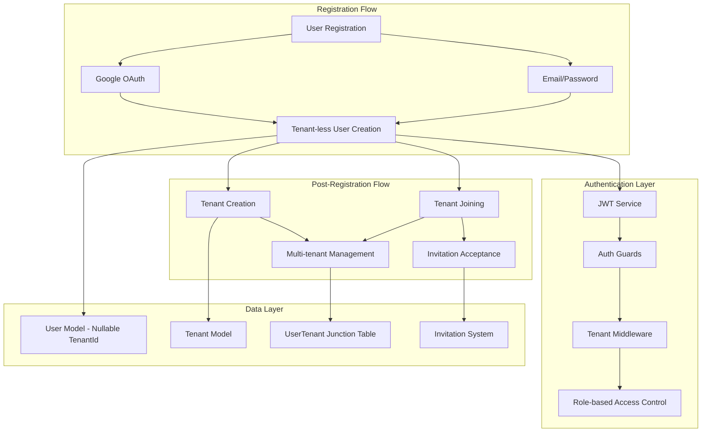

# Design Document

## Overview

This document outlines the technical design for implementing a tenant-less user registration system that allows users to create accounts using Google OAuth or email/password authentication without requiring a pre-existing tenant. The design enables users to sign up independently and then create or join tenants afterward, providing a more flexible onboarding experience for B2B SaaS platforms.

## Architecture

### High-Level System Architecture



### Authentication Flow Changes

The system will support three distinct user states:

1. **Tenant-less Users**: Users with `tenantId: null`
2. **Single-tenant Users**: Users with a specific `tenantId`
3. **Multi-tenant Users**: Users with multiple tenant associations (future enhancement)

## Components and Interfaces

### 1. Database Schema Modifications

#### Users Table Modifications
```sql
-- Make tenantId nullable and update constraints
ALTER TABLE users ALTER COLUMN tenant_id DROP NOT NULL;

-- Update unique constraint to handle null tenantId
DROP INDEX IF EXISTS users_email_tenant_id_key;
CREATE UNIQUE INDEX users_email_tenant_unique 
ON users (email, tenant_id) 
WHERE tenant_id IS NOT NULL;

-- Allow multiple users with null tenant_id and same email (for future multi-tenant support)
CREATE UNIQUE INDEX users_email_null_tenant_unique 
ON users (email) 
WHERE tenant_id IS NULL;
```

#### New UserTenant Junction Table (Future Multi-tenant Support)
```sql
CREATE TABLE user_tenants (
  id SERIAL PRIMARY KEY,
  user_id VARCHAR NOT NULL REFERENCES users(id) ON DELETE CASCADE,
  tenant_id VARCHAR NOT NULL REFERENCES tenants(id) ON DELETE CASCADE,
  role_id VARCHAR NOT NULL REFERENCES roles(id) ON DELETE CASCADE,
  is_active BOOLEAN DEFAULT true,
  joined_at TIMESTAMP DEFAULT NOW(),
  created_at TIMESTAMP DEFAULT NOW(),
  updated_at TIMESTAMP DEFAULT NOW(),
  
  UNIQUE(user_id, tenant_id)
);

CREATE INDEX idx_user_tenants_user_id ON user_tenants(user_id);
CREATE INDEX idx_user_tenants_tenant_id ON user_tenants(tenant_id);
CREATE INDEX idx_user_tenants_active ON user_tenants(is_active);
```

### 2. Updated Service Components

#### Enhanced AuthService
```typescript
@Injectable()
export class AuthService {
  constructor(
    private readonly prisma: PrismaService,
    private readonly jwtService: JwtService,
    private readonly emailOTPService: EmailOTPService,
  ) {}

  /**
   * Register a new tenant-less user with email/password
   */
  async registerTenantlessUser(registerDto: RegisterDto): Promise<{
    user: Omit<User, 'password'>;
    accessToken: string;
    requiresVerification: boolean;
  }> {
    // Check if email already exists (for any tenant or tenant-less)
    const existingUser = await this.prisma.user.findFirst({
      where: { email: registerDto.email },
    });

    if (existingUser) {
      throw new ConflictException('Email already registered');
    }

    // Hash password
    const hashedPassword = await bcrypt.hash(registerDto.password, 10);

    // Create tenant-less user
    const user = await this.prisma.user.create({
      data: {
        email: registerDto.email,
        password: hashedPassword,
        firstName: registerDto.firstName,
        lastName: registerDto.lastName,
        tenantId: null, // Explicitly set to null
        authMethods: ['password'],
        emailVerified: false,
      },
    });

    // Generate JWT token for tenant-less user
    const payload: JwtPayload = {
      userId: user.id,
      tenantId: null,
      roles: [], // No roles until user joins/creates tenant
    };

    const accessToken = this.jwtService.sign(payload);

    // Send verification email
    let requiresVerification = false;
    try {
      await this.emailOTPService.generateOTP(user.id, user.email);
      requiresVerification = true;
    } catch (error) {
      console.error('Failed to send verification email:', error);
    }

    const { password, ...userWithoutPassword } = user;
    return {
      user: userWithoutPassword,
      accessToken,
      requiresVerification,
    };
  }

  /**
   * Enhanced login to handle tenant-less users
   */
  async login(loginDto: LoginDto, tenantId?: string): Promise<{
    accessToken: string;
    emailVerified: boolean;
    requiresVerification: boolean;
    hasTenant: boolean;
  }> {
    let user: User | null;

    if (tenantId) {
      // Traditional tenant-specific login
      user = await this.prisma.user.findUnique({
        where: {
          email_tenantId: {
            email: loginDto.email,
            tenantId: tenantId,
          },
        },
        include: {
          roles: {
            include: {
              role: true,
            },
          },
        },
      });
    } else {
      // Tenant-less login - find user without tenant
      user = await this.prisma.user.findFirst({
        where: {
          email: loginDto.email,
          tenantId: null,
        },
        include: {
          roles: {
            include: {
              role: true,
            },
          },
        },
      });
    }

    if (!user) {
      throw new UnauthorizedException('Invalid credentials');
    }

    // Verify password
    const isPasswordValid = await bcrypt.compare(loginDto.password, user.password);
    if (!isPasswordValid) {
      throw new UnauthorizedException('Invalid credentials');
    }

    // Generate JWT token
    const payload: JwtPayload = {
      userId: user.id,
      tenantId: user.tenantId,
      roles: user.roles?.map((ur) => ur.role.id) || [],
    };

    const accessToken = this.jwtService.sign(payload);

    return {
      accessToken,
      emailVerified: user.emailVerified || false,
      requiresVerification: !user.emailVerified,
      hasTenant: user.tenantId !== null,
    };
  }
}
```

#### Enhanced GoogleAuthService
```typescript
@Injectable()
export class GoogleAuthService {
  constructor(
    private readonly prisma: PrismaService,
    private readonly jwtService: JwtService,
    private readonly authAuditService: AuthAuditService,
  ) {}

  /**
   * Authenticate with Google OAuth - supports tenant-less registration
   */
  async authenticateWithGoogle(
    profile: GoogleProfile,
    tenantId?: string,
  ): Promise<AuthenticationResult> {
    let user: User | null;

    if (tenantId) {
      // Traditional tenant-specific Google OAuth
      return this.authenticateWithGoogleForTenant(profile, tenantId);
    }

    // Tenant-less Google OAuth
    // Check if user exists by Google ID
    user = await this.prisma.user.findUnique({
      where: { googleId: profile.id },
      include: {
        roles: {
          include: {
            role: true,
          },
        },
      },
    });

    if (user) {
      // Existing Google user
      if (user.tenantId === null) {
        // Tenant-less user signing in
        return this.generateTokenForUser(user);
      } else {
        // User has tenant - redirect to tenant-specific flow
        throw new BadRequestException('User belongs to a tenant. Please use tenant-specific login.');
      }
    }

    // Check if user exists by email (tenant-less)
    user = await this.prisma.user.findFirst({
      where: {
        email: profile.email,
        tenantId: null,
      },
    });

    if (user) {
      // Auto-link Google account to existing tenant-less user
      await this.linkGoogleAccountInternal(user.id, profile);
      user = await this.prisma.user.findUnique({
        where: { id: user.id },
        include: {
          roles: {
            include: {
              role: true,
            },
          },
        },
      });
    } else {
      // Create new tenant-less user
      user = await this.createTenantlessUserFromGoogle(profile);
    }

    return this.generateTokenForUser(user!);
  }

  /**
   * Create a new tenant-less user from Google profile
   */
  async createTenantlessUserFromGoogle(profile: GoogleProfile): Promise<User> {
    const user = await this.prisma.user.create({
      data: {
        email: profile.email,
        firstName: profile.firstName || null,
        lastName: profile.lastName || null,
        tenantId: null, // Explicitly null
        googleId: profile.id,
        googleLinkedAt: new Date(),
        authMethods: ['google'],
        password: '', // Empty password for Google-only users
        emailVerified: true, // OAuth users have pre-verified emails
        emailVerifiedAt: new Date(),
      },
      include: {
        roles: {
          include: {
            role: true,
          },
        },
      },
    });

    return user;
  }

  private generateTokenForUser(user: User): AuthenticationResult {
    const payload: JwtPayload = {
      userId: user.id,
      tenantId: user.tenantId,
      roles: user.roles?.map((ur) => ur.role.id) || [],
    };

    const accessToken = this.jwtService.sign(payload);
    return { accessToken };
  }
}
```

#### New TenantManagementService
```typescript
@Injectable()
export class TenantManagementService {
  constructor(
    private readonly prisma: PrismaService,
    private readonly tenantService: TenantService,
    private readonly jwtService: JwtService,
  ) {}

  /**
   * Create a new tenant for a tenant-less user
   */
  async createTenantForUser(
    userId: string,
    createTenantDto: CreateTenantForUserDto,
  ): Promise<{
    tenant: Tenant;
    accessToken: string;
  }> {
    // Verify user exists and is tenant-less
    const user = await this.prisma.user.findUnique({
      where: { id: userId },
    });

    if (!user) {
      throw new NotFoundException('User not found');
    }

    if (user.tenantId !== null) {
      throw new BadRequestException('User already belongs to a tenant');
    }

    // Check if tenant name is available
    const existingTenant = await this.prisma.tenant.findFirst({
      where: { name: createTenantDto.tenantName },
    });

    if (existingTenant) {
      throw new ConflictException('Tenant name already exists');
    }

    // Create tenant and assign user as admin
    const result = await this.prisma.$transaction(async (tx) => {
      // Create tenant
      const tenant = await tx.tenant.create({
        data: {
          name: createTenantDto.tenantName,
          googleSsoEnabled: false,
          googleAutoProvision: false,
        },
      });

      // Create default permissions for tenant
      const defaultPermissions = [
        { action: 'create', subject: 'project' },
        { action: 'read', subject: 'project' },
        { action: 'update', subject: 'project' },
        { action: 'delete', subject: 'project' },
        { action: 'create', subject: 'user' },
        { action: 'read', subject: 'user' },
        { action: 'update', subject: 'user' },
        { action: 'delete', subject: 'user' },
        { action: 'create', subject: 'role' },
        { action: 'read', subject: 'role' },
        { action: 'update', subject: 'role' },
        { action: 'delete', subject: 'role' },
      ];

      const createdPermissions = await Promise.all(
        defaultPermissions.map((perm) =>
          tx.permission.create({
            data: {
              action: perm.action,
              subject: perm.subject,
              tenantId: tenant.id,
            },
          }),
        ),
      );

      // Create Admin role
      const adminRole = await tx.role.create({
        data: {
          name: 'Admin',
          tenantId: tenant.id,
        },
      });

      // Assign all permissions to Admin role
      await Promise.all(
        createdPermissions.map((permission) =>
          tx.rolePermission.create({
            data: {
              roleId: adminRole.id,
              permissionId: permission.id,
            },
          }),
        ),
      );

      // Create Member role
      const memberRole = await tx.role.create({
        data: {
          name: 'Member',
          tenantId: tenant.id,
        },
      });

      // Update user to belong to tenant
      await tx.user.update({
        where: { id: userId },
        data: {
          tenantId: tenant.id,
        },
      });

      // Assign Admin role to user
      await tx.userRole.create({
        data: {
          userId: userId,
          roleId: adminRole.id,
        },
      });

      return { tenant, adminRole };
    });

    // Generate new JWT token with tenant context
    const payload: JwtPayload = {
      userId: userId,
      tenantId: result.tenant.id,
      roles: [result.adminRole.id],
    };

    const accessToken = this.jwtService.sign(payload);

    return {
      tenant: result.tenant,
      accessToken,
    };
  }

  /**
   * Join an existing tenant via invitation
   */
  async joinTenantForUser(
    userId: string,
    invitationToken: string,
  ): Promise<{
    tenant: Tenant;
    accessToken: string;
  }> {
    // Verify user exists and is tenant-less
    const user = await this.prisma.user.findUnique({
      where: { id: userId },
    });

    if (!user) {
      throw new NotFoundException('User not found');
    }

    if (user.tenantId !== null) {
      throw new BadRequestException('User already belongs to a tenant');
    }

    // Find and validate invitation
    const invitation = await this.prisma.tenantInvitation.findUnique({
      where: { token: invitationToken },
      include: {
        tenant: true,
        roles: {
          include: {
            role: true,
          },
        },
      },
    });

    if (!invitation) {
      throw new NotFoundException('Invitation not found');
    }

    if (invitation.status !== 'PENDING') {
      throw new BadRequestException('Invitation is no longer valid');
    }

    if (invitation.expiresAt < new Date()) {
      throw new BadRequestException('Invitation has expired');
    }

    if (invitation.email !== user.email) {
      throw new BadRequestException('Invitation email does not match user email');
    }

    // Accept invitation and assign user to tenant
    const result = await this.prisma.$transaction(async (tx) => {
      // Update user to belong to tenant
      await tx.user.update({
        where: { id: userId },
        data: {
          tenantId: invitation.tenantId,
        },
      });

      // Assign roles from invitation
      await Promise.all(
        invitation.roles.map((invitationRole) =>
          tx.userRole.create({
            data: {
              userId: userId,
              roleId: invitationRole.roleId,
            },
          }),
        ),
      );

      // Mark invitation as accepted
      await tx.tenantInvitation.update({
        where: { id: invitation.id },
        data: {
          status: 'ACCEPTED',
          acceptedAt: new Date(),
        },
      });

      return {
        tenant: invitation.tenant,
        roles: invitation.roles.map((ir) => ir.role.id),
      };
    });

    // Generate new JWT token with tenant context
    const payload: JwtPayload = {
      userId: userId,
      tenantId: result.tenant.id,
      roles: result.roles,
    };

    const accessToken = this.jwtService.sign(payload);

    return {
      tenant: result.tenant,
      accessToken,
    };
  }

  /**
   * Get user's tenant status
   */
  async getUserTenantStatus(userId: string): Promise<{
    hasTenant: boolean;
    tenant?: Tenant;
    availableInvitations: TenantInvitation[];
  }> {
    const user = await this.prisma.user.findUnique({
      where: { id: userId },
      include: {
        tenant: true,
      },
    });

    if (!user) {
      throw new NotFoundException('User not found');
    }

    const availableInvitations = await this.prisma.tenantInvitation.findMany({
      where: {
        email: user.email,
        status: 'PENDING',
        expiresAt: {
          gt: new Date(),
        },
      },
      include: {
        tenant: true,
      },
    });

    return {
      hasTenant: user.tenantId !== null,
      tenant: user.tenant || undefined,
      availableInvitations,
    };
  }
}
```

### 3. Updated Controller Components

#### Enhanced AuthController
```typescript
@Controller('auth')
export class AuthController {
  constructor(
    private readonly authService: AuthService,
    private readonly googleAuthService: GoogleAuthService,
    private readonly googleOAuthService: GoogleOAuthService,
    private readonly oauthStateService: OAuthStateService,
  ) {}

  @Public()
  @Post('register')
  @HttpCode(HttpStatus.CREATED)
  @ApiOperation({
    summary: 'Register new tenant-less user',
    description: 'Create a new user account without requiring a tenant. User can create or join tenant later.',
  })
  async register(@Body() registerDto: RegisterDto) {
    return this.authService.registerTenantlessUser(registerDto);
  }

  @Public()
  @Post('login')
  @HttpCode(HttpStatus.OK)
  @ApiOperation({
    summary: 'User login - supports both tenant-less and tenant-specific',
    description: 'Authenticate user. If no tenant header provided, attempts tenant-less login.',
  })
  async login(
    @Body() loginDto: LoginDto,
    @Headers('x-tenant-id') tenantId?: string,
  ) {
    return this.authService.login(loginDto, tenantId);
  }

  @Public()
  @Get('google')
  @ApiOperation({
    summary: 'Initiate Google OAuth - supports tenant-less registration',
    description: 'Start Google OAuth flow. If no tenant header provided, creates tenant-less user.',
  })
  async googleAuth(@Headers('x-tenant-id') tenantId?: string) {
    // Generate state for CSRF protection
    const state = await this.oauthStateService.generateState(undefined, tenantId);
    
    // Generate Google OAuth URL
    const authUrl = this.googleOAuthService.generateAuthUrl(state);
    
    return { authUrl, state };
  }

  @Public()
  @Get('google/callback')
  @HttpCode(HttpStatus.OK)
  @ApiOperation({
    summary: 'Complete Google OAuth flow',
    description: 'Handle Google OAuth callback. Creates tenant-less user if no tenant context.',
  })
  async googleAuthCallback(@Query() callbackDto: GoogleCallbackDto) {
    const { code, state } = callbackDto;

    // Validate state parameter
    const stateData = await this.oauthStateService.validateState(state);
    if (!stateData) {
      throw new BadRequestException('Invalid or expired state parameter');
    }

    // Exchange code for tokens
    const { idToken } = await this.googleOAuthService.exchangeCodeForTokens(code);
    
    // Verify and extract profile from ID token
    const googleProfile = await this.googleOAuthService.verifyIdToken(idToken);
    
    // Handle authentication (tenant-less or tenant-specific)
    const result = await this.googleAuthService.authenticateWithGoogle(
      googleProfile,
      stateData.tenantId,
    );
    
    return result;
  }
}
```

#### New TenantManagementController
```typescript
@Controller('tenant-management')
@UseGuards(JwtAuthGuard)
@ApiTags('Tenant Management')
export class TenantManagementController {
  constructor(
    private readonly tenantManagementService: TenantManagementService,
  ) {}

  @Post('create')
  @HttpCode(HttpStatus.CREATED)
  @ApiOperation({
    summary: 'Create new tenant for current user',
    description: 'Create a new tenant and assign current user as admin. User must be tenant-less.',
  })
  async createTenant(
    @CurrentUser() user: User,
    @Body() createTenantDto: CreateTenantForUserDto,
  ) {
    return this.tenantManagementService.createTenantForUser(user.id, createTenantDto);
  }

  @Post('join')
  @HttpCode(HttpStatus.OK)
  @ApiOperation({
    summary: 'Join existing tenant via invitation',
    description: 'Join a tenant using invitation token. User must be tenant-less.',
  })
  async joinTenant(
    @CurrentUser() user: User,
    @Body() joinTenantDto: JoinTenantDto,
  ) {
    return this.tenantManagementService.joinTenantForUser(user.id, joinTenantDto.invitationToken);
  }

  @Get('status')
  @ApiOperation({
    summary: 'Get user tenant status',
    description: 'Get current user tenant status and available invitations.',
  })
  async getTenantStatus(@CurrentUser() user: User) {
    return this.tenantManagementService.getUserTenantStatus(user.id);
  }
}
```

### 4. Updated Middleware and Guards

#### Enhanced TenantMiddleware
```typescript
@Injectable()
export class TenantMiddleware implements NestMiddleware {
  use(req: Request, res: Response, next: NextFunction) {
    const tenantId = req.headers['x-tenant-id'] as string;
    
    // Store tenant context for both tenant-specific and tenant-less requests
    req['tenantContext'] = {
      tenantId: tenantId || null,
      isTenantRequired: false, // Will be set by guards
    };
    
    next();
  }
}
```

#### New TenantRequiredGuard
```typescript
@Injectable()
export class TenantRequiredGuard implements CanActivate {
  canActivate(context: ExecutionContext): boolean {
    const request = context.switchToHttp().getRequest();
    const user = request.user;
    
    if (!user) {
      throw new UnauthorizedException('Authentication required');
    }
    
    if (!user.tenantId) {
      throw new BadRequestException('Tenant membership required. Please create or join a tenant.');
    }
    
    return true;
  }
}
```

#### Enhanced JwtAuthGuard
```typescript
@Injectable()
export class JwtAuthGuard extends AuthGuard('jwt') {
  canActivate(context: ExecutionContext) {
    return super.canActivate(context);
  }

  handleRequest(err: any, user: any, info: any) {
    if (err || !user) {
      throw err || new UnauthorizedException();
    }
    
    // Accept both tenant-less and tenant-bound users
    return user;
  }
}
```

### 5. Data Transfer Objects

#### New DTOs
```typescript
export class RegisterDto {
  @IsEmail()
  @IsNotEmpty()
  email: string;

  @IsString()
  @MinLength(8)
  @IsNotEmpty()
  password: string;

  @IsString()
  @IsOptional()
  firstName?: string;

  @IsString()
  @IsOptional()
  lastName?: string;
}

export class CreateTenantForUserDto {
  @IsString()
  @IsNotEmpty()
  @MinLength(2)
  @MaxLength(50)
  tenantName: string;

  @IsString()
  @IsOptional()
  description?: string;
}

export class JoinTenantDto {
  @IsString()
  @IsNotEmpty()
  invitationToken: string;
}
```

### 6. Updated JWT Payload Interface

```typescript
export interface JwtPayload {
  userId: string;
  tenantId: string | null; // Now nullable
  roles: string[];
  iat?: number;
  exp?: number;
}
```

## Error Handling

### New Error Types
```typescript
export class TenantRequiredError extends BadRequestException {
  constructor() {
    super('Tenant membership required. Please create or join a tenant.');
  }
}

export class UserAlreadyHasTenantError extends BadRequestException {
  constructor() {
    super('User already belongs to a tenant.');
  }
}

export class TenantNameUnavailableError extends ConflictException {
  constructor(tenantName: string) {
    super(`Tenant name '${tenantName}' is already taken.`);
  }
}
```

## Testing Strategy

### Unit Tests
- **TenantManagementService**: Test tenant creation, joining, and status retrieval
- **Enhanced AuthService**: Test tenant-less registration and login
- **Enhanced GoogleAuthService**: Test tenant-less Google OAuth flow
- **Guards and Middleware**: Test tenant-required vs tenant-optional endpoints

### Integration Tests
- **Complete Registration Flow**: Test tenant-less user creation and tenant setup
- **Invitation Acceptance**: Test joining tenants via invitations
- **Multi-tenant Scenarios**: Test users transitioning between tenant-less and tenant-bound states
- **Backward Compatibility**: Ensure existing tenant-bound users continue to work

### E2E Tests
- **User Onboarding Journey**: Complete flow from registration to tenant creation
- **Google OAuth Integration**: End-to-end Google sign-up and tenant creation
- **Invitation Workflows**: Complete invitation sending and acceptance flows

## Migration Strategy

### Database Migration
```sql
-- Migration: Make tenantId nullable and update constraints
BEGIN;

-- Make tenantId nullable
ALTER TABLE users ALTER COLUMN tenant_id DROP NOT NULL;

-- Update unique constraints
DROP INDEX IF EXISTS users_email_tenant_id_key;
CREATE UNIQUE INDEX users_email_tenant_unique 
ON users (email, tenant_id) 
WHERE tenant_id IS NOT NULL;

CREATE UNIQUE INDEX users_email_null_tenant_unique 
ON users (email) 
WHERE tenant_id IS NULL;

-- Create user_tenants table for future multi-tenant support
CREATE TABLE user_tenants (
  id SERIAL PRIMARY KEY,
  user_id VARCHAR NOT NULL REFERENCES users(id) ON DELETE CASCADE,
  tenant_id VARCHAR NOT NULL REFERENCES tenants(id) ON DELETE CASCADE,
  role_id VARCHAR NOT NULL REFERENCES roles(id) ON DELETE CASCADE,
  is_active BOOLEAN DEFAULT true,
  joined_at TIMESTAMP DEFAULT NOW(),
  created_at TIMESTAMP DEFAULT NOW(),
  updated_at TIMESTAMP DEFAULT NOW(),
  
  UNIQUE(user_id, tenant_id)
);

CREATE INDEX idx_user_tenants_user_id ON user_tenants(user_id);
CREATE INDEX idx_user_tenants_tenant_id ON user_tenants(tenant_id);

COMMIT;
```

## Security Considerations

### Access Control
- **Tenant-less Users**: Limited access to non-tenant-specific resources only
- **Tenant Creation**: Rate limiting and validation to prevent abuse
- **Invitation Security**: Secure token generation and validation
- **JWT Tokens**: Support for null tenantId in token payload

### Audit Logging
- **Tenant-less Activities**: Log activities for users without tenant context
- **Tenant Transitions**: Log when users create or join tenants
- **Security Events**: Monitor for suspicious tenant creation patterns

## Performance Considerations

### Database Optimization
- **Nullable Indexes**: Proper indexing for nullable tenantId queries
- **Query Performance**: Efficient queries for both tenant-less and tenant-bound users
- **Connection Pooling**: Handle increased query complexity

### Caching Strategy
- **User Status Cache**: Cache tenant membership status
- **Invitation Cache**: Cache active invitations for users
- **Tenant Metadata Cache**: Cache tenant information for quick access