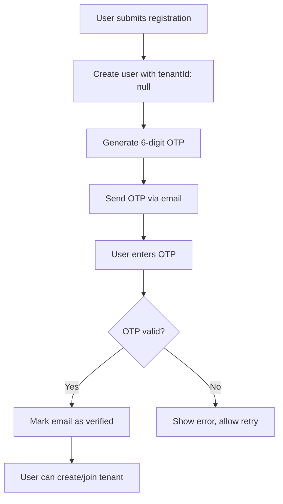
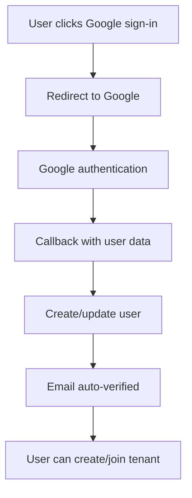
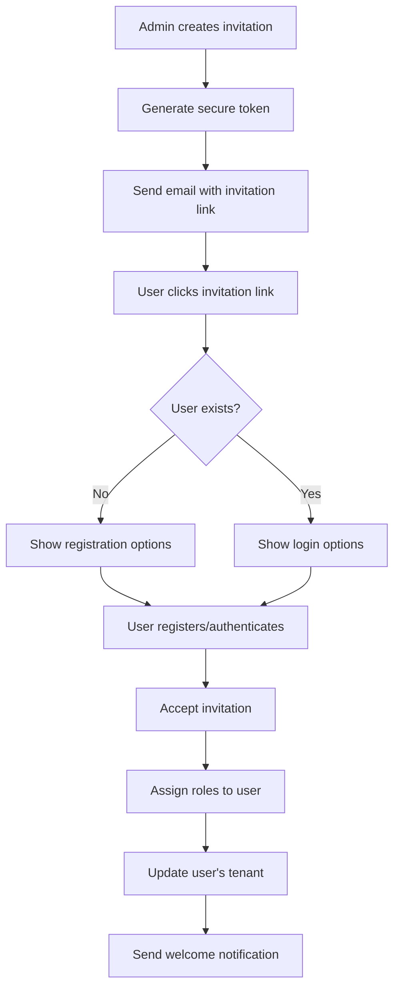

# Multi-Tenant NestJS Backend - Developer Wiki

> **Complete Developer Guide** - Everything you need to know to work with this multi-tenant NestJS backend, including all recent features and changes.

## 📋 Table of Contents

- [🚀 Quick Start](#-quick-start)
- [🏗️ Architecture Overview](#️-architecture-overview)
- [🔐 Authentication System](#-authentication-system)
- [🏢 Multi-Tenancy](#-multi-tenancy)
- [👥 User Management](#-user-management)
- [📧 Notification System](#-notification-system)
- [🎫 Invitation System](#-invitation-system)
- [🔑 Permissions & Roles](#-permissions--roles)
- [📊 API Reference](#-api-reference)
- [🧪 Testing](#-testing)
- [🔧 Development Workflows](#-development-workflows)
- [🚨 Troubleshooting](#-troubleshooting)

---

## 🚀 Quick Start

### Prerequisites
- Node.js 18+
- PostgreSQL 15+
- Redis (for notifications and rate limiting)

### 5-Minute Setup

```bash
# 1. Clone and install
git clone <repository-url>
cd nestjs-multi-tenant-starter
npm install

# 2. Environment setup
cp .env.example .env
# Edit .env with your database and Redis URLs

# 3. Database setup
npx prisma generate
npx prisma migrate dev
npx prisma db seed

# 4. Start Redis (required)
docker run -d --name redis -p 6379:6379 redis:7-alpine

# 5. Start the application
npm run start:dev
```

**🎉 Ready!** Visit http://localhost:3000/api/docs for API documentation.

---

## 🏗️ Architecture Overview

### System Design

This is a **shared database, shared schema** multi-tenant architecture with:

- **Tenant Isolation**: Automatic data scoping via Prisma middleware
- **Flexible User Registration**: Users can register without tenants, then create/join organizations
- **Hybrid RBAC**: Role-based + user-specific permissions
- **Enterprise Notifications**: Multi-channel delivery with real-time WebSocket support
- **Comprehensive Security**: JWT auth, rate limiting, audit logging

### Key Components

```
┌─────────────────┐    ┌─────────────────┐    ┌─────────────────┐
│   Frontend      │    │   API Gateway   │    │   Database      │
│   (Your App)    │◄──►│   (NestJS)      │◄──►│   (PostgreSQL)  │
└─────────────────┘    └─────────────────┘    └─────────────────┘
                              │
                              ▼
                       ┌─────────────────┐
                       │     Redis       │
                       │ (Cache/Queues)  │
                       └─────────────────┘
```

### Recent Major Changes ⭐

1. **Tenant-less Registration**: Users can now register without belonging to a tenant
2. **Email OTP Verification**: 6-digit OTP verification for email/password registration
3. **Invitation System**: Complete tenant invitation workflow with role assignment
4. **Multi-tenant Users**: Foundation for users belonging to multiple tenants

---

## 🔐 Authentication System

### Authentication Flows

#### 1. **Tenant-less Registration** (NEW ⭐)

Users can now register without a tenant and create/join organizations later:

```bash
# Register without tenant
curl -X POST http://localhost:3000/api/auth/register \
  -H "Content-Type: application/json" \
  -d '{
    "email": "user@example.com",
    "password": "SecurePass123!",
    "firstName": "John",
    "lastName": "Doe"
  }'
```

**Response:**
```json
{
  "user": {
    "id": "clx123",
    "email": "user@example.com",
    "tenantId": null,
    "emailVerified": false
  },
  "message": "Registration successful. Please verify your email."
}
```

#### 2. **Email OTP Verification** (NEW ⭐)

After registration, users must verify their email with a 6-digit OTP:

```bash
# Verify email with OTP
curl -X POST http://localhost:3000/api/auth/verify-email \
  -H "Content-Type: application/json" \
  -d '{
    "email": "user@example.com",
    "otp": "123456"
  }'
```

**OTP Features:**
- 6-digit numeric code
- 30-minute expiration
- Rate limited (3 attempts per 5 minutes)
- Secure Redis storage
- Resend capability

#### 3. **Google OAuth Flow**

```bash
# Initiate Google OAuth
GET http://localhost:3000/api/auth/google

# Handle callback (automatic)
GET http://localhost:3000/api/auth/google/callback?code=...
```

#### 4. **Login Flow**

```bash
# Login (works for both tenant-less and tenant-bound users)
curl -X POST http://localhost:3000/api/auth/login \
  -H "Content-Type: application/json" \
  -H "x-tenant-id: tenant-id-or-omit-for-tenant-less" \
  -d '{
    "email": "user@example.com",
    "password": "SecurePass123!"
  }'
```

### JWT Token Structure

**Tenant-less User Token:**
```json
{
  "sub": "user-id",
  "email": "user@example.com",
  "tenantId": null,
  "emailVerified": true,
  "iat": 1234567890,
  "exp": 1234567890
}
```

**Tenant-bound User Token:**
```json
{
  "sub": "user-id",
  "email": "user@example.com",
  "tenantId": "tenant-id",
  "emailVerified": true,
  "iat": 1234567890,
  "exp": 1234567890
}
```

---

## 🏢 Multi-Tenancy

### Tenant Creation (NEW ⭐)

Tenant-less users can create their own tenant:

```bash
# Create tenant (requires authenticated tenant-less user)
curl -X POST http://localhost:3000/api/tenant-management/create \
  -H "Content-Type: application/json" \
  -H "Authorization: Bearer <tenant-less-user-token>" \
  -d '{
    "name": "Acme Corporation",
    "subdomain": "acme"
  }'
```

**What happens:**
1. Creates new tenant with unique subdomain
2. Assigns user as tenant admin
3. Creates default roles and permissions
4. Updates user's `tenantId`
5. Issues new JWT token with tenant context
6. Sets up notification preferences

### Tenant Identification

The system identifies tenants through:

1. **Header-based** (recommended):
   ```bash
   -H "x-tenant-id: tenant-id"
   ```

2. **Subdomain-based** (future):
   ```
   https://acme.yourapp.com/api/...
   ```

### Tenant Isolation

**Automatic Data Scoping:**
- Prisma middleware automatically adds `tenantId` filters
- Cross-tenant access returns 404 (not 403) for security
- All queries are tenant-scoped by default

**Example:**
```typescript
// This query is automatically scoped to current tenant
const projects = await prisma.project.findMany();
// Becomes: SELECT * FROM projects WHERE tenantId = 'current-tenant-id'
```

---

## 👥 User Management

### User States

1. **Tenant-less User**: `tenantId: null`
   - Can create or join tenants
   - Limited access to tenant-specific features
   - Must verify email for full access

2. **Tenant-bound User**: `tenantId: "tenant-id"`
   - Full access to tenant features
   - Role-based permissions
   - Can receive invitations to other tenants

3. **Multi-tenant User** (future): Multiple tenant associations

### User Registration Flows

#### Email/Password Registration


#### Google OAuth Registration


### User Status Check

```bash
# Check user's tenant status
curl -X GET http://localhost:3000/api/users/me/tenant-status \
  -H "Authorization: Bearer <token>"
```

**Response:**
```json
{
  "hasTenant": false,
  "user": {
    "id": "user-id",
    "email": "user@example.com",
    "emailVerified": true,
    "tenantId": null
  },
  "availableInvitations": [
    {
      "id": "invitation-id",
      "tenantName": "Acme Corp",
      "inviterEmail": "admin@acme.com",
      "roles": ["Member"],
      "expiresAt": "2024-12-31T23:59:59Z"
    }
  ]
}
```

---

## 📧 Notification System

### Overview

Enterprise-grade notification system with:
- **Multi-channel delivery**: Email, SMS, In-app, WebSocket
- **Provider flexibility**: Resend, AWS SES, Twilio, Termii
- **Queue-based processing**: Redis + BullMQ
- **Real-time updates**: WebSocket gateway
- **User preferences**: Granular per-category settings
- **Rate limiting**: Multi-level protection
- **Monitoring**: Prometheus metrics + alerting

### Quick Start

#### Send a Notification

```bash
curl -X POST http://localhost:3000/api/notifications \
  -H "Content-Type: application/json" \
  -H "x-tenant-id: tenant-id" \
  -H "Authorization: Bearer <token>" \
  -d '{
    "userId": "target-user-id",
    "title": "Welcome!",
    "message": "Welcome to our platform",
    "category": "welcome",
    "priority": "high",
    "channels": ["EMAIL", "IN_APP"],
    "data": {
      "actionUrl": "https://app.example.com/welcome"
    }
  }'
```

#### WebSocket Connection

```javascript
const socket = io('ws://localhost:3000/notifications', {
  auth: { token: 'jwt-token' },
  extraHeaders: { 'x-tenant-id': 'tenant-id' }
});

socket.on('notification', (notification) => {
  console.log('New notification:', notification);
});
```

### Email Providers

Configure in `.env`:

```env
# Resend (recommended)
EMAIL_PROVIDER=resend
EMAIL_API_KEY=re_your_api_key

# AWS SES
EMAIL_PROVIDER=ses
AWS_REGION=us-east-1
AWS_ACCESS_KEY_ID=your_key
AWS_SECRET_ACCESS_KEY=your_secret

# SMTP (Gmail, etc.)
EMAIL_PROVIDER=smtp
SMTP_HOST=smtp.gmail.com
SMTP_PORT=587
SMTP_USER=your_email@gmail.com
SMTP_PASSWORD=your_app_password
```

### SMS Providers

```env
# Twilio
SMS_PROVIDER=twilio
SMS_API_KEY=your_account_sid
SMS_API_SECRET=your_auth_token
SMS_FROM_NUMBER=+1234567890

# Termii
SMS_PROVIDER=termii
SMS_API_KEY=your_api_key
TERMII_SENDER_ID=YourBrand
```

### Notification Categories

Built-in categories:
- `welcome` - Welcome messages
- `account` - Account-related notifications
- `security` - Security alerts
- `billing` - Billing and payment notifications
- `system` - System maintenance notifications
- `marketing` - Marketing communications

### Rate Limiting

Multi-level rate limiting:
- **Tenant Level**: 100 notifications/minute
- **User Level**: 50 notifications/minute
- **Category Level**: 10 notifications/hour per category
- **Admin Bypass**: Automatic bypass for admin users

---

## 🎫 Invitation System

### Overview (NEW ⭐)

Complete tenant invitation system allowing admins to invite users with specific roles:

- **Email invitations** with secure tokens
- **Role assignment** during invitation
- **Expiration management** (default 7 days)
- **Status tracking** (pending, accepted, expired, cancelled)
- **Audit logging** for compliance
- **Rate limiting** to prevent abuse

### Invitation Flow



### Create Invitation

```bash
curl -X POST http://localhost:3000/api/invitations \
  -H "Content-Type: application/json" \
  -H "x-tenant-id: tenant-id" \
  -H "Authorization: Bearer <admin-token>" \
  -d '{
    "email": "newuser@example.com",
    "roleIds": ["role-id-1", "role-id-2"],
    "expiresAt": "2024-12-31T23:59:59Z",
    "message": "Welcome to our team!"
  }'
```

### Bulk Invitations

```bash
curl -X POST http://localhost:3000/api/invitations/bulk \
  -H "Content-Type: application/json" \
  -H "x-tenant-id: tenant-id" \
  -H "Authorization: Bearer <admin-token>" \
  -d '{
    "emails": [
      "user1@example.com",
      "user2@example.com",
      "user3@example.com"
    ],
    "roleIds": ["member-role-id"],
    "expiresAt": "2024-12-31T23:59:59Z"
  }'
```

### Accept Invitation

```bash
curl -X POST http://localhost:3000/api/invitations/accept \
  -H "Content-Type: application/json" \
  -H "Authorization: Bearer <user-token>" \
  -d '{
    "token": "invitation-token-from-email"
  }'
```

### Invitation Management

```bash
# List invitations
GET /api/invitations?status=pending&page=1&limit=20

# Cancel invitation
DELETE /api/invitations/{invitationId}

# Resend invitation
POST /api/invitations/{invitationId}/resend

# Get invitation details
GET /api/invitations/{invitationId}
```

### Invitation Email Template

The system sends beautifully formatted emails with:
- Company branding
- Clear call-to-action button
- Invitation details (roles, expiry)
- Security information
- Mobile-responsive design

---

## 🔑 Permissions & Roles

### Hybrid RBAC System

The system supports both role-based and user-specific permissions:

**Effective Permissions = Role Permissions ∪ User-Specific Permissions**

### Permission Format

Permissions follow the pattern: `action:subject`

Examples:
- `create:project`
- `read:user`
- `update:tenant`
- `delete:role`
- `manage:invitations`

### Default Roles

Created automatically for each tenant:

1. **Super Admin**
   - All permissions
   - Tenant management
   - User management
   - System configuration

2. **Admin**
   - User management
   - Project management
   - Role assignment
   - Invitation management

3. **Manager**
   - Project management
   - Team member management
   - Basic reporting

4. **Member**
   - Basic project access
   - Profile management
   - Notification preferences

### Role Management

```bash
# Create custom role
curl -X POST http://localhost:3000/api/roles \
  -H "Content-Type: application/json" \
  -H "x-tenant-id: tenant-id" \
  -H "Authorization: Bearer <admin-token>" \
  -d '{
    "name": "Project Manager"
  }'

# Assign permissions to role
curl -X PUT http://localhost:3000/api/roles/{roleId}/permissions \
  -H "Content-Type: application/json" \
  -H "x-tenant-id: tenant-id" \
  -H "Authorization: Bearer <admin-token>" \
  -d '{
    "permissionIds": ["perm-id-1", "perm-id-2"]
  }'

# Assign role to user
curl -X PUT http://localhost:3000/api/users/{userId}/roles \
  -H "Content-Type: application/json" \
  -H "x-tenant-id: tenant-id" \
  -H "Authorization: Bearer <admin-token>" \
  -d '{
    "roleIds": ["role-id-1"]
  }'
```

### User-Specific Permissions

```bash
# Grant direct permission to user
curl -X PUT http://localhost:3000/api/users/{userId}/permissions \
  -H "Content-Type: application/json" \
  -H "x-tenant-id: tenant-id" \
  -H "Authorization: Bearer <admin-token>" \
  -d '{
    "permissionIds": ["special-permission-id"]
  }'
```

### Permission Guards

Protect routes with permission decorators:

```typescript
@Controller('projects')
export class ProjectController {
  @Post()
  @UseGuards(JwtAuthGuard, PermissionsGuard)
  @Permissions('create:project')
  async createProject(@Body() dto: CreateProjectDto) {
    // Only users with 'create:project' permission can access
  }

  @Get()
  @UseGuards(JwtAuthGuard, PermissionsGuard)
  @Permissions('read:project')
  async getProjects() {
    // Automatically scoped to current tenant
  }
}
```

---

## 📊 API Reference

### Authentication Endpoints

| Method | Endpoint | Description | Auth Required |
|--------|----------|-------------|---------------|
| POST | `/auth/register` | Register new user (tenant-less) | No |
| POST | `/auth/verify-email` | Verify email with OTP | No |
| POST | `/auth/resend-otp` | Resend OTP | No |
| POST | `/auth/login` | Login user | No |
| GET | `/auth/google` | Initiate Google OAuth | No |
| GET | `/auth/google/callback` | Google OAuth callback | No |
| POST | `/auth/google/link` | Link Google account | Yes |
| DELETE | `/auth/google/unlink` | Unlink Google account | Yes |

### Tenant Management Endpoints

| Method | Endpoint | Description | Auth Required |
|--------|----------|-------------|---------------|
| POST | `/tenant-management/create` | Create tenant (tenant-less user) | Yes |
| GET | `/tenant-management/status` | Get user's tenant status | Yes |
| POST | `/tenant-management/join` | Join tenant via invitation | Yes |

### User Endpoints

| Method | Endpoint | Description | Auth Required |
|--------|----------|-------------|---------------|
| GET | `/users/me` | Get current user profile | Yes |
| PUT | `/users/me` | Update user profile | Yes |
| GET | `/users/me/tenant-status` | Get tenant association status | Yes |
| GET | `/users` | List tenant users | Yes |
| GET | `/users/{id}` | Get user details | Yes |
| PUT | `/users/{id}/roles` | Assign roles to user | Yes (Admin) |
| PUT | `/users/{id}/permissions` | Grant direct permissions | Yes (Admin) |

### Invitation Endpoints

| Method | Endpoint | Description | Auth Required |
|--------|----------|-------------|---------------|
| POST | `/invitations` | Create invitation | Yes (Admin) |
| POST | `/invitations/bulk` | Create bulk invitations | Yes (Admin) |
| GET | `/invitations` | List invitations | Yes (Admin) |
| GET | `/invitations/{id}` | Get invitation details | Yes |
| POST | `/invitations/accept` | Accept invitation | Yes |
| POST | `/invitations/{id}/resend` | Resend invitation | Yes (Admin) |
| DELETE | `/invitations/{id}` | Cancel invitation | Yes (Admin) |

### Notification Endpoints

| Method | Endpoint | Description | Auth Required |
|--------|----------|-------------|---------------|
| POST | `/notifications` | Send notification | Yes |
| GET | `/notifications` | List user notifications | Yes |
| GET | `/notifications/{id}` | Get notification details | Yes |
| PATCH | `/notifications/mark-read` | Mark notifications as read | Yes |
| GET | `/notifications/preferences` | Get notification preferences | Yes |
| PUT | `/notifications/preferences` | Update preferences | Yes |
| GET | `/notifications/monitoring/stats` | Get notification stats | Yes (Admin) |

### Role & Permission Endpoints

| Method | Endpoint | Description | Auth Required |
|--------|----------|-------------|---------------|
| GET | `/roles` | List tenant roles | Yes |
| POST | `/roles` | Create role | Yes (Admin) |
| PUT | `/roles/{id}/permissions` | Assign permissions to role | Yes (Admin) |
| GET | `/permissions` | List tenant permissions | Yes |
| POST | `/permissions` | Create custom permission | Yes (Admin) |

---

## 🧪 Testing

### Test Structure

```
test/
├── *.spec.ts                    # Unit tests
├── *.integration-spec.ts        # Integration tests
├── *.e2e-spec.ts               # End-to-end tests
├── tenant-less-*.spec.ts       # Tenant-less user tests
├── email-otp.integration-spec.ts # OTP verification tests
└── invitation-*.spec.ts        # Invitation system tests
```

### Running Tests

```bash
# Unit tests
npm run test

# Integration tests
npm run test:integration

# E2E tests
npm run test:e2e

# Test coverage
npm run test:cov

# Watch mode
npm run test:watch
```

### Test Database Setup

```bash
# Setup test database
npm run test:integration:setup
```

### Key Test Scenarios

1. **Tenant-less Registration Flow**
2. **Email OTP Verification**
3. **Tenant Creation by Tenant-less User**
4. **Invitation Acceptance Flow**
5. **Multi-tenant Data Isolation**
6. **Permission System Validation**
7. **Notification Delivery**
8. **Rate Limiting**

### Example Test

```typescript
describe('Tenant-less Registration', () => {
  it('should allow user registration without tenant', async () => {
    const response = await request(app.getHttpServer())
      .post('/auth/register')
      .send({
        email: 'test@example.com',
        password: 'SecurePass123!',
        firstName: 'Test',
        lastName: 'User'
      })
      .expect(201);

    expect(response.body.user.tenantId).toBeNull();
    expect(response.body.user.emailVerified).toBe(false);
  });
});
```

---

## 🔧 Development Workflows

### Adding a New Feature

1. **Create Spec** (if complex):
   ```bash
   # Create feature spec in .kiro/specs/
   mkdir .kiro/specs/my-feature
   # Add requirements.md, design.md, tasks.md
   ```

2. **Database Changes**:
   ```bash
   # Update schema
   vim prisma/schema.prisma
   
   # Create migration
   npx prisma migrate dev --name add_my_feature
   ```

3. **Implementation**:
   ```bash
   # Create module
   nest g module my-feature
   nest g service my-feature
   nest g controller my-feature
   ```

4. **Add Tests**:
   ```bash
   # Unit tests
   touch src/my-feature/my-feature.service.spec.ts
   
   # Integration tests
   touch test/my-feature.integration-spec.ts
   ```

5. **Documentation**:
   ```bash
   # Update this wiki
   # Add API documentation
   # Update module README
   ```

### Adding a New Tenant-Scoped Resource

1. **Add to Prisma Schema**:
   ```prisma
   model MyResource {
     id       String @id @default(cuid())
     name     String
     tenantId String  // Required for tenant isolation
     // ... other fields
     
     tenant   Tenant @relation(fields: [tenantId], references: [id], onDelete: Cascade)
     
     @@index([tenantId])
     @@map("my_resources")
   }
   ```

2. **Create Service** (automatic tenant scoping):
   ```typescript
   @Injectable()
   export class MyResourceService {
     constructor(private prisma: PrismaService) {}
     
     async findAll() {
       // Automatically scoped to current tenant via middleware
       return this.prisma.myResource.findMany();
     }
   }
   ```

3. **Protect Controller**:
   ```typescript
   @Controller('my-resources')
   @UseGuards(JwtAuthGuard, PermissionsGuard)
   export class MyResourceController {
     @Get()
     @Permissions('read:my-resource')
     async findAll() {
       return this.service.findAll();
     }
   }
   ```

### Adding Custom Permissions

1. **Define Permission**:
   ```typescript
   // In seed script or migration
   await prisma.permission.create({
     data: {
       action: 'export',
       subject: 'report',
       tenantId: tenant.id
     }
   });
   ```

2. **Use in Controller**:
   ```typescript
   @Get('export')
   @Permissions('export:report')
   async exportReport() {
     // Only users with this permission can access
   }
   ```

### Email Template Development

1. **Create Template**:
   ```tsx
   // src/notifications/templates/email/my-template.tsx
   export const MyTemplate = ({ data }) => (
     <Html>
       <Head />
       <Body>
         <Container>
           <Text>Hello {data.name}!</Text>
           <Button href={data.actionUrl}>
             Take Action
           </Button>
         </Container>
       </Body>
     </Html>
   );
   ```

2. **Register Template**:
   ```typescript
   // In notification service
   await this.sendNotification({
     template: 'my-template',
     data: { name: 'John', actionUrl: 'https://...' }
   });
   ```

---

## 🚨 Troubleshooting

### Common Issues

#### 1. **Tenant Identification Errors**

**Problem**: `Tenant ID is required` error

**Solutions**:
- Ensure `x-tenant-id` header is included
- Verify tenant ID exists in database
- Check if endpoint requires tenant context

```bash
# Check if tenant exists
curl -X GET http://localhost:3000/api/tenants/{tenant-id} \
  -H "Authorization: Bearer <token>"
```

#### 2. **Email OTP Not Working**

**Problem**: OTP emails not being sent

**Solutions**:
- Check email provider configuration in `.env`
- Verify Redis is running: `redis-cli ping`
- Check notification system status
- Verify email provider credentials

```bash
# Test email configuration
curl -X POST http://localhost:3000/api/notifications/test-email \
  -H "Authorization: Bearer <admin-token>"
```

#### 3. **Permission Denied (403)**

**Problem**: User can't access protected resources

**Solutions**:
- Verify user has required permission
- Check JWT token is valid
- Ensure permission exists in tenant
- Verify role assignments

```bash
# Check user permissions
curl -X GET http://localhost:3000/api/users/me/permissions \
  -H "x-tenant-id: tenant-id" \
  -H "Authorization: Bearer <token>"
```

#### 4. **Cross-Tenant Access (404)**

**Problem**: Getting 404 for resources that exist

**This is expected behavior for security!**
- Verify you're using correct tenant ID
- Check JWT token matches tenant ID in header
- Ensure resource belongs to the tenant

#### 5. **Invitation Not Working**

**Problem**: Invitation emails not sending or acceptance failing

**Solutions**:
- Check invitation hasn't expired
- Verify email provider is configured
- Check invitation token is valid
- Ensure user has permission to accept

```bash
# Check invitation status
curl -X GET http://localhost:3000/api/invitations/{invitation-id} \
  -H "Authorization: Bearer <token>"
```

#### 6. **Rate Limiting (429 Errors)**

**Problem**: Too many requests error

**Solutions**:
- Check rate limit headers in response
- Wait for rate limit window to reset
- Use admin account to bypass limits (testing)
- Reset rate limits: `redis-cli FLUSHDB`

#### 7. **WebSocket Connection Issues**

**Problem**: Real-time notifications not working

**Solutions**:
- Ensure JWT token is valid
- Check CORS configuration
- Verify tenant ID in connection headers
- Check firewall/proxy WebSocket support

```javascript
// Debug WebSocket connection
const socket = io('ws://localhost:3000/notifications', {
  auth: { token: 'your-jwt-token' },
  extraHeaders: { 'x-tenant-id': 'your-tenant-id' }
});

socket.on('connect', () => console.log('Connected'));
socket.on('connect_error', (error) => console.error('Connection error:', error));
```

### Database Issues

#### Reset Database
```bash
# WARNING: This deletes all data
npx prisma migrate reset
```

#### Check Database Connection
```bash
npx prisma db pull
```

#### View Database
```bash
npx prisma studio
```

### Redis Issues

#### Check Redis Connection
```bash
redis-cli ping
# Should return: PONG
```

#### Clear Redis Cache
```bash
redis-cli FLUSHDB
```

#### Monitor Redis
```bash
redis-cli MONITOR
```

### Debugging Tips

1. **Enable Debug Logging**:
   ```env
   LOG_LEVEL=debug
   ```

2. **Check Application Logs**:
   ```bash
   npm run start:dev
   # Watch for error messages
   ```

3. **Use Prisma Studio**:
   ```bash
   npx prisma studio
   # Visual database browser
   ```

4. **Test API with Postman**:
   - Import `postman_collection.json`
   - Set up environment variables
   - Test complete workflows

5. **Check Health Endpoints**:
   ```bash
   curl http://localhost:3000/api/health
   ```

---

## 🎯 Next Steps

### For New Developers

1. **Complete the Quick Start** setup
2. **Explore the API** using Swagger UI
3. **Run the test suite** to understand functionality
4. **Create a test tenant** and user
5. **Send your first notification**
6. **Review the codebase** structure

### For Frontend Developers

1. **Study the API Reference** section
2. **Understand the authentication flows**
3. **Implement tenant-less registration UI**
4. **Build invitation acceptance flow**
5. **Integrate WebSocket notifications**
6. **Handle multi-tenant scenarios**

### For Backend Developers

1. **Review the architecture** and design patterns
2. **Understand the tenant isolation** mechanism
3. **Study the permission system** implementation
4. **Explore the notification system** architecture
5. **Add custom features** following the workflows
6. **Contribute to the test suite**

---

## 📚 Additional Resources

- **API Documentation**: http://localhost:3000/api/docs
- **Database Schema**: `prisma/schema.prisma`
- **Test Examples**: `test/` directory
- **Postman Collection**: `postman_collection.json`
- **Architecture Docs**: `docs/architecture/`
- **Module Docs**: `docs/modules/`

---

**🎉 Happy Coding!** This wiki covers all the major features and recent changes. For specific implementation details, refer to the codebase and existing documentation in the `docs/` directory.