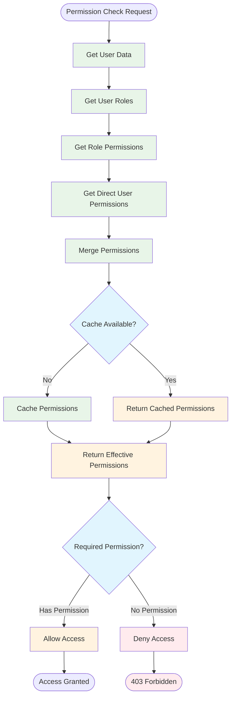

# Data Flow Diagrams and Process Flows

This document provides detailed data flow diagrams for key processes in the multi-tenant NestJS application, helping developers understand how data moves through the system and how different components interact.

## 🔄 Core Data Flow Patterns

### Request Processing Pipeline


### Tenant Isolation Data Flow


## 🔐 Authentication and Authorization Flows

### JWT Authentication Flow


### Google OAuth Flow


### Permission Resolution Flow



## 📧 Notification System Data Flows

### Notification Creation and Processing


### Real-time Notification Flow


### Notification Preference Flow


## 👥 User Management Data Flows

### User Registration Flow


### Role Assignment Flow

```mermaid
flowchart TD
    START([Assign Role Request]) --> VALIDATE_USER[Validate User Exists]
    VALIDATE_USER --> VALIDATE_ROLE[Validate Role Exists]
    VALIDATE_ROLE --> CHECK_TENANT[Check Same Tenant]
    
    CHECK_TENANT --> CHECK_PERMS{Has Permission?}
    CHECK_PERMS -->|No| FORBIDDEN[403 Forbidden]
    CHECK_PERMS -->|Yes| CHECK_EXISTING[Check Existing Assignment]
    
    CHECK_EXISTING --> EXISTING{Already Assigned?}
    EXISTING -->|Yes| CONFLICT[409 Conflict]
    EXISTING -->|No| CREATE_ASSIGNMENT[Create Role Assignment]
    
    CREATE_ASSIGNMENT --> UPDATE_CACHE[Update Permission Cache]
    UPDATE_CACHE --> LOG_AUDIT[Log Audit Event]
    LOG_AUDIT --> NOTIFY_USER[Notify User (Optional)]
    NOTIFY_USER --> SUCCESS[200 Success]
    
    FORBIDDEN --> END([Request Failed])
    CONFLICT --> END
    SUCCESS --> END([Request Complete])
    
    classDef validation fill:#e8f5e8
    classDef decision fill:#e1f5fe
    classDef success fill:#e8f5e8
    classDef error fill:#ffebee
    
    class VALIDATE_USER,VALIDATE_ROLE,CHECK_TENANT,CHECK_EXISTING validation
    class CHECK_PERMS,EXISTING decision
    class CREATE_ASSIGNMENT,UPDATE_CACHE,LOG_AUDIT,NOTIFY_USER,SUCCESS success
    class FORBIDDEN,CONFLICT error
```

## 🔄 Queue Processing Data Flows

### Background Job Processing


### Queue Monitoring Flow


## 📊 Rate Limiting Data Flow

### Multi-Level Rate Limiting


## 🔍 Error Handling Data Flow

### Global Exception Handling


These data flow diagrams provide a comprehensive view of how data moves through the multi-tenant NestJS application, helping developers understand the system's behavior and debug issues effectively.