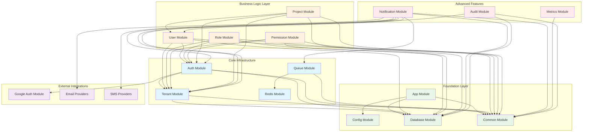
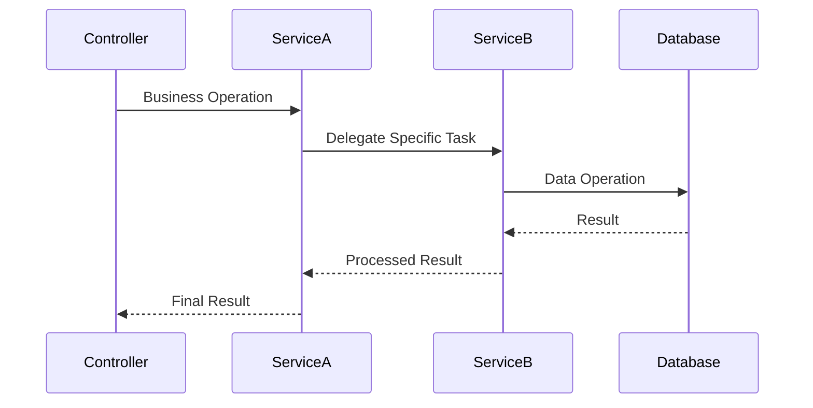
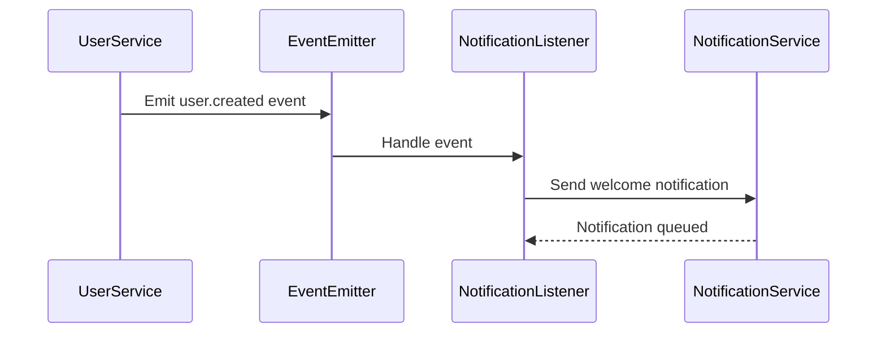
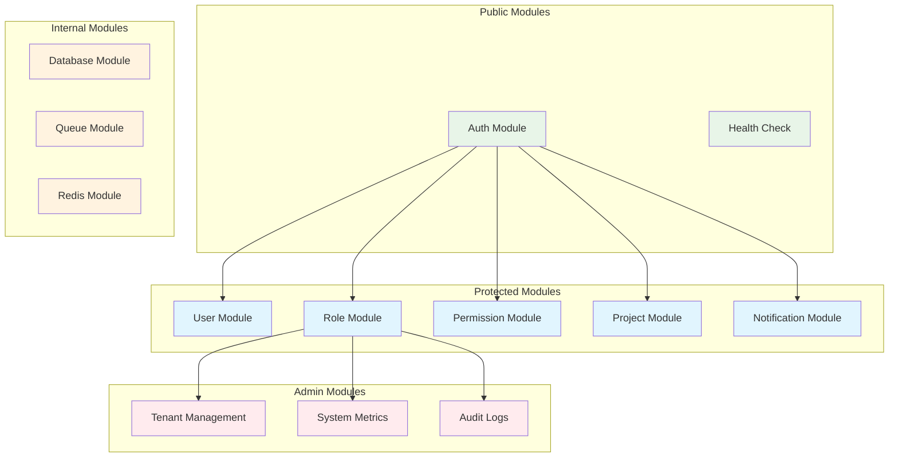
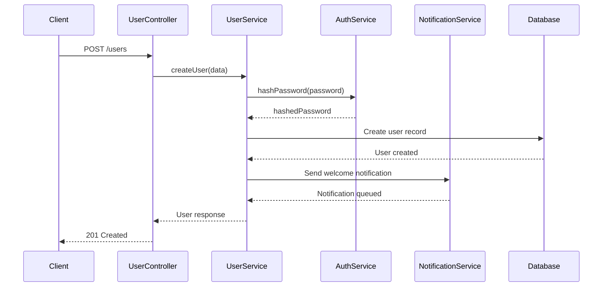
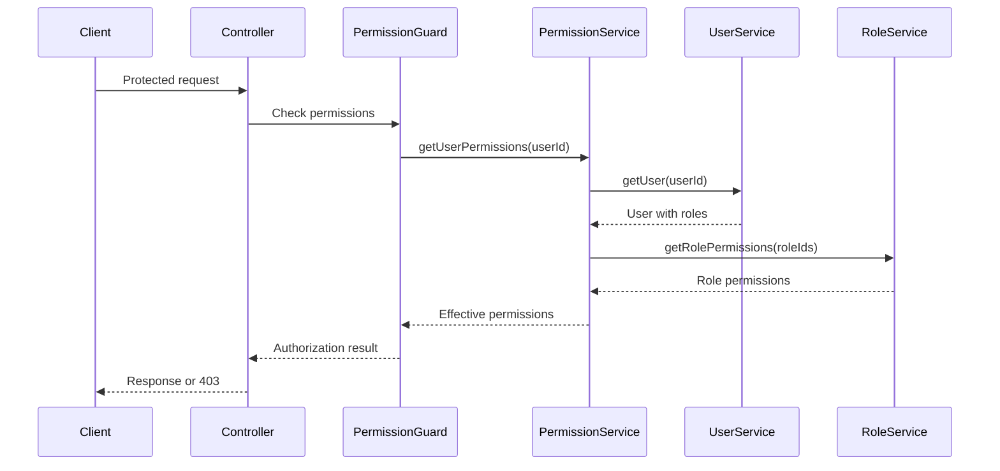

# Module Relationships and Dependencies

This document details the relationships between modules in the multi-tenant NestJS application, explaining how they interact, depend on each other, and maintain clean separation of concerns.

## 🏗️ Module Dependency Graph



## 📋 Module Descriptions and Responsibilities

### Foundation Layer

#### App Module
- **Purpose**: Root module that orchestrates the entire application
- **Responsibilities**:
  - Bootstrap the application
  - Configure global middleware
  - Import and configure all feature modules
  - Set up global exception filters and interceptors
- **Dependencies**: All other modules
- **Exports**: None (root module)

#### Config Module
- **Purpose**: Centralized configuration management
- **Responsibilities**:
  - Load and validate environment variables
  - Provide type-safe configuration objects
  - Handle different environment configurations
- **Dependencies**: None
- **Exports**: Configuration services

#### Database Module
- **Purpose**: Database connection and ORM configuration
- **Responsibilities**:
  - Prisma client configuration
  - Database connection management
  - Tenant isolation middleware
  - Migration and seeding utilities
- **Dependencies**: Config Module
- **Exports**: PrismaService, database utilities

#### Common Module
- **Purpose**: Shared utilities and cross-cutting concerns
- **Responsibilities**:
  - Global guards, filters, and interceptors
  - Shared decorators and utilities
  - Common DTOs and interfaces
  - Validation pipes
- **Dependencies**: None
- **Exports**: Shared utilities, guards, decorators

### Core Infrastructure

#### Tenant Module
- **Purpose**: Multi-tenant context management
- **Responsibilities**:
  - Tenant identification from requests
  - Request-scoped tenant context storage
  - Tenant validation and activation checks
  - Tenant-aware middleware
- **Dependencies**: Database, Common
- **Exports**: TenantContextService, tenant middleware

```typescript
// Example tenant context usage
@Injectable()
export class TenantContextService {
  private tenantId: string;
  
  setTenantId(tenantId: string): void {
    this.tenantId = tenantId;
  }
  
  getTenantId(): string {
    if (!this.tenantId) {
      throw new Error('Tenant context not set');
    }
    return this.tenantId;
  }
}
```

#### Auth Module
- **Purpose**: Authentication and authorization
- **Responsibilities**:
  - JWT token generation and validation
  - Google OAuth integration
  - Password hashing and verification
  - Authentication guards and strategies
- **Dependencies**: Database, Tenant, Common, Google Auth
- **Exports**: AuthService, JWT guards, auth decorators

#### Queue Module
- **Purpose**: Background job processing
- **Responsibilities**:
  - Queue configuration and management
  - Job scheduling and processing
  - Queue monitoring and health checks
  - Dead letter queue handling
- **Dependencies**: Redis, Common
- **Exports**: Queue services, job processors

### Business Logic Layer

#### User Module
- **Purpose**: User management and operations
- **Responsibilities**:
  - User CRUD operations
  - User profile management
  - User-role and user-permission relationships
  - User authentication data
- **Dependencies**: Auth, Tenant, Database, Common
- **Exports**: UserService, user-related DTOs

```typescript
// Example user service with tenant isolation
@Injectable()
export class UserService {
  constructor(
    private readonly prisma: PrismaService,
    private readonly tenantContext: TenantContextService,
  ) {}

  async findAll(): Promise<User[]> {
    // Tenant ID automatically applied by Prisma middleware
    return this.prisma.user.findMany();
  }
}
```

#### Role Module
- **Purpose**: Role-based access control
- **Responsibilities**:
  - Role CRUD operations
  - Role-permission assignments
  - Role hierarchy management
  - Role validation and checks
- **Dependencies**: Auth, Tenant, Database, Common
- **Exports**: RoleService, role-related DTOs

#### Permission Module
- **Purpose**: Permission management system
- **Responsibilities**:
  - Permission CRUD operations
  - Permission validation
  - Permission resolution (role + direct)
  - Permission caching
- **Dependencies**: Auth, Tenant, Database, Common
- **Exports**: PermissionService, permission guards

#### Project Module
- **Purpose**: Example business entity (tenant-scoped resource)
- **Responsibilities**:
  - Project CRUD operations
  - Project-user relationships
  - Project access control
  - Project lifecycle management
- **Dependencies**: Auth, Tenant, Database, User, Common
- **Exports**: ProjectService, project-related DTOs

### Advanced Features

#### Notification Module
- **Purpose**: Multi-channel notification system
- **Responsibilities**:
  - Notification creation and delivery
  - Multi-channel support (email, SMS, in-app)
  - User preference management
  - Template management and rendering
  - Delivery tracking and analytics
- **Dependencies**: Auth, Tenant, Database, User, Queue, Email/SMS providers
- **Exports**: NotificationService, notification controllers

```typescript
// Example notification service integration
@Injectable()
export class NotificationService {
  constructor(
    private readonly prisma: PrismaService,
    private readonly queueService: QueueService,
    private readonly userService: UserService,
  ) {}

  async sendNotification(data: CreateNotificationDto): Promise<void> {
    // Create notification record
    const notification = await this.prisma.notification.create({ data });
    
    // Queue for processing
    await this.queueService.addNotificationJob(notification);
  }
}
```

## 🔄 Inter-Module Communication Patterns

### Service-to-Service Communication



### Event-Driven Communication



### Dependency Injection Patterns

```typescript
// Example of proper dependency injection
@Injectable()
export class ProjectService {
  constructor(
    // Core dependencies
    private readonly prisma: PrismaService,
    private readonly tenantContext: TenantContextService,
    
    // Business logic dependencies
    private readonly userService: UserService,
    private readonly notificationService: NotificationService,
    
    // Infrastructure dependencies
    private readonly logger: Logger,
  ) {}

  async createProject(data: CreateProjectDto): Promise<Project> {
    // Use injected services
    const user = await this.userService.findById(data.ownerId);
    const project = await this.prisma.project.create({ data });
    
    // Trigger notification
    await this.notificationService.sendNotification({
      userId: user.id,
      type: 'project.created',
      data: { projectId: project.id },
    });

    return project;
  }
}
```

## 🛡️ Security Boundaries

### Module-Level Security



### Permission Requirements by Module

| Module | Required Permission | Admin Only | Notes |
|--------|-------------------|------------|-------|
| User | `read:user`, `create:user` | No | Basic user operations |
| Role | `manage:roles` | Yes | Role management |
| Permission | `manage:permissions` | Yes | Permission management |
| Project | `read:project`, `create:project` | No | Project operations |
| Notification | `send:notification` | No | Send notifications |
| Tenant | `manage:tenant` | Yes | Tenant administration |
| Metrics | `read:metrics` | Yes | System monitoring |
| Audit | `read:audit` | Yes | Audit log access |

## 📊 Data Flow Between Modules

### User Creation Flow



### Permission Check Flow



## 🔧 Module Configuration Patterns

### Feature Module Template

```typescript
@Module({
  imports: [
    // Core dependencies
    DatabaseModule,
    CommonModule,
    
    // Feature dependencies
    AuthModule,
    TenantModule,
  ],
  controllers: [FeatureController],
  providers: [
    FeatureService,
    // Feature-specific providers
  ],
  exports: [
    FeatureService,
    // Exported services for other modules
  ],
})
export class FeatureModule {}
```

### Dynamic Module Configuration

```typescript
@Module({})
export class NotificationModule {
  static forRoot(options: NotificationModuleOptions): DynamicModule {
    return {
      module: NotificationModule,
      imports: [
        QueueModule.forRoot(options.queue),
        EmailModule.forRoot(options.email),
        SmsModule.forRoot(options.sms),
      ],
      providers: [
        {
          provide: NOTIFICATION_OPTIONS,
          useValue: options,
        },
        NotificationService,
      ],
      exports: [NotificationService],
    };
  }
}
```

## 🚀 Module Scalability Considerations

### Horizontal Scaling

- **Stateless Design**: All modules are stateless and can be scaled horizontally
- **Database Connection Pooling**: Shared database connections across module instances
- **Cache Consistency**: Redis-based caching ensures consistency across instances

### Microservice Extraction

The modular architecture supports easy extraction of modules into microservices:

1. **Notification Module** → Notification Microservice
2. **Auth Module** → Authentication Service
3. **User/Role/Permission** → Identity Service

### Performance Optimization

- **Lazy Loading**: Modules can be lazy-loaded for better startup performance
- **Caching**: Module-level caching for frequently accessed data
- **Connection Pooling**: Optimized database connections per module

This modular architecture provides a solid foundation for building scalable, maintainable applications while ensuring clear separation of concerns and proper dependency management.