# System Architecture Overview

This document provides a comprehensive overview of the multi-tenant NestJS application architecture, explaining the design decisions, patterns, and implementation details that make this system scalable, secure, and maintainable.

## 🏗️ High-Level Architecture

The application follows a layered architecture with clear separation of concerns:

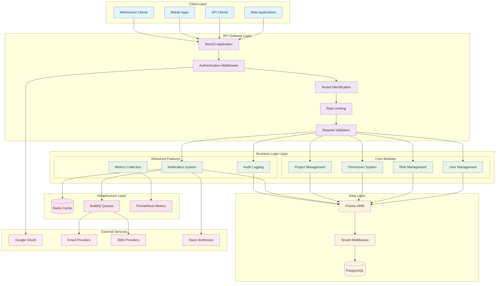

## 🏢 Multi-Tenant Architecture

### Design Pattern: Shared Database, Shared Schema

The application implements a **shared database, shared schema** multi-tenancy pattern, which provides:

- **Resource Efficiency**: All tenants share the same database instance and schema
- **Cost Effectiveness**: Lower operational costs compared to database-per-tenant
- **Simplified Management**: Single database to maintain, backup, and scale
- **Easy Scaling**: Horizontal scaling through read replicas and connection pooling

### Tenant Isolation Layers

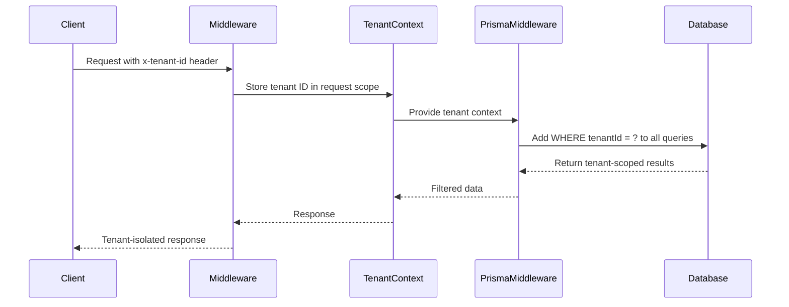

#### Layer 1: Request Identification
- **Header-based**: `x-tenant-id` header in requests
- **Subdomain-based**: Extract tenant from subdomain (optional)
- **JWT-based**: Tenant ID embedded in JWT token

#### Layer 2: Context Management
- **Request-scoped storage**: Tenant context stored per request
- **Dependency injection**: Tenant context available throughout request lifecycle
- **Validation**: Ensures tenant exists and is active

#### Layer 3: Database Middleware
- **Automatic scoping**: Prisma middleware adds `tenantId` filters to all queries
- **Query interception**: Intercepts and modifies queries before execution
- **Transparent operation**: Business logic doesn't need tenant-aware code

#### Layer 4: API Response Filtering
- **404 for cross-tenant access**: Returns 404 instead of 403 to prevent information leakage
- **Data sanitization**: Removes sensitive tenant information from responses
- **Audit logging**: Logs all cross-tenant access attempts

### Tenant Data Model

```typescript
// Core tenant isolation pattern
interface TenantScoped {
  tenantId: string;
  // ... other fields
}

// All tenant-scoped entities extend this
interface User extends TenantScoped {
  id: string;
  email: string;
  // ... user fields
}
```

## 🔧 Module Structure

### Core Module Architecture

Each module follows a consistent structure:

```
src/[module]/
├── [module].module.ts          # Module definition and dependencies
├── [module].controller.ts      # HTTP endpoints and request handling
├── [module].service.ts         # Business logic and data operations
├── dto/                        # Data Transfer Objects
│   ├── create-[entity].dto.ts
│   ├── update-[entity].dto.ts
│   └── [entity]-filter.dto.ts
├── guards/                     # Module-specific guards
├── decorators/                 # Custom decorators
└── interfaces/                 # TypeScript interfaces
```

### Module Dependencies

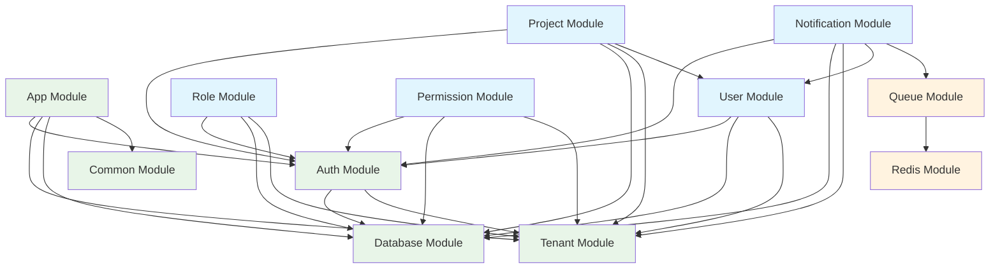

### Dependency Injection Pattern

The application uses NestJS's powerful dependency injection system:

```typescript
@Injectable()
export class UserService {
  constructor(
    private readonly prisma: PrismaService,
    private readonly tenantContext: TenantContextService,
    private readonly notificationService: NotificationService,
  ) {}
  
  async createUser(data: CreateUserDto): Promise<User> {
    const tenantId = this.tenantContext.getTenantId();
    // Business logic here - tenantId automatically applied by Prisma middleware
    return this.prisma.user.create({ data: { ...data, tenantId } });
  }
}
```

## 🔄 Data Flow Patterns

### Request Processing Flow

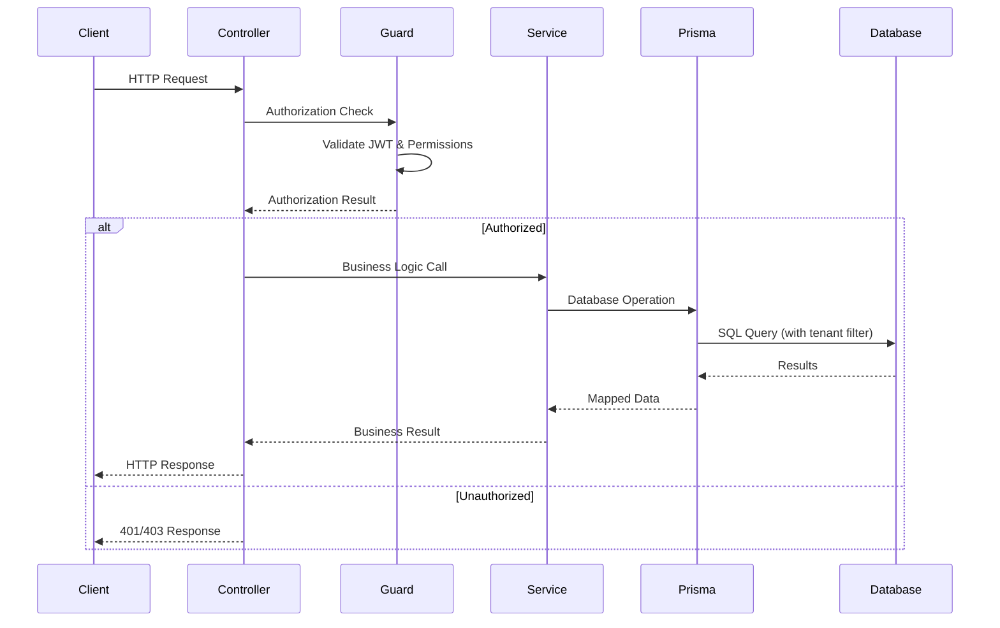

### Notification Processing Flow

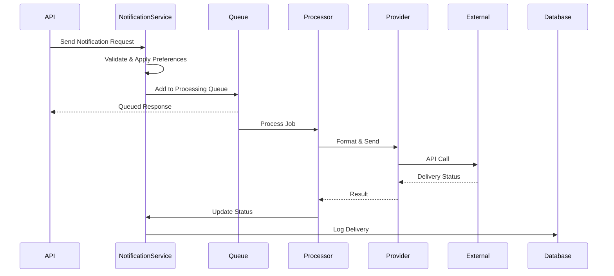

### Authentication Flow

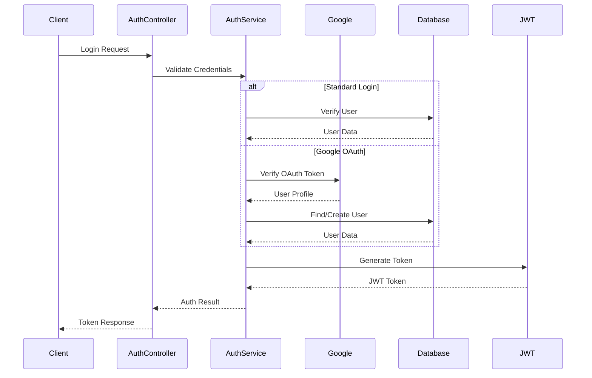

## 🛡️ Security Architecture

### Multi-Layer Security Model

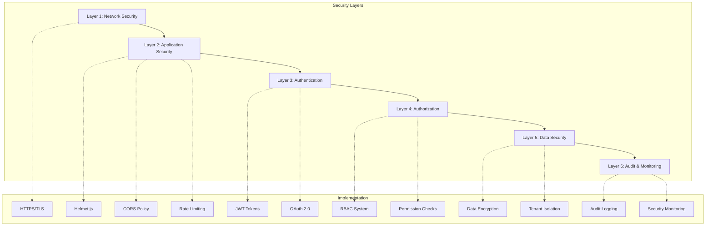

### Permission System Architecture

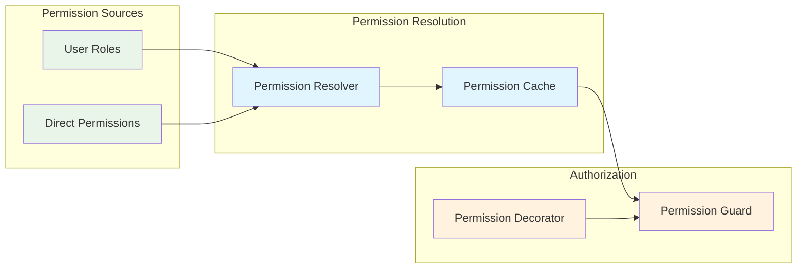

### Rate Limiting Architecture

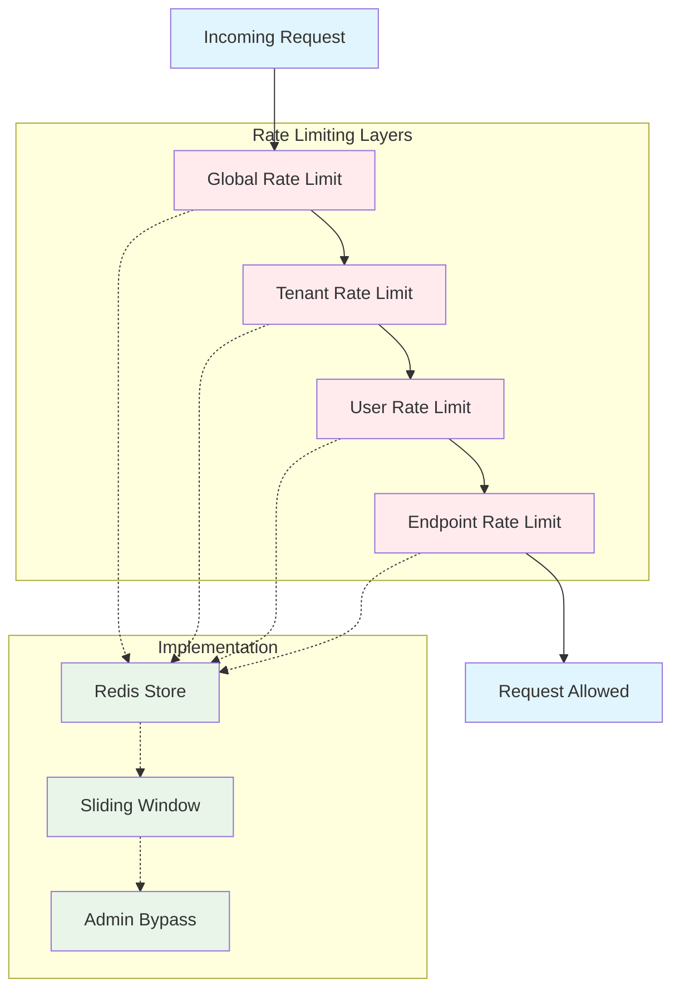

## 📊 Performance Considerations

### Database Optimization

- **Connection Pooling**: Prisma connection pooling for efficient database connections
- **Query Optimization**: Automatic tenant filtering reduces query complexity
- **Indexing Strategy**: Composite indexes on `(tenantId, id)` for optimal performance
- **Read Replicas**: Support for read replica routing for read-heavy workloads

### Caching Strategy

- **Redis Caching**: Permission caching and rate limiting data
- **Application Caching**: In-memory caching for frequently accessed data
- **Query Result Caching**: Prisma query result caching for repeated queries

### Scalability Patterns

- **Horizontal Scaling**: Stateless application design enables horizontal scaling
- **Queue Processing**: Background job processing for non-blocking operations
- **Microservice Ready**: Modular architecture supports microservice extraction

## 🔍 Monitoring & Observability

### Metrics Collection

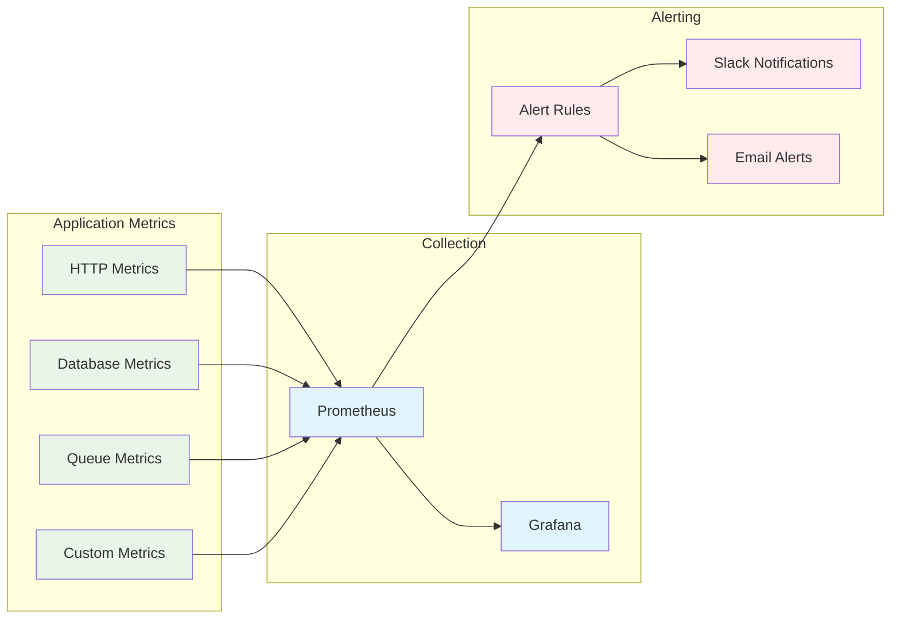

### Logging Strategy

- **Structured Logging**: JSON-formatted logs with correlation IDs
- **Tenant Context**: All logs include tenant information for debugging
- **Audit Trail**: Complete audit trail for compliance and security
- **Error Tracking**: Comprehensive error logging with stack traces

## 🚀 Deployment Architecture

### Container Strategy

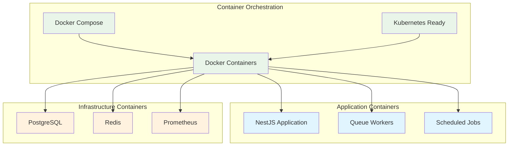

This architecture provides a solid foundation for building scalable, secure, and maintainable multi-tenant SaaS applications while maintaining clear separation of concerns and following industry best practices.