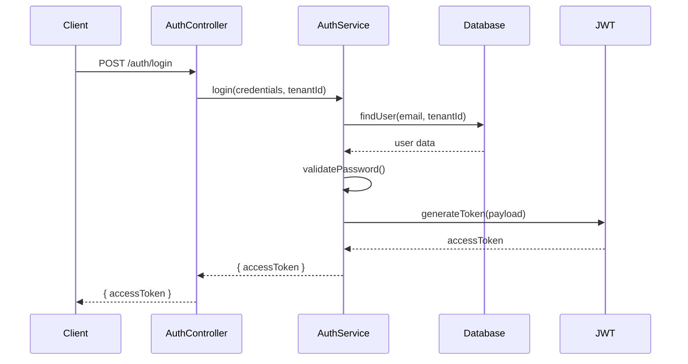
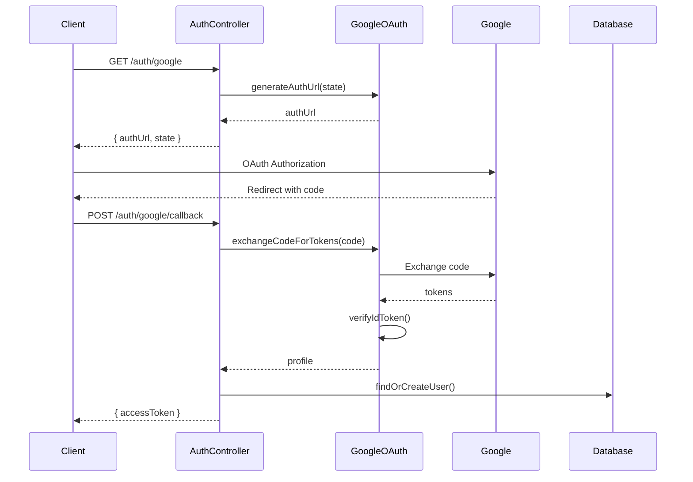

# Authentication Module

## Purpose

The Authentication module provides comprehensive authentication and authorization services for the multi-tenant NestJS application. It handles user authentication through multiple methods (password-based and Google OAuth), JWT token management, role-based access control (RBAC), and security measures including rate limiting and audit logging.

## Key Features

- **Multi-Method Authentication**: Supports both password-based and Google OAuth authentication
- **JWT Token Management**: Secure token generation, validation, and refresh
- **Multi-Tenant Security**: Tenant-isolated authentication with cross-tenant protection
- **Role-Based Access Control**: Comprehensive RBAC system with permissions and roles
- **Rate Limiting**: Advanced rate limiting for OAuth operations and general authentication
- **Audit Logging**: Comprehensive audit trail for all authentication events
- **Account Linking**: Ability to link/unlink Google accounts to existing user accounts
- **Security Measures**: CSRF protection, state validation, and comprehensive error handling

## Dependencies

### Internal Dependencies
- **Database Module**: For user data persistence and tenant isolation
- **Tenant Module**: For tenant context management and isolation
- **Common Module**: For shared guards, decorators, and interceptors

### External Dependencies
- **@nestjs/jwt**: JWT token generation and validation
- **@nestjs/throttler**: Rate limiting functionality
- **google-auth-library**: Google OAuth integration
- **bcrypt**: Password hashing and validation
- **ioredis**: Redis integration for rate limiting and session management

## Quick Start

### Basic Password Authentication

```typescript
import { AuthService } from '@/auth';

// Login with email and password
const result = await authService.login({
  email: 'user@example.com',
  password: 'securePassword'
}, 'tenant-id');

console.log(result.accessToken); // JWT token
```

### Google OAuth Authentication

```typescript
import { GoogleOAuthService } from '@/auth/services';

// Generate OAuth URL
const authUrl = googleOAuthService.generateAuthUrl('csrf-state');

// Exchange code for tokens
const tokens = await googleOAuthService.exchangeCodeForTokens('auth-code');

// Verify ID token
const profile = await googleOAuthService.verifyIdToken(tokens.idToken);
```

### Using Authentication Guards

```typescript
import { Controller, Get, UseGuards } from '@nestjs/common';
import { JwtAuthGuard } from '@/auth/guards';
import { CurrentUser } from '@/auth/decorators';

@Controller('protected')
@UseGuards(JwtAuthGuard)
export class ProtectedController {
  @Get('profile')
  getProfile(@CurrentUser() user: User) {
    return user;
  }
}
```

## Architecture Overview

### Core Components

1. **AuthController**: Main authentication endpoints
2. **AuthService**: Core authentication logic
3. **GoogleAuthService**: Google OAuth integration
4. **GoogleOAuthService**: Google OAuth client operations
5. **JwtAuthGuard**: JWT token validation guard
6. **Rate Limiting Services**: OAuth-specific rate limiting
7. **Audit Services**: Authentication event logging

### Authentication Flow



### Google OAuth Flow



## Design Patterns

### Repository Pattern
The module uses the repository pattern through Prisma service for data access, ensuring clean separation between business logic and data persistence.

### Guard Pattern
Authentication and authorization are implemented using NestJS guards, providing declarative security that can be applied at the controller or method level.

### Factory Pattern
Error handling uses factory patterns to create consistent error responses across different authentication scenarios.

### Interceptor Pattern
Audit logging is implemented using interceptors, automatically capturing authentication events without cluttering business logic.

## Integration Points

### Database Integration
- User authentication data stored in tenant-isolated tables
- Role and permission data managed through RBAC tables
- Audit logs stored for compliance and security monitoring

### Tenant Module Integration
- Tenant context automatically applied to all authentication operations
- Cross-tenant access prevention through middleware and guards
- Tenant-specific configuration for OAuth providers

### Common Module Integration
- Shared guards for permission checking
- Common decorators for extracting user and tenant information
- Global exception filters for consistent error handling

## Security Considerations

### Multi-Tenant Security
- All authentication operations are tenant-isolated
- JWT tokens include tenant ID validation
- Cross-tenant access is prevented at the guard level

### OAuth Security
- CSRF protection through state parameter validation
- Rate limiting on OAuth endpoints to prevent abuse
- Comprehensive audit logging for OAuth operations

### Password Security
- Passwords hashed using bcrypt with appropriate salt rounds
- Rate limiting on login attempts
- Account lockout mechanisms (configurable)

### Token Security
- JWT tokens include expiration times
- Tokens validated on every request
- Tenant ID validation prevents cross-tenant token usage

## Configuration

### Environment Variables

```bash
# JWT Configuration
JWT_SECRET=your-jwt-secret-key
JWT_EXPIRES_IN=1h

# Google OAuth Configuration
GOOGLE_CLIENT_ID=your-google-client-id
GOOGLE_CLIENT_SECRET=your-google-client-secret
GOOGLE_CALLBACK_URL=http://localhost:3000/auth/google/callback

# Rate Limiting Configuration
GOOGLE_OAUTH_IP_INITIATE_MAX_REQUESTS=10
GOOGLE_OAUTH_IP_CALLBACK_MAX_REQUESTS=15
GOOGLE_OAUTH_TENANT_AUTH_MAX_REQUESTS=50

# Redis Configuration (for rate limiting)
REDIS_HOST=localhost
REDIS_PORT=6379
REDIS_PASSWORD=your-redis-password
```

### Module Configuration

The auth module is configured as a global module and automatically imports required dependencies:

```typescript
@Global()
@Module({
  imports: [
    DatabaseModule,
    TenantModule,
    GoogleAuthMetricsModule,
    JwtModule.registerAsync({
      imports: [ConfigModule],
      global: true,
      useFactory: (configService: ConfigService) => ({
        secret: configService.get<string>('config.jwt.secret'),
        signOptions: {
          expiresIn: configService.get<string>('config.jwt.expiresIn'),
        },
      }),
      inject: [ConfigService],
    }),
  ],
  // ... controllers and providers
})
export class AuthModule {}
```

## Testing

### Unit Testing
All services and guards include comprehensive unit tests with mocked dependencies.

### Integration Testing
Integration tests cover the complete authentication flows including database interactions.

### E2E Testing
End-to-end tests validate the complete authentication workflows from HTTP requests to database persistence.

## Performance Considerations

### Rate Limiting
- Redis-based rate limiting for scalability
- Different limits for different operation types
- Graceful degradation when rate limiting service is unavailable

### Token Validation
- Efficient JWT validation with caching
- Database queries optimized with proper indexing
- User data cached during request lifecycle

### OAuth Operations
- State management using Redis for scalability
- Efficient token exchange with Google APIs
- Comprehensive error handling for external API failures

## Monitoring and Observability

### Metrics
- Authentication success/failure rates
- OAuth operation timing and success rates
- Rate limiting effectiveness metrics
- Token validation performance metrics

### Logging
- Comprehensive audit logging for all authentication events
- Structured logging with correlation IDs
- Security event logging for monitoring and alerting

### Health Checks
- OAuth provider connectivity checks
- Database connectivity validation
- Redis connectivity for rate limiting

## Common Use Cases

### Standard User Login
```typescript
// POST /auth/login
{
  "email": "user@example.com",
  "password": "securePassword"
}
```

### Google OAuth Login
```typescript
// 1. GET /auth/google (with x-tenant-id header)
// 2. User completes OAuth flow
// 3. POST /auth/google/callback
{
  "code": "oauth-authorization-code",
  "state": "csrf-protection-state",
  "tenantId": "tenant-id"
}
```

### Account Linking
```typescript
// 1. GET /auth/google/link (authenticated)
// 2. User completes OAuth flow
// 3. POST /auth/google/link/callback (authenticated)
{
  "code": "oauth-authorization-code",
  "state": "csrf-protection-state"
}
```

### Permission-Protected Endpoints
```typescript
@Controller('admin')
@UseGuards(JwtAuthGuard, PermissionsGuard)
export class AdminController {
  @Get('users')
  @Permissions('read:users')
  getUsers() {
    // Only accessible with 'read:users' permission
  }
}
```