# Authentication Architecture

## Overview

The authentication module implements a comprehensive security architecture that supports multiple authentication methods, role-based access control, and multi-tenant isolation. The architecture is designed for scalability, security, and maintainability.

## Core Architecture Components

### 1. Authentication Layer

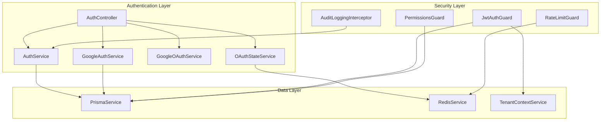

### 2. Service Architecture

#### AuthService
- **Purpose**: Core authentication logic for password-based authentication
- **Responsibilities**:
  - User credential validation
  - Password verification using bcrypt
  - JWT token generation
  - Tenant-scoped user lookup

#### GoogleAuthService
- **Purpose**: Google OAuth integration and user management
- **Responsibilities**:
  - Google account authentication
  - Account linking/unlinking
  - User creation from Google profiles
  - Authentication method management

#### GoogleOAuthService
- **Purpose**: Google OAuth client operations
- **Responsibilities**:
  - OAuth URL generation
  - Authorization code exchange
  - ID token verification
  - Google API communication

#### OAuthStateService
- **Purpose**: CSRF protection for OAuth flows
- **Responsibilities**:
  - State parameter generation
  - State validation
  - User context association
  - Redis-based state storage

## Authentication Flows

### 1. Password Authentication Flow

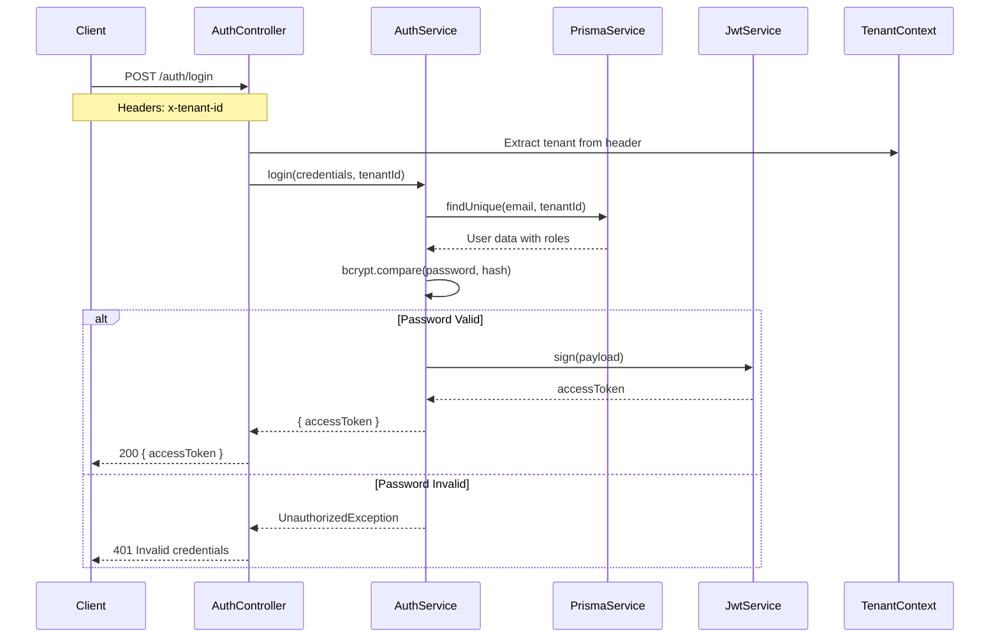

### 2. Google OAuth Authentication Flow

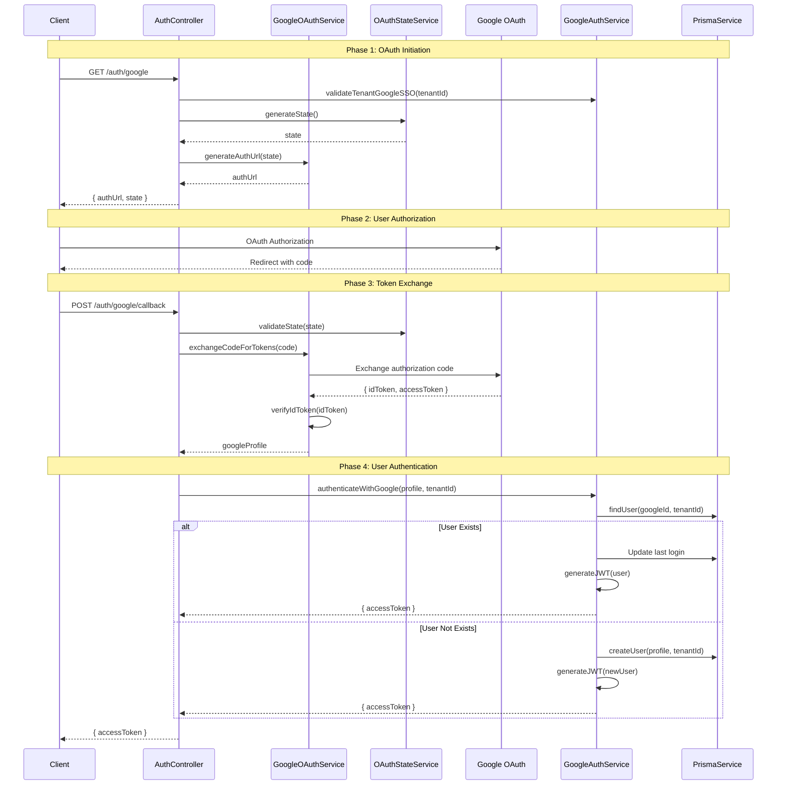

### 3. Account Linking Flow

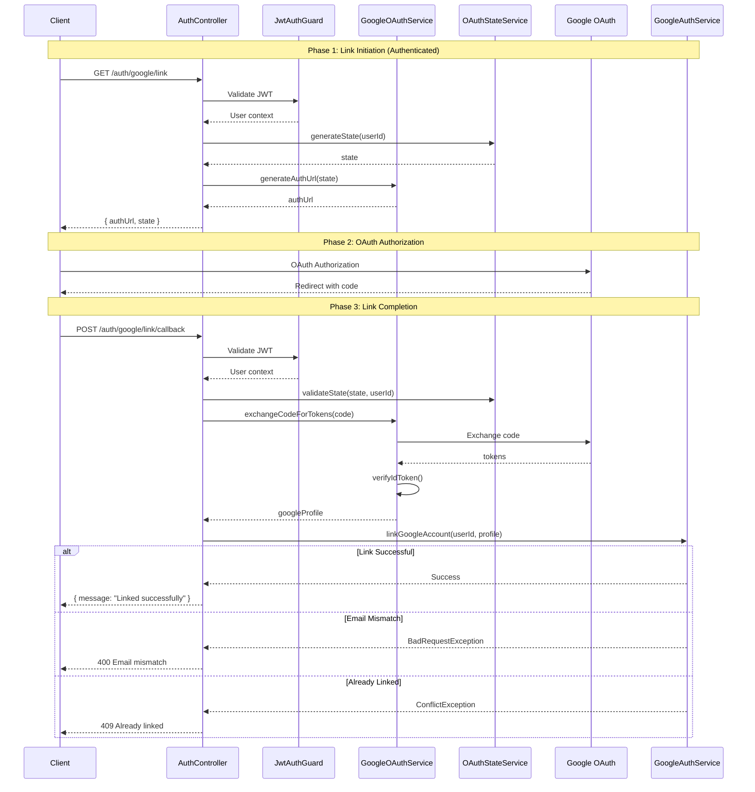

## Security Architecture

### 1. Multi-Tenant Security

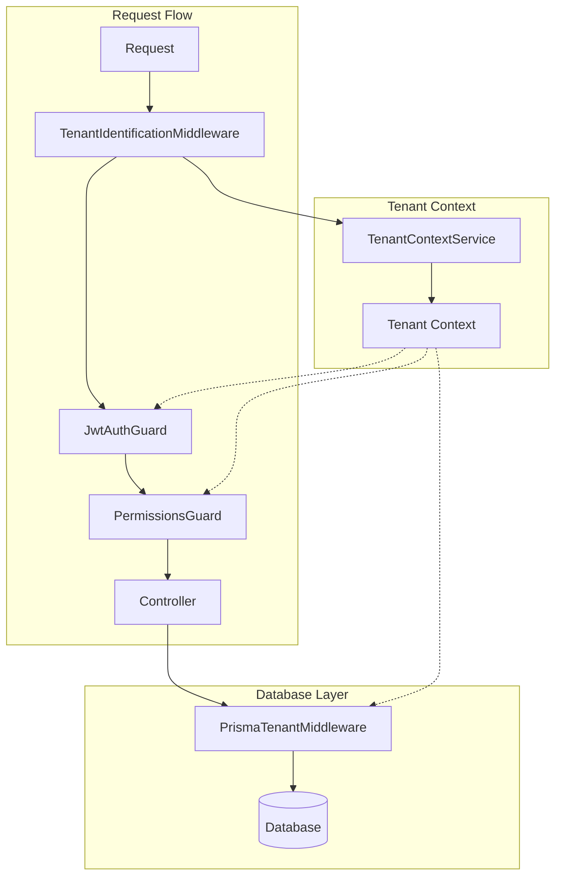

### 2. JWT Token Validation

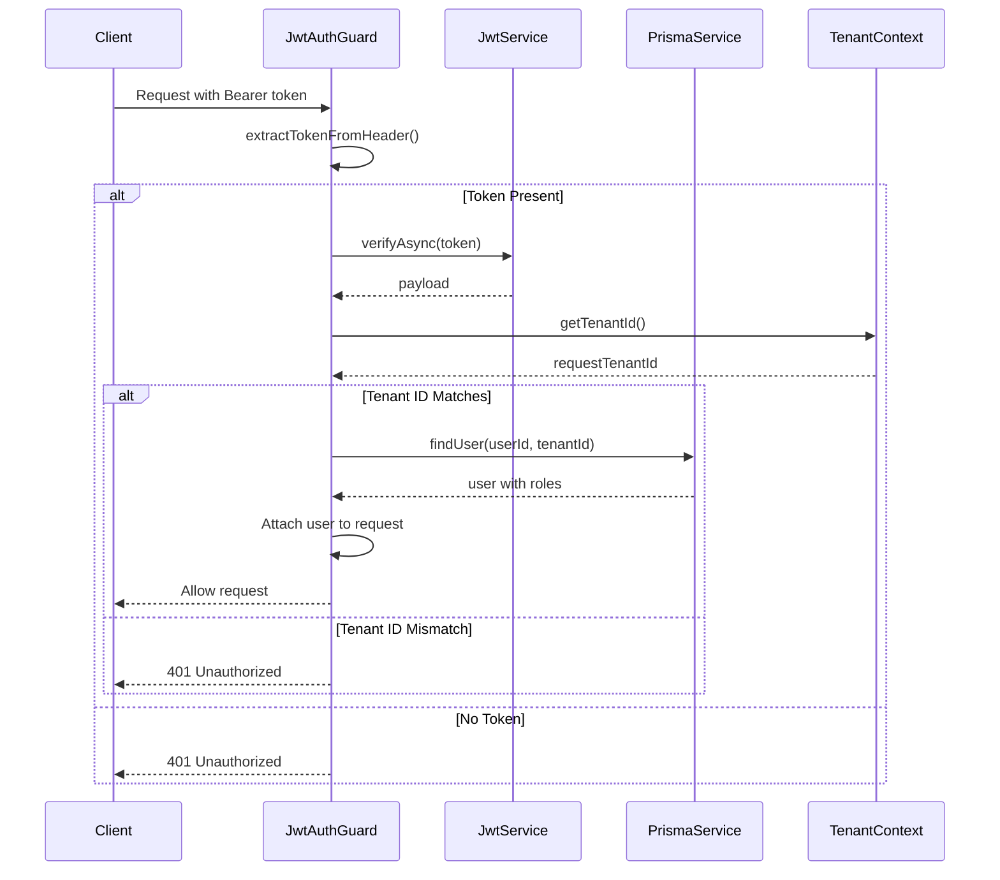

### 3. Permission-Based Authorization

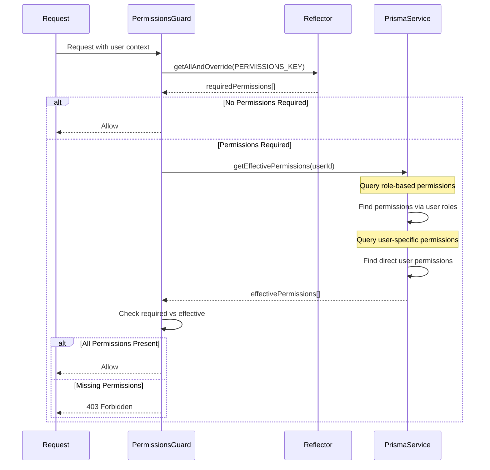

## Rate Limiting Architecture

### 1. Multi-Level Rate Limiting

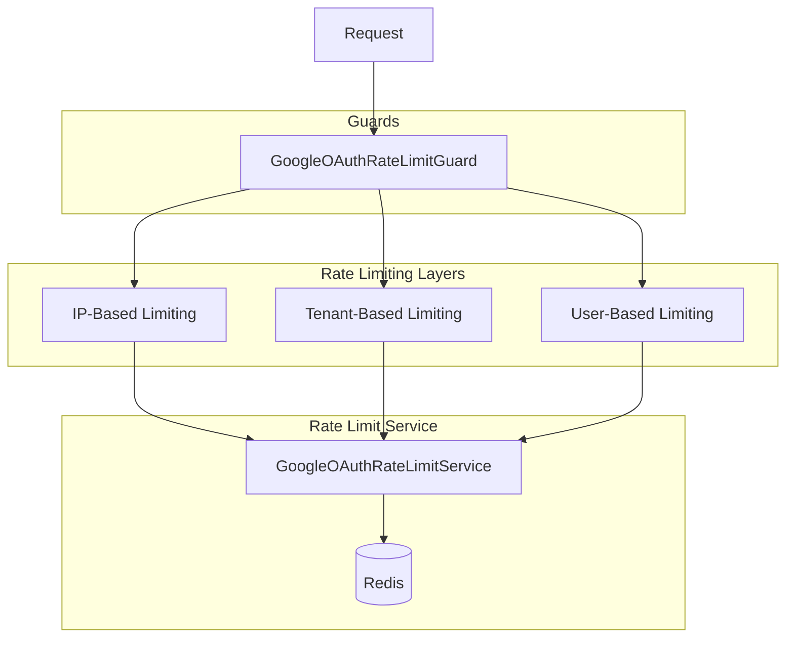

### 2. Rate Limiting Flow

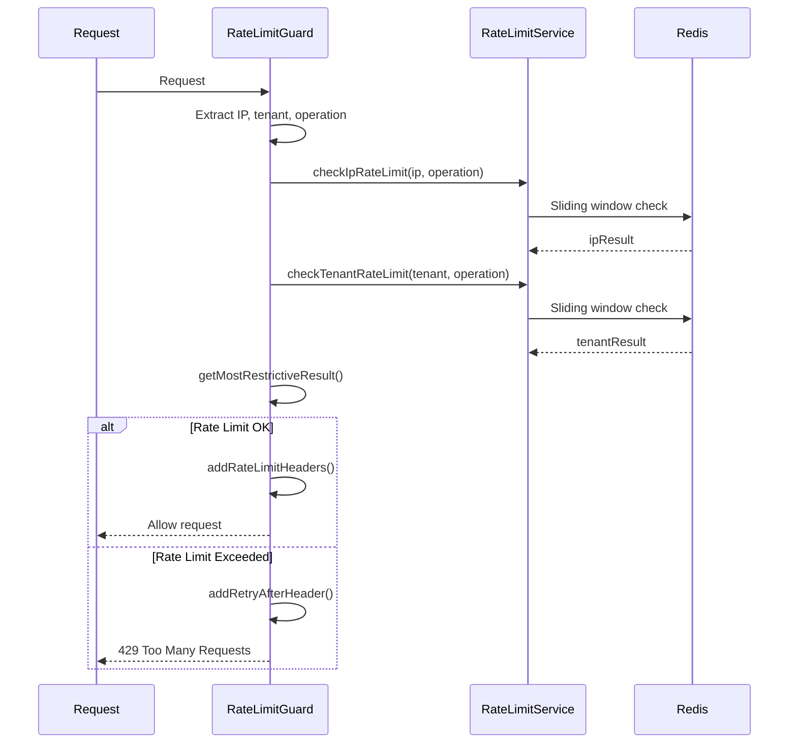

## Audit Logging Architecture

### 1. Audit Flow

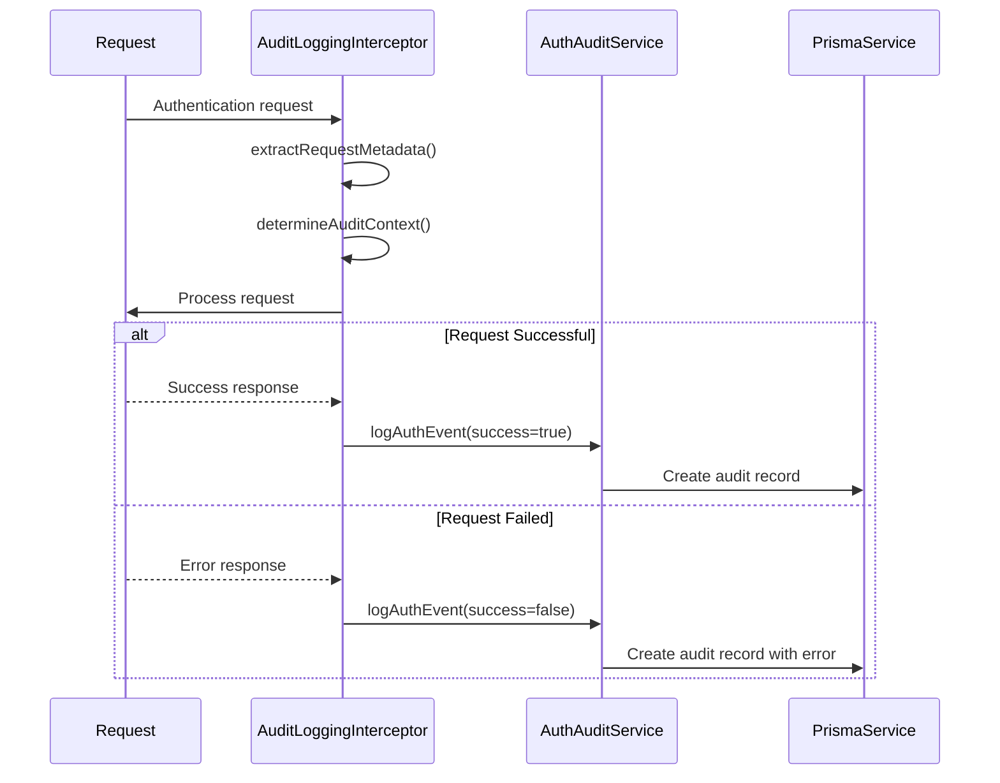

### 2. Audit Data Structure

```typescript
interface AuthAuditEvent {
  userId: string;
  tenantId: string;
  action: 'password_login' | 'google_login' | 'google_link' | 'google_settings_update';
  authMethod: 'password' | 'google' | 'admin';
  success: boolean;
  ipAddress: string;
  userAgent: string;
  errorCode?: string;
  errorMessage?: string;
  metadata: {
    requestId: string;
    path: string;
    method: string;
    duration: number;
    timestamp: string;
    [key: string]: any;
  };
}
```

## Data Models and Relationships

### 1. Authentication Data Model

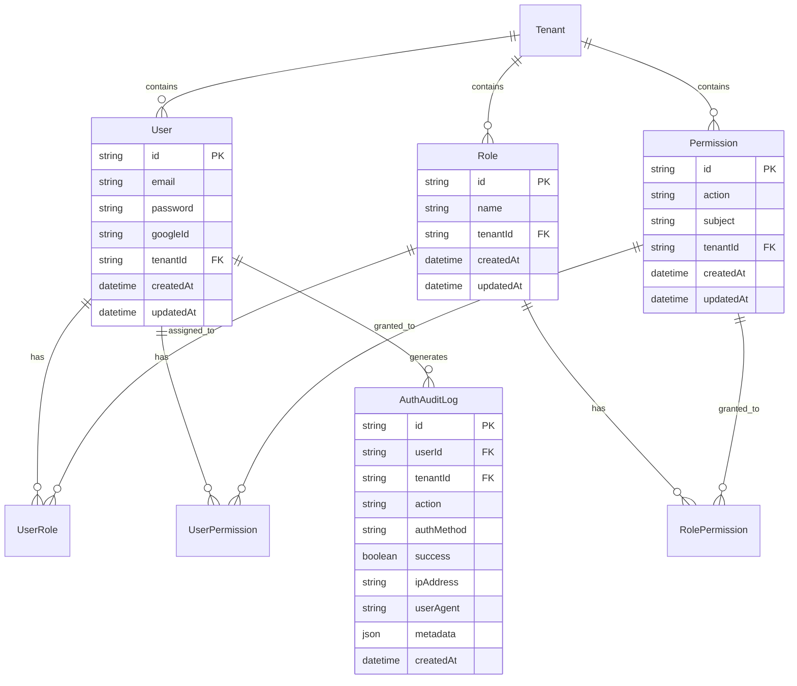

## Configuration Architecture

### 1. Configuration Layers

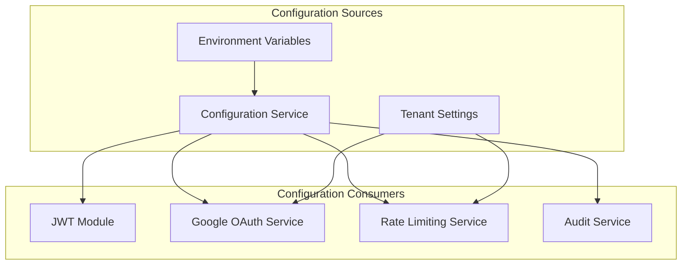

### 2. Configuration Schema

```typescript
interface AuthConfiguration {
  jwt: {
    secret: string;
    expiresIn: string;
  };
  google: {
    clientId: string;
    clientSecret: string;
    callbackUrl: string;
  };
  rateLimiting: {
    oauth: {
      ip: {
        initiate: { windowMs: number; maxRequests: number };
        callback: { windowMs: number; maxRequests: number };
        linking: { windowMs: number; maxRequests: number };
      };
      tenant: {
        auth: { windowMs: number; maxRequests: number };
        linking: { windowMs: number; maxRequests: number };
      };
    };
  };
  redis: {
    host: string;
    port: number;
    password?: string;
  };
}
```

## Error Handling Architecture

### 1. Error Flow

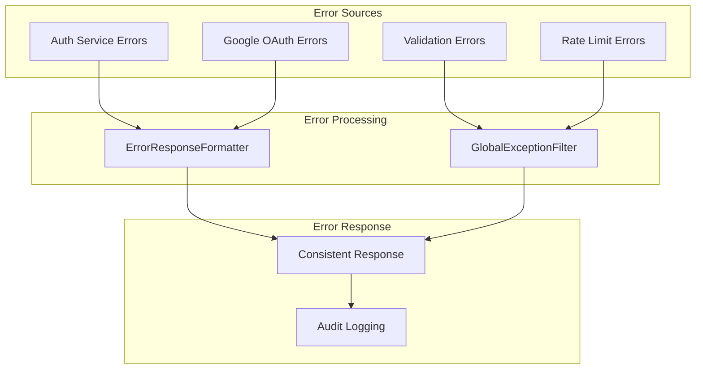

### 2. Error Types and Handling

```typescript
// Custom Error Types
class GoogleOAuthError extends Error {
  constructor(message: string, public code: string) {
    super(message);
  }
}

class AccountLinkingError extends Error {
  constructor(message: string, public reason: string) {
    super(message);
  }
}

// Error Response Format
interface ErrorResponse {
  statusCode: number;
  message: string;
  error: string;
  timestamp: string;
  path: string;
  correlationId?: string;
}
```

## Performance Considerations

### 1. Caching Strategy

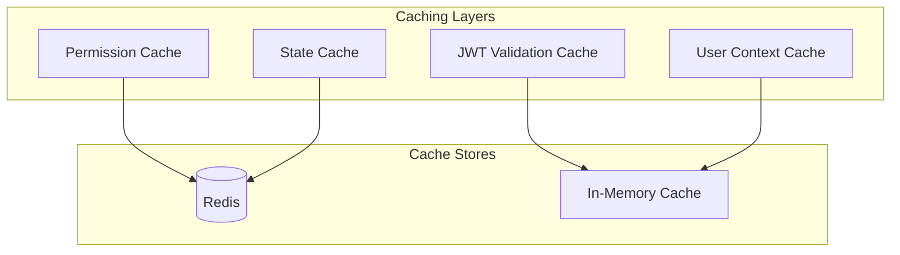

### 2. Database Optimization

- **Indexes**: Composite indexes on (email, tenantId), (googleId, tenantId)
- **Connection Pooling**: Prisma connection pooling for scalability
- **Query Optimization**: Efficient joins for role/permission queries
- **Tenant Isolation**: Automatic tenant filtering at middleware level

## Monitoring and Observability

### 1. Metrics Collection

```typescript
interface AuthMetrics {
  authentication: {
    loginAttempts: Counter;
    loginSuccesses: Counter;
    loginFailures: Counter;
    oauthAttempts: Counter;
    oauthSuccesses: Counter;
    oauthFailures: Counter;
  };
  performance: {
    authenticationDuration: Histogram;
    tokenValidationDuration: Histogram;
    permissionCheckDuration: Histogram;
  };
  security: {
    rateLimitHits: Counter;
    suspiciousActivity: Counter;
    crossTenantAttempts: Counter;
  };
}
```

### 2. Health Checks

```typescript
interface AuthHealthChecks {
  database: boolean;
  redis: boolean;
  googleOAuth: boolean;
  jwtValidation: boolean;
}
```

This architecture provides a comprehensive, secure, and scalable authentication system that supports multiple authentication methods while maintaining strict multi-tenant isolation and comprehensive audit trails.