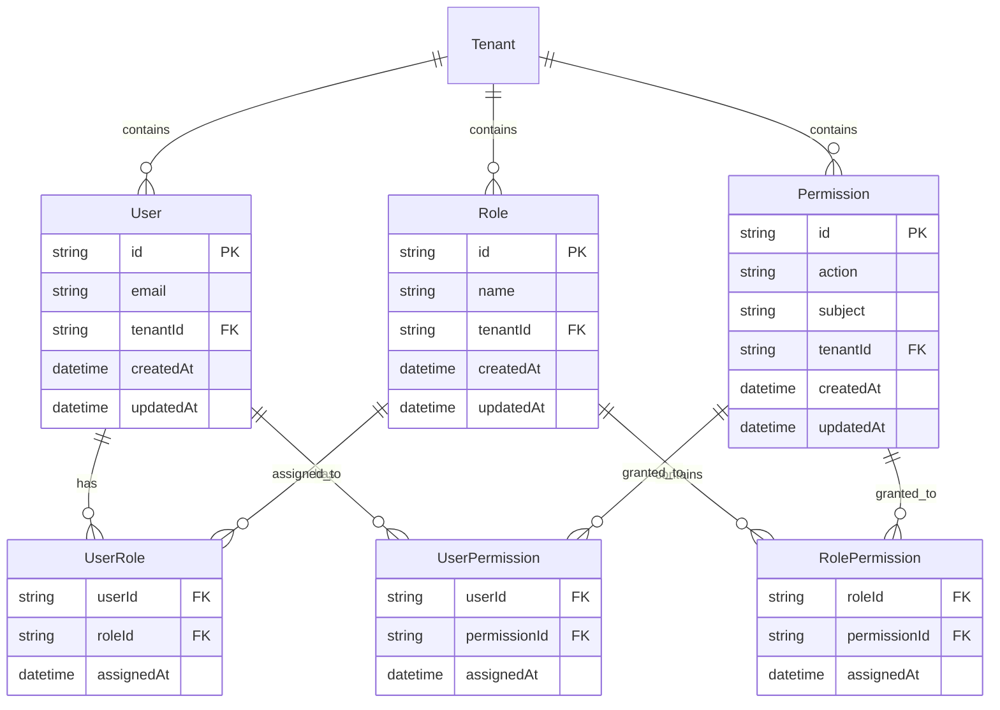
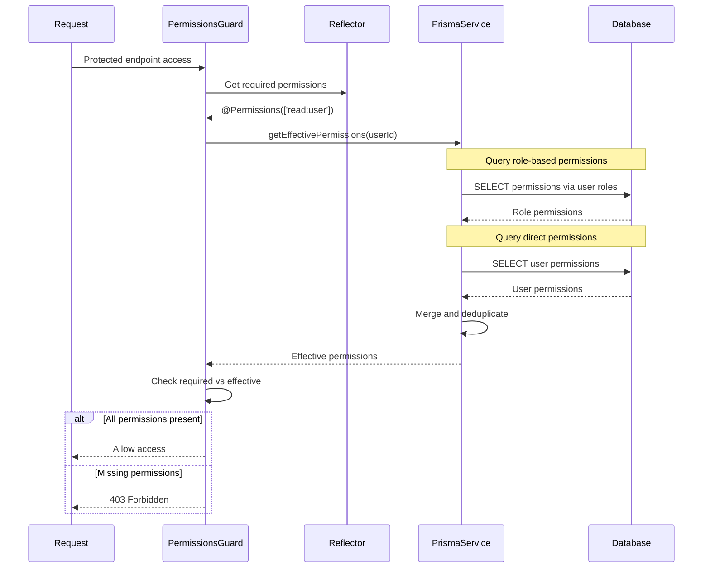
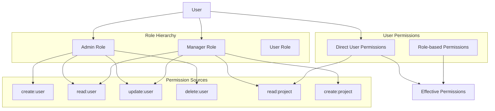

# Role-Based Access Control (RBAC) System

## Overview

The RBAC system provides comprehensive authorization capabilities for the multi-tenant NestJS application. It implements a flexible permission model that supports both role-based and user-specific permissions, with complete tenant isolation.

## Core Concepts

### 1. Permissions

Permissions define what actions can be performed on specific resources. They follow the format `action:subject`.

**Structure:**
- **Action**: The operation being performed (e.g., `read`, `write`, `create`, `delete`)
- **Subject**: The resource or entity (e.g., `user`, `project`, `role`, `permission`)

**Examples:**
- `read:user` - Can view user information
- `create:project` - Can create new projects
- `delete:role` - Can delete roles
- `update:permission` - Can modify permissions

### 2. Roles

Roles are collections of permissions that can be assigned to users. They provide a way to group related permissions together for easier management.

**Characteristics:**
- Tenant-scoped (each tenant has its own roles)
- Can contain multiple permissions
- Can be assigned to multiple users
- Support hierarchical permission inheritance

### 3. Users

Users can have permissions through two mechanisms:
- **Role-based permissions**: Inherited from assigned roles
- **Direct permissions**: Granted directly to the user

**Effective Permissions**: The combination of role-based and direct permissions

## Data Model

### Entity Relationships



### Database Schema

```sql
-- Permissions table
CREATE TABLE permissions (
    id UUID PRIMARY KEY DEFAULT gen_random_uuid(),
    action VARCHAR(50) NOT NULL,
    subject VARCHAR(50) NOT NULL,
    tenant_id UUID NOT NULL REFERENCES tenants(id) ON DELETE CASCADE,
    created_at TIMESTAMP DEFAULT NOW(),
    updated_at TIMESTAMP DEFAULT NOW(),
    UNIQUE(action, subject, tenant_id)
);

-- Roles table
CREATE TABLE roles (
    id UUID PRIMARY KEY DEFAULT gen_random_uuid(),
    name VARCHAR(100) NOT NULL,
    tenant_id UUID NOT NULL REFERENCES tenants(id) ON DELETE CASCADE,
    created_at TIMESTAMP DEFAULT NOW(),
    updated_at TIMESTAMP DEFAULT NOW(),
    UNIQUE(name, tenant_id)
);

-- User-Role junction table
CREATE TABLE user_roles (
    user_id UUID NOT NULL REFERENCES users(id) ON DELETE CASCADE,
    role_id UUID NOT NULL REFERENCES roles(id) ON DELETE CASCADE,
    assigned_at TIMESTAMP DEFAULT NOW(),
    PRIMARY KEY (user_id, role_id)
);

-- Role-Permission junction table
CREATE TABLE role_permissions (
    role_id UUID NOT NULL REFERENCES roles(id) ON DELETE CASCADE,
    permission_id UUID NOT NULL REFERENCES permissions(id) ON DELETE CASCADE,
    assigned_at TIMESTAMP DEFAULT NOW(),
    PRIMARY KEY (role_id, permission_id)
);

-- User-Permission junction table (direct permissions)
CREATE TABLE user_permissions (
    user_id UUID NOT NULL REFERENCES users(id) ON DELETE CASCADE,
    permission_id UUID NOT NULL REFERENCES permissions(id) ON DELETE CASCADE,
    assigned_at TIMESTAMP DEFAULT NOW(),
    PRIMARY KEY (user_id, permission_id)
);
```

## Permission System Architecture

### 1. Permission Resolution Flow



### 2. Permission Inheritance



## API Reference

### Permission Management

#### GET /permissions

List all permissions in the current tenant.

**Authentication**: JWT Required  
**Permission**: `read:permission`

**Response:**
```json
[
  {
    "id": "perm-123",
    "action": "read",
    "subject": "user",
    "tenantId": "tenant-123",
    "createdAt": "2023-01-01T00:00:00Z",
    "updatedAt": "2023-01-01T00:00:00Z"
  }
]
```

#### POST /permissions

Create a new permission.

**Authentication**: JWT Required  
**Permission**: `create:permission`

**Request Body:**
```json
{
  "action": "read",
  "subject": "user"
}
```

**Response:**
```json
{
  "id": "perm-123",
  "action": "read",
  "subject": "user",
  "tenantId": "tenant-123",
  "createdAt": "2023-01-01T00:00:00Z",
  "updatedAt": "2023-01-01T00:00:00Z"
}
```

#### DELETE /permissions/:id

Delete a permission and remove it from all roles and users.

**Authentication**: JWT Required  
**Permission**: `delete:permission`

**Response:**
```json
{
  "message": "Permission deleted successfully"
}
```

### Role Management

#### GET /roles

List all roles in the current tenant with their permissions.

**Authentication**: JWT Required  
**Permission**: `read:role`

**Response:**
```json
[
  {
    "id": "role-123",
    "name": "Admin",
    "tenantId": "tenant-123",
    "permissions": [
      {
        "permission": {
          "id": "perm-123",
          "action": "read",
          "subject": "user"
        }
      }
    ],
    "createdAt": "2023-01-01T00:00:00Z",
    "updatedAt": "2023-01-01T00:00:00Z"
  }
]
```

#### GET /roles/:id

Get a specific role with its permissions.

**Authentication**: JWT Required  
**Permission**: `read:role`

**Response:**
```json
{
  "id": "role-123",
  "name": "Admin",
  "tenantId": "tenant-123",
  "permissions": [
    {
      "permission": {
        "id": "perm-123",
        "action": "read",
        "subject": "user"
      }
    }
  ],
  "createdAt": "2023-01-01T00:00:00Z",
  "updatedAt": "2023-01-01T00:00:00Z"
}
```

#### POST /roles

Create a new role.

**Authentication**: JWT Required  
**Permission**: `create:role`

**Request Body:**
```json
{
  "name": "Manager"
}
```

**Response:**
```json
{
  "id": "role-456",
  "name": "Manager",
  "tenantId": "tenant-123",
  "permissions": [],
  "createdAt": "2023-01-01T00:00:00Z",
  "updatedAt": "2023-01-01T00:00:00Z"
}
```

#### PUT /roles/:id

Update role name.

**Authentication**: JWT Required  
**Permission**: `update:role`

**Request Body:**
```json
{
  "name": "Senior Manager"
}
```

#### PUT /roles/:id/permissions

Replace all permissions for a role.

**Authentication**: JWT Required  
**Permission**: `update:role`

**Request Body:**
```json
{
  "permissionIds": ["perm-123", "perm-456", "perm-789"]
}
```

**Response:**
```json
{
  "id": "role-123",
  "name": "Admin",
  "permissions": [
    {
      "permission": {
        "id": "perm-123",
        "action": "read",
        "subject": "user"
      }
    }
  ]
}
```

#### DELETE /roles/:id

Delete a role and remove it from all users.

**Authentication**: JWT Required  
**Permission**: `delete:role`

**Response:**
```json
{
  "message": "Role deleted successfully"
}
```

### User Permission Management

#### GET /users/:id/permissions

Get all effective permissions for a user (role-based + direct).

**Authentication**: JWT Required  
**Permission**: `read:user`

**Response:**
```json
{
  "userId": "user-123",
  "effectivePermissions": [
    "read:user",
    "create:user",
    "update:user",
    "read:project",
    "create:project"
  ],
  "roleBasedPermissions": [
    "read:user",
    "create:user",
    "update:user"
  ],
  "directPermissions": [
    "read:project",
    "create:project"
  ]
}
```

#### PUT /users/:id/roles

Assign roles to a user (replaces existing roles).

**Authentication**: JWT Required  
**Permission**: `update:user`

**Request Body:**
```json
{
  "roleIds": ["role-123", "role-456"]
}
```

#### PUT /users/:id/permissions

Assign direct permissions to a user (replaces existing direct permissions).

**Authentication**: JWT Required  
**Permission**: `update:user`

**Request Body:**
```json
{
  "permissionIds": ["perm-123", "perm-456"]
}
```

## Implementation Examples

### 1. Using Permission Decorators

```typescript
import { Controller, Get, Post, UseGuards } from '@nestjs/common';
import { JwtAuthGuard } from '@/auth/guards';
import { PermissionsGuard } from '@/common/guards';
import { Permissions } from '@/common/decorators';

@Controller('projects')
@UseGuards(JwtAuthGuard, PermissionsGuard)
export class ProjectController {
  // Single permission required
  @Get()
  @Permissions('read:project')
  getProjects() {
    return this.projectService.findAll();
  }

  // Multiple permissions required (ALL must be present)
  @Post()
  @Permissions('create:project', 'read:user')
  createProject() {
    return this.projectService.create();
  }

  // Admin-only endpoint
  @Get('admin/stats')
  @Permissions('admin:project')
  getProjectStats() {
    return this.projectService.getStats();
  }
}
```

### 2. Custom Permission Checking

```typescript
import { Injectable } from '@nestjs/common';
import { PrismaService } from '@/database';

@Injectable()
export class CustomPermissionService {
  constructor(private prisma: PrismaService) {}

  async checkUserPermission(
    userId: string,
    requiredPermission: string
  ): Promise<boolean> {
    const effectivePermissions = await this.getEffectivePermissions(userId);
    return effectivePermissions.includes(requiredPermission);
  }

  async checkMultiplePermissions(
    userId: string,
    requiredPermissions: string[],
    requireAll: boolean = true
  ): Promise<boolean> {
    const effectivePermissions = await this.getEffectivePermissions(userId);
    
    if (requireAll) {
      return requiredPermissions.every(perm => 
        effectivePermissions.includes(perm)
      );
    } else {
      return requiredPermissions.some(perm => 
        effectivePermissions.includes(perm)
      );
    }
  }

  private async getEffectivePermissions(userId: string): Promise<string[]> {
    // Get role-based permissions
    const rolePermissions = await this.prisma.permission.findMany({
      where: {
        roles: {
          some: {
            role: {
              users: {
                some: { userId }
              }
            }
          }
        }
      },
      select: { action: true, subject: true }
    });

    // Get direct user permissions
    const userPermissions = await this.prisma.permission.findMany({
      where: {
        users: {
          some: { userId }
        }
      },
      select: { action: true, subject: true }
    });

    // Combine and format permissions
    const allPermissions = [...rolePermissions, ...userPermissions];
    const permissionStrings = allPermissions.map(p => `${p.action}:${p.subject}`);
    
    // Remove duplicates
    return [...new Set(permissionStrings)];
  }
}
```

### 3. Dynamic Permission Checking in Services

```typescript
import { Injectable, ForbiddenException } from '@nestjs/common';
import { CustomPermissionService } from './custom-permission.service';

@Injectable()
export class ProjectService {
  constructor(
    private permissionService: CustomPermissionService
  ) {}

  async getProject(projectId: string, userId: string) {
    // Check if user can read projects
    const canRead = await this.permissionService.checkUserPermission(
      userId,
      'read:project'
    );

    if (!canRead) {
      throw new ForbiddenException('Insufficient permissions to read projects');
    }

    // Additional business logic for project ownership
    const project = await this.findProject(projectId);
    
    if (project.isPrivate && project.ownerId !== userId) {
      // Check if user has admin permissions for private projects
      const isAdmin = await this.permissionService.checkUserPermission(
        userId,
        'admin:project'
      );
      
      if (!isAdmin) {
        throw new ForbiddenException('Cannot access private project');
      }
    }

    return project;
  }
}
```

### 4. Role-Based UI Components

```typescript
// React component with permission-based rendering
import { usePermissions } from '@/hooks/usePermissions';

const ProjectManagement = () => {
  const { hasPermission, hasAnyPermission } = usePermissions();

  return (
    <div>
      <h1>Projects</h1>
      
      {/* Show create button only if user can create projects */}
      {hasPermission('create:project') && (
        <button onClick={createProject}>Create Project</button>
      )}
      
      {/* Show admin panel if user has any admin permissions */}
      {hasAnyPermission(['admin:project', 'admin:user']) && (
        <AdminPanel />
      )}
      
      {/* Show different content based on permissions */}
      {hasPermission('read:project') ? (
        <ProjectList />
      ) : (
        <div>You don't have permission to view projects</div>
      )}
    </div>
  );
};

// Custom hook for permission checking
const usePermissions = () => {
  const { user } = useAuth();
  
  const hasPermission = (permission: string): boolean => {
    return user?.permissions?.includes(permission) || false;
  };
  
  const hasAnyPermission = (permissions: string[]): boolean => {
    return permissions.some(permission => hasPermission(permission));
  };
  
  const hasAllPermissions = (permissions: string[]): boolean => {
    return permissions.every(permission => hasPermission(permission));
  };
  
  return { hasPermission, hasAnyPermission, hasAllPermissions };
};
```

## Common Permission Patterns

### 1. Standard CRUD Permissions

```typescript
// Resource-based CRUD permissions
const USER_PERMISSIONS = {
  READ: 'read:user',
  CREATE: 'create:user',
  UPDATE: 'update:user',
  DELETE: 'delete:user',
};

const PROJECT_PERMISSIONS = {
  READ: 'read:project',
  CREATE: 'create:project',
  UPDATE: 'update:project',
  DELETE: 'delete:project',
  ADMIN: 'admin:project',
};
```

### 2. Hierarchical Permissions

```typescript
// Admin permissions typically include all lower-level permissions
const PERMISSION_HIERARCHY = {
  'admin:user': ['read:user', 'create:user', 'update:user', 'delete:user'],
  'admin:project': ['read:project', 'create:project', 'update:project', 'delete:project'],
  'manager:project': ['read:project', 'create:project', 'update:project'],
  'viewer:project': ['read:project'],
};
```

### 3. Contextual Permissions

```typescript
// Permissions that depend on context (ownership, team membership, etc.)
const CONTEXTUAL_PERMISSIONS = {
  // Can update own profile
  'update:own:profile': (userId: string, targetUserId: string) => userId === targetUserId,
  
  // Can manage team projects
  'manage:team:project': async (userId: string, projectId: string) => {
    const project = await getProject(projectId);
    const userTeams = await getUserTeams(userId);
    return userTeams.includes(project.teamId);
  },
};
```

## Best Practices

### 1. Permission Naming Conventions

- Use lowercase actions: `read`, `create`, `update`, `delete`
- Use singular subjects: `user`, `project`, `role`, `permission`
- Be specific: `read:user:profile` vs `read:user:settings`
- Use consistent patterns across resources

### 2. Role Design

- **Principle of Least Privilege**: Grant minimum permissions needed
- **Role Hierarchy**: Design roles that build upon each other
- **Business-Aligned**: Roles should match business functions
- **Maintainable**: Avoid too many granular roles

### 3. Permission Granularity

- **Balance**: Not too broad, not too granular
- **Composable**: Permissions should work well together
- **Predictable**: Clear what each permission allows
- **Extensible**: Easy to add new permissions

### 4. Security Considerations

- **Tenant Isolation**: All permissions are tenant-scoped
- **Audit Trail**: Log permission changes and usage
- **Regular Review**: Periodically review and clean up permissions
- **Fail Secure**: Default to deny access when in doubt

## Troubleshooting

### Common Issues

1. **Permission Not Working**
   - Check if `PermissionsGuard` is applied
   - Verify permission format (`action:subject`)
   - Ensure user has the required permission

2. **Role Permissions Not Inherited**
   - Check user-role assignments
   - Verify role-permission assignments
   - Check for tenant isolation issues

3. **Cross-Tenant Permission Access**
   - Verify tenant context is properly set
   - Check database queries include tenant filtering
   - Ensure JWT tokens include correct tenant ID

### Debugging Queries

```sql
-- Check user's effective permissions
SELECT DISTINCT p.action, p.subject
FROM permissions p
LEFT JOIN role_permissions rp ON p.id = rp.permission_id
LEFT JOIN roles r ON rp.role_id = r.id
LEFT JOIN user_roles ur ON r.id = ur.role_id
LEFT JOIN user_permissions up ON p.id = up.permission_id
WHERE (ur.user_id = 'user-id' OR up.user_id = 'user-id')
  AND p.tenant_id = 'tenant-id';

-- Check role assignments for user
SELECT r.name, r.id
FROM roles r
JOIN user_roles ur ON r.id = ur.role_id
WHERE ur.user_id = 'user-id'
  AND r.tenant_id = 'tenant-id';

-- Check permissions for role
SELECT p.action, p.subject
FROM permissions p
JOIN role_permissions rp ON p.id = rp.permission_id
WHERE rp.role_id = 'role-id'
  AND p.tenant_id = 'tenant-id';
```

This comprehensive RBAC system provides flexible, secure, and maintainable authorization for multi-tenant applications while maintaining clear separation of concerns and following security best practices.