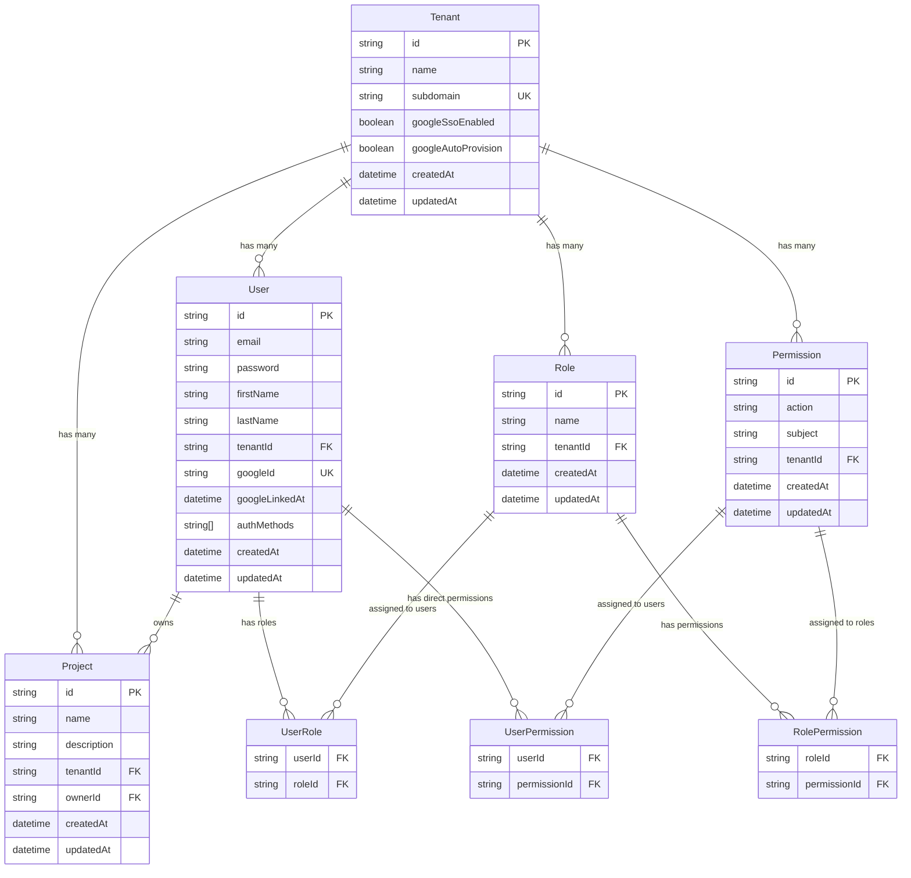
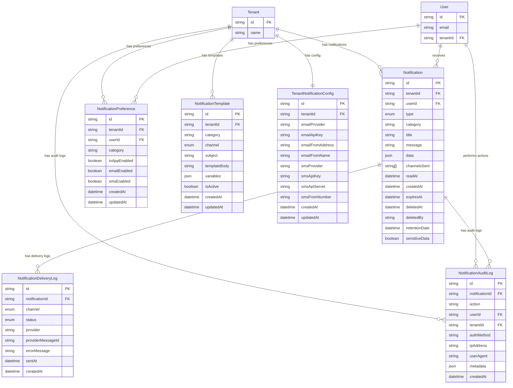
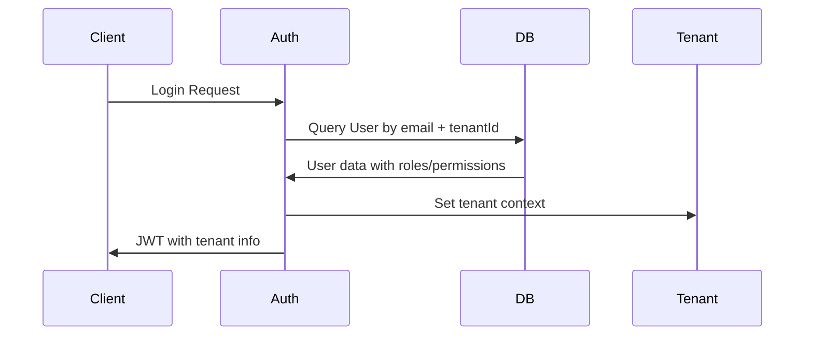
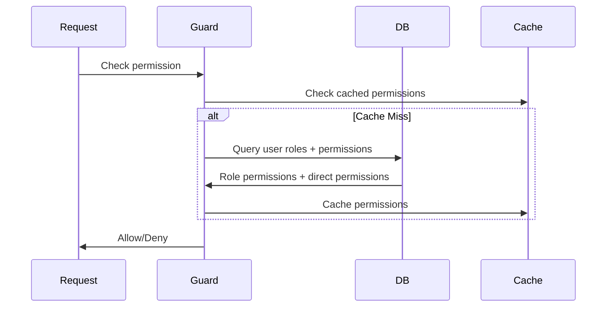
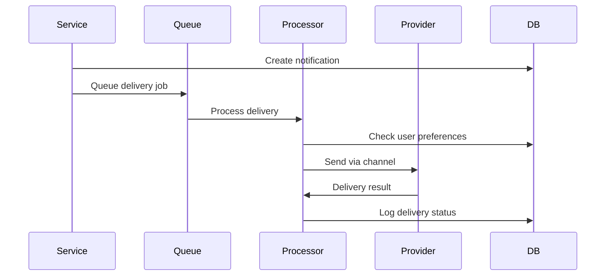

# Database Entity Relationships

## Overview

This document provides detailed entity relationship diagrams and explanations for all data models in the multi-tenant NestJS application.

## Core Entity Relationship Diagram



## Notification System Entity Relationships



## Detailed Entity Descriptions

### Core Entities

#### Tenant
**Purpose**: Root entity for multi-tenancy, isolates all data by organization.

**Key Relationships**:
- One-to-many with all tenant-scoped entities
- Cascade delete ensures complete tenant data removal

**Unique Constraints**:
- `subdomain`: Optional unique subdomain for tenant identification

**Indexes**:
- `googleSsoEnabled`: For efficient SSO configuration queries

#### User
**Purpose**: User accounts within tenants with support for multiple authentication methods.

**Key Relationships**:
- Belongs to exactly one tenant
- Many-to-many with roles (through UserRole)
- Many-to-many with permissions (through UserPermission)
- One-to-many with projects (as owner)

**Unique Constraints**:
- `(email, tenantId)`: Email unique within tenant
- `googleId`: Global unique Google ID

**Indexes**:
- `tenantId`: Primary tenant isolation index
- `authMethods`: GIN index for array queries

#### Role
**Purpose**: Named collections of permissions for role-based access control.

**Key Relationships**:
- Belongs to exactly one tenant
- Many-to-many with users (through UserRole)
- Many-to-many with permissions (through RolePermission)

**Unique Constraints**:
- `(name, tenantId)`: Role name unique within tenant

#### Permission
**Purpose**: Granular access control definitions using action-subject pattern.

**Key Relationships**:
- Belongs to exactly one tenant
- Many-to-many with roles (through RolePermission)
- Many-to-many with users (through UserPermission)

**Unique Constraints**:
- `(action, subject, tenantId)`: Permission unique within tenant

**Permission Pattern**:
- **Action**: `create`, `read`, `update`, `delete`
- **Subject**: `project`, `user`, `role`, `permission`

#### Project
**Purpose**: Business entities managed by users within tenants.

**Key Relationships**:
- Belongs to exactly one tenant
- Belongs to exactly one user (owner)

**Indexes**:
- `tenantId`: Tenant isolation
- `ownerId`: Owner-based queries

### Join Tables

#### UserRole
**Purpose**: Many-to-many relationship between users and roles.

**Composite Primary Key**: `(userId, roleId)`

**Cascade Behavior**: Deletes when user or role is deleted

#### RolePermission
**Purpose**: Many-to-many relationship between roles and permissions.

**Composite Primary Key**: `(roleId, permissionId)`

**Cascade Behavior**: Deletes when role or permission is deleted

#### UserPermission
**Purpose**: Direct permission assignments to users (overrides).

**Composite Primary Key**: `(userId, permissionId)`

**Cascade Behavior**: Deletes when user or permission is deleted

### Notification System Entities

#### Notification
**Purpose**: Individual notification messages sent to users.

**Key Features**:
- **Privacy Controls**: `sensitiveData` flag for GDPR compliance
- **Retention Management**: `retentionDate` for automatic cleanup
- **Soft Deletion**: `deletedAt` and `deletedBy` for audit trails
- **Multi-Channel**: `channelsSent` array tracks delivery channels

**Indexes**:
- `(tenantId, userId)`: User notifications within tenant
- `category`: Category-based filtering
- `createdAt`: Chronological ordering
- `deletedAt`: Soft deletion queries
- `retentionDate`: Cleanup operations
- `sensitiveData`: Privacy compliance queries

#### NotificationPreference
**Purpose**: User preferences for notification delivery per category.

**Key Features**:
- **Per-Category Control**: Granular control over notification types
- **Multi-Channel Support**: Separate toggles for in-app, email, SMS

**Unique Constraints**:
- `(tenantId, userId, category)`: One preference per user per category

#### NotificationDeliveryLog
**Purpose**: Audit trail for notification delivery attempts.

**Key Features**:
- **Provider Tracking**: Records which provider was used
- **Status Monitoring**: Tracks delivery success/failure
- **Error Logging**: Detailed error messages for troubleshooting

**Indexes**:
- `notificationId`: Link to parent notification
- `status`: Delivery status queries

#### NotificationTemplate
**Purpose**: Customizable templates for notification content.

**Key Features**:
- **Tenant-Specific**: Can be global or tenant-specific
- **Multi-Channel**: Separate templates per delivery channel
- **Variable Support**: JSON variables for dynamic content

**Indexes**:
- `(tenantId, category, channel)`: Template lookup
- `isActive`: Active template filtering

#### TenantNotificationConfig
**Purpose**: Tenant-specific notification provider configuration.

**Key Features**:
- **Provider Flexibility**: Support for multiple email/SMS providers
- **Secure Storage**: API keys and credentials per tenant
- **Custom Branding**: From addresses and names per tenant

**Unique Constraints**:
- `tenantId`: One configuration per tenant

#### NotificationAuditLog
**Purpose**: Comprehensive audit trail for notification operations.

**Key Features**:
- **Action Tracking**: Records all notification-related actions
- **User Context**: Tracks who performed actions
- **Security Context**: IP address and user agent logging
- **Metadata Storage**: Flexible JSON metadata for additional context

**Indexes**:
- `(tenantId, userId)`: User actions within tenant
- `notificationId`: Actions on specific notifications
- `action`: Action-based filtering
- `createdAt`: Chronological audit trails

## Data Flow Patterns

### User Authentication Flow



### Permission Resolution Flow



### Notification Delivery Flow



## Indexing Strategy

### Primary Indexes

```sql
-- Tenant isolation indexes (most critical)
CREATE INDEX idx_users_tenant_id ON users(tenant_id);
CREATE INDEX idx_roles_tenant_id ON roles(tenant_id);
CREATE INDEX idx_permissions_tenant_id ON permissions(tenant_id);
CREATE INDEX idx_projects_tenant_id ON projects(tenant_id);
CREATE INDEX idx_notifications_tenant_id ON notifications(tenant_id);

-- User-based indexes
CREATE INDEX idx_notifications_user_id ON notifications(user_id);
CREATE INDEX idx_projects_owner_id ON projects(owner_id);

-- Join table indexes
CREATE INDEX idx_user_roles_user_id ON user_roles(user_id);
CREATE INDEX idx_user_roles_role_id ON user_roles(role_id);
CREATE INDEX idx_role_permissions_role_id ON role_permissions(role_id);
CREATE INDEX idx_role_permissions_permission_id ON role_permissions(permission_id);
```

### Performance Indexes

```sql
-- Notification system performance
CREATE INDEX idx_notifications_created_at ON notifications(created_at DESC);
CREATE INDEX idx_notifications_category ON notifications(category);
CREATE INDEX idx_notifications_read_at ON notifications(read_at) WHERE read_at IS NULL;

-- Authentication indexes
CREATE INDEX idx_users_email_tenant ON users(email, tenant_id);
CREATE INDEX idx_users_google_id ON users(google_id) WHERE google_id IS NOT NULL;

-- Audit and compliance indexes
CREATE INDEX idx_notifications_retention_date ON notifications(retention_date) WHERE retention_date IS NOT NULL;
CREATE INDEX idx_notifications_deleted_at ON notifications(deleted_at) WHERE deleted_at IS NOT NULL;
CREATE INDEX idx_notification_audit_logs_created_at ON notification_audit_logs(created_at DESC);
```

### Composite Indexes

```sql
-- Multi-column indexes for complex queries
CREATE INDEX idx_notifications_user_tenant_created ON notifications(user_id, tenant_id, created_at DESC);
CREATE INDEX idx_notification_preferences_user_category ON notification_preferences(user_id, category);
CREATE INDEX idx_notification_delivery_logs_notification_status ON notification_delivery_logs(notification_id, status);
```

## Constraints and Validation

### Database Constraints

```sql
-- Unique constraints
ALTER TABLE tenants ADD CONSTRAINT uk_tenants_subdomain UNIQUE (subdomain);
ALTER TABLE users ADD CONSTRAINT uk_users_email_tenant UNIQUE (email, tenant_id);
ALTER TABLE users ADD CONSTRAINT uk_users_google_id UNIQUE (google_id);
ALTER TABLE roles ADD CONSTRAINT uk_roles_name_tenant UNIQUE (name, tenant_id);
ALTER TABLE permissions ADD CONSTRAINT uk_permissions_action_subject_tenant UNIQUE (action, subject, tenant_id);

-- Check constraints
ALTER TABLE permissions ADD CONSTRAINT ck_permissions_action 
    CHECK (action IN ('create', 'read', 'update', 'delete'));
ALTER TABLE permissions ADD CONSTRAINT ck_permissions_subject 
    CHECK (subject IN ('project', 'user', 'role', 'permission'));

-- Foreign key constraints with cascade
ALTER TABLE users ADD CONSTRAINT fk_users_tenant 
    FOREIGN KEY (tenant_id) REFERENCES tenants(id) ON DELETE CASCADE;
ALTER TABLE projects ADD CONSTRAINT fk_projects_tenant 
    FOREIGN KEY (tenant_id) REFERENCES tenants(id) ON DELETE CASCADE;
ALTER TABLE projects ADD CONSTRAINT fk_projects_owner 
    FOREIGN KEY (owner_id) REFERENCES users(id) ON DELETE CASCADE;
```

### Application-Level Validation

```typescript
// Prisma schema validation
model User {
  email     String @db.VarChar(255)
  password  String @db.VarChar(255)
  googleId  String? @unique @map("google_id") @db.VarChar(255)
  
  @@unique([email, tenantId])
  @@index([tenantId])
}

model Permission {
  action   String // Validated in application: create|read|update|delete
  subject  String // Validated in application: project|user|role|permission
  
  @@unique([action, subject, tenantId])
}
```

## Migration Considerations

### Schema Evolution

1. **Additive Changes**: New columns, indexes, tables
2. **Backward Compatible**: Nullable columns, optional fields
3. **Breaking Changes**: Column removal, type changes (require careful planning)

### Data Migration Patterns

```sql
-- Example: Adding new column with default value
ALTER TABLE users ADD COLUMN last_login_at TIMESTAMP;

-- Example: Migrating data with tenant awareness
UPDATE notifications 
SET retention_date = created_at + INTERVAL '90 days'
WHERE tenant_id = 'specific_tenant_id' AND retention_date IS NULL;

-- Example: Creating new indexes concurrently
CREATE INDEX CONCURRENTLY idx_new_column ON table_name(new_column);
```

### Rollback Strategies

1. **Schema Rollbacks**: Maintain backward compatibility
2. **Data Rollbacks**: Backup critical data before migrations
3. **Feature Flags**: Use application-level flags for new features

This comprehensive entity relationship documentation provides the foundation for understanding the database structure and relationships in the multi-tenant NestJS application.