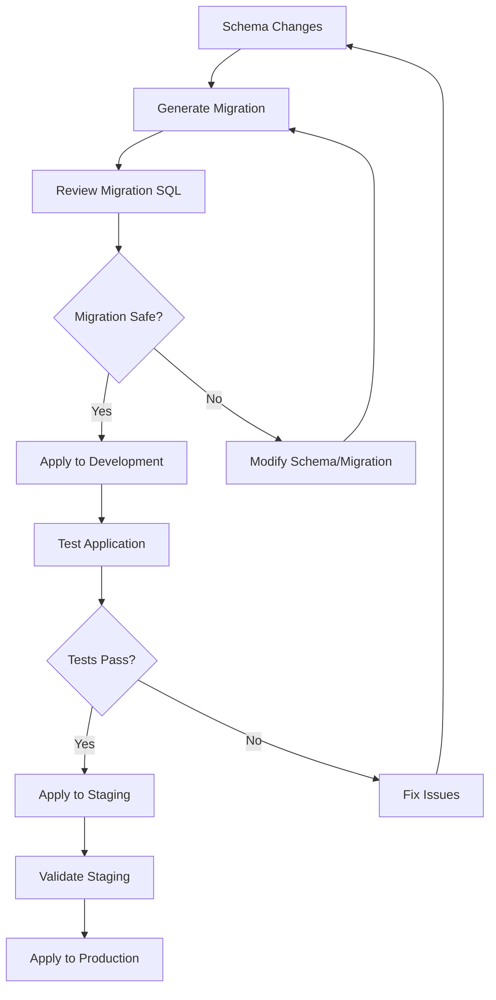

# Database Migrations and Seeding

## Overview

This document covers database migration management and seeding processes for the multi-tenant NestJS application using Prisma ORM.

## Migration Management

### Migration Workflow



### Migration Commands

#### Development Workflow

```bash
# Generate migration from schema changes
npx prisma migrate dev --name descriptive_migration_name

# Reset database (development only - destroys all data)
npx prisma migrate reset

# Check migration status
npx prisma migrate status

# Generate Prisma client after schema changes
npx prisma generate
```

#### Production Workflow

```bash
# Apply pending migrations to production
npx prisma migrate deploy

# Resolve migration conflicts (if needed)
npx prisma migrate resolve --applied migration_timestamp

# Rollback to specific migration (manual process)
# Note: Prisma doesn't support automatic rollbacks
```

### Migration History

The application includes the following key migrations:

#### 1. Initial Migration (`20251005131304_init`)

**Purpose**: Establishes core multi-tenant structure

**Tables Created**:
- `tenants`: Root tenant entities
- `users`: User accounts with tenant isolation
- `roles`: Role definitions per tenant
- `permissions`: Granular permissions per tenant
- `projects`: Business entities owned by users
- `user_roles`: User-role assignments
- `role_permissions`: Role-permission assignments
- `user_permissions`: Direct user permissions

**Key Features**:
- Multi-tenant architecture with tenant isolation
- Role-based access control (RBAC)
- Composite unique constraints for tenant scoping

```sql
-- Example from initial migration
CREATE TABLE "tenants" (
    "id" TEXT NOT NULL,
    "name" TEXT NOT NULL,
    "subdomain" TEXT,
    "created_at" TIMESTAMP(3) NOT NULL DEFAULT CURRENT_TIMESTAMP,
    "updated_at" TIMESTAMP(3) NOT NULL,
    CONSTRAINT "tenants_pkey" PRIMARY KEY ("id")
);

CREATE UNIQUE INDEX "tenants_subdomain_key" ON "tenants"("subdomain");
```

#### 2. Project Description (`20251005214956_add_project_description`)

**Purpose**: Adds description field to projects

**Changes**:
- Added `description` column to `projects` table
- Column is nullable for backward compatibility

```sql
-- Migration SQL
ALTER TABLE "projects" ADD COLUMN "description" TEXT;
```

#### 3. Notification System (`20251007114541_add_notification_system`)

**Purpose**: Implements comprehensive notification system

**Tables Created**:
- `notifications`: Core notification entities
- `notification_preferences`: User notification preferences
- `notification_delivery_logs`: Delivery tracking
- `notification_templates`: Customizable templates
- `tenant_notification_configs`: Provider configurations

**Key Features**:
- Multi-channel notification support (in-app, email, SMS)
- User preference management
- Delivery tracking and audit trails
- Tenant-specific provider configurations

#### 4. Privacy Features (`20251008232326_add_notification_privacy_features`)

**Purpose**: Enhances notification system with privacy and compliance features

**Changes**:
- Added privacy controls to notifications
- Implemented retention policies
- Enhanced audit logging
- Added soft deletion support

**New Fields**:
```sql
ALTER TABLE "notifications" ADD COLUMN "deleted_at" TIMESTAMP(3);
ALTER TABLE "notifications" ADD COLUMN "deleted_by" TEXT;
ALTER TABLE "notifications" ADD COLUMN "retention_date" TIMESTAMP(3);
ALTER TABLE "notifications" ADD COLUMN "sensitive_data" BOOLEAN NOT NULL DEFAULT false;
```

#### 5. Google Authentication (`20251009134846_add_google_authentication`)

**Purpose**: Adds Google OAuth integration support

**Changes**:
- Added Google ID field to users
- Added authentication method tracking
- Added Google-specific tenant settings

**New Fields**:
```sql
ALTER TABLE "users" ADD COLUMN "google_id" VARCHAR(255);
ALTER TABLE "users" ADD COLUMN "google_linked_at" TIMESTAMP(3);
ALTER TABLE "users" ADD COLUMN "auth_methods" TEXT[] DEFAULT ARRAY['password'];
ALTER TABLE "tenants" ADD COLUMN "google_sso_enabled" BOOLEAN NOT NULL DEFAULT false;
ALTER TABLE "tenants" ADD COLUMN "google_auto_provision" BOOLEAN NOT NULL DEFAULT false;
```

## Migration Best Practices

### 1. Naming Conventions

```bash
# Good migration names
npx prisma migrate dev --name add_user_profile_fields
npx prisma migrate dev --name create_notification_system
npx prisma migrate dev --name fix_user_email_constraint

# Avoid generic names
npx prisma migrate dev --name update_schema
npx prisma migrate dev --name changes
```

### 2. Backward Compatibility

```sql
-- ✅ Safe: Adding nullable column
ALTER TABLE "users" ADD COLUMN "phone_number" TEXT;

-- ✅ Safe: Adding column with default value
ALTER TABLE "users" ADD COLUMN "is_active" BOOLEAN NOT NULL DEFAULT true;

-- ⚠️ Risky: Adding non-nullable column without default
ALTER TABLE "users" ADD COLUMN "required_field" TEXT NOT NULL;

-- ❌ Breaking: Dropping column
ALTER TABLE "users" DROP COLUMN "old_field";
```

### 3. Index Management

```sql
-- Create indexes concurrently in production
CREATE INDEX CONCURRENTLY "idx_users_email" ON "users"("email");

-- Drop unused indexes
DROP INDEX IF EXISTS "old_unused_index";
```

### 4. Data Migration Patterns

```sql
-- Migrate data in batches for large tables
UPDATE notifications 
SET retention_date = created_at + INTERVAL '90 days'
WHERE id IN (
    SELECT id FROM notifications 
    WHERE retention_date IS NULL 
    LIMIT 1000
);
```

## Database Seeding

### Seed Script Overview

The seed script (`prisma/seed.ts`) creates comprehensive test data for development and testing environments.

### Seed Data Structure

#### Tenants Created

**Acme Corp** (`subdomain: acme`)
- Complete RBAC setup with multiple roles
- 5 users with different permission levels
- 4 sample projects
- Full permission matrix

**TechStart Inc** (`subdomain: techstart`)
- Minimal setup for testing tenant isolation
- 1 admin user
- 2 sample projects
- Basic permissions

### Running Seed Script

```bash
# Run seed script
npm run seed

# Or directly with Prisma
npx prisma db seed

# Seed with custom environment
DATABASE_URL="postgresql://..." npx prisma db seed
```

### Seed Script Configuration

```json
// package.json
{
  "prisma": {
    "seed": "ts-node prisma/seed.ts"
  }
}
```

### Detailed Seed Data

#### User Accounts (All passwords: `password123`)

**Acme Corp Users**:
```typescript
// Admin user with full permissions
{
  email: 'admin@acme.com',
  firstName: 'Alice',
  lastName: 'Admin',
  roles: ['Admin'] // All permissions
}

// Project Manager with project management permissions
{
  email: 'pm@acme.com',
  firstName: 'Bob',
  lastName: 'Manager',
  roles: ['Project Manager'] // Project CRUD + User read
}

// Member with read-only permissions
{
  email: 'member@acme.com',
  firstName: 'Charlie',
  lastName: 'Member',
  roles: ['Member'] // Read-only permissions
}

// User with multiple roles
{
  email: 'multi@acme.com',
  firstName: 'Diana',
  lastName: 'Multi',
  roles: ['Member', 'Project Manager'] // Combined permissions
}

// User with custom direct permissions
{
  email: 'custom@acme.com',
  firstName: 'Eve',
  lastName: 'Custom',
  roles: ['Member'],
  directPermissions: ['delete:project'] // Override via UserPermission
}
```

#### Role Definitions

```typescript
// Admin Role - Full permissions
const adminPermissions = [
  'create:project', 'read:project', 'update:project', 'delete:project',
  'create:user', 'read:user', 'update:user', 'delete:user',
  'create:role', 'read:role', 'update:role', 'delete:role',
  'create:permission', 'read:permission', 'delete:permission'
];

// Project Manager Role - Project management + user read
const projectManagerPermissions = [
  'create:project', 'read:project', 'update:project', 'delete:project',
  'read:user'
];

// Member Role - Read-only access
const memberPermissions = [
  'read:project', 'read:user', 'read:role', 'read:permission'
];
```

#### Sample Projects

**Acme Corp Projects**:
- Website Redesign (Owner: Admin)
- Mobile App Development (Owner: Project Manager)
- API Integration (Owner: Project Manager)
- Database Migration (Owner: Admin)

**TechStart Projects**:
- MVP Development (Owner: Admin)
- Market Research (Owner: Admin)

### Custom Seeding

#### Environment-Specific Seeding

```typescript
// prisma/seed.ts
const environment = process.env.NODE_ENV || 'development';

if (environment === 'production') {
  console.log('Skipping seed in production');
  process.exit(0);
}

if (environment === 'test') {
  // Minimal test data
  await createTestData();
} else {
  // Full development data
  await createDevelopmentData();
}
```

#### Tenant-Specific Seeding

```typescript
async function seedTenant(tenantData: CreateTenantData) {
  const tenant = await prisma.tenant.create({
    data: tenantData
  });

  // Create standard roles for tenant
  await createStandardRoles(tenant.id);
  
  // Create admin user
  await createAdminUser(tenant.id, tenantData.adminEmail);
  
  // Create sample data
  await createSampleProjects(tenant.id);
}
```

### Seed Data Validation

#### Data Integrity Checks

```typescript
async function validateSeedData() {
  // Check tenant isolation
  const acmeTenant = await prisma.tenant.findUnique({
    where: { subdomain: 'acme' },
    include: { users: true, projects: true }
  });

  const techStartTenant = await prisma.tenant.findUnique({
    where: { subdomain: 'techstart' },
    include: { users: true, projects: true }
  });

  // Verify no cross-tenant data leakage
  assert(acmeTenant.users.every(u => u.tenantId === acmeTenant.id));
  assert(techStartTenant.users.every(u => u.tenantId === techStartTenant.id));

  console.log('✅ Seed data validation passed');
}
```

## Testing Migrations

### Migration Testing Strategy

```typescript
// test/migration.test.ts
describe('Database Migrations', () => {
  beforeEach(async () => {
    // Reset to clean state
    await execSync('npx prisma migrate reset --force');
  });

  it('should apply all migrations successfully', async () => {
    await execSync('npx prisma migrate deploy');
    
    // Verify schema is correct
    const tables = await prisma.$queryRaw`
      SELECT table_name FROM information_schema.tables 
      WHERE table_schema = 'public'
    `;
    
    expect(tables).toContainEqual({ table_name: 'tenants' });
    expect(tables).toContainEqual({ table_name: 'users' });
    // ... verify all expected tables
  });

  it('should maintain data integrity after migrations', async () => {
    // Apply migrations up to specific point
    await execSync('npx prisma migrate deploy');
    
    // Insert test data
    await prisma.tenant.create({
      data: { name: 'Test Tenant', subdomain: 'test' }
    });

    // Apply remaining migrations
    await execSync('npx prisma migrate deploy');
    
    // Verify data is still intact
    const tenant = await prisma.tenant.findUnique({
      where: { subdomain: 'test' }
    });
    
    expect(tenant).toBeTruthy();
    expect(tenant.name).toBe('Test Tenant');
  });
});
```

### Performance Testing

```typescript
// test/migration-performance.test.ts
describe('Migration Performance', () => {
  it('should complete migrations within acceptable time', async () => {
    const startTime = Date.now();
    
    await execSync('npx prisma migrate deploy');
    
    const duration = Date.now() - startTime;
    expect(duration).toBeLessThan(30000); // 30 seconds max
  });

  it('should handle large datasets efficiently', async () => {
    // Create large dataset
    await createLargeDataset();
    
    const startTime = Date.now();
    await execSync('npx prisma migrate deploy');
    const duration = Date.now() - startTime;
    
    expect(duration).toBeLessThan(60000); // 1 minute max for large datasets
  });
});
```

## Troubleshooting

### Common Migration Issues

#### 1. Migration Conflicts

**Symptom**: Migration fails with "Migration already applied" error

**Solution**:
```bash
# Check migration status
npx prisma migrate status

# Mark migration as applied (if manually applied)
npx prisma migrate resolve --applied 20231001000000_migration_name

# Or rollback and reapply
npx prisma migrate reset
npx prisma migrate deploy
```

#### 2. Schema Drift

**Symptom**: Database schema doesn't match Prisma schema

**Solution**:
```bash
# Pull current database schema
npx prisma db pull

# Compare with current schema.prisma
# Resolve differences manually

# Generate new migration if needed
npx prisma migrate dev --name fix_schema_drift
```

#### 3. Seed Script Failures

**Symptom**: Seed script fails with constraint violations

**Solution**:
```bash
# Reset database completely
npx prisma migrate reset --force

# Check for existing data conflicts
npx prisma studio

# Fix seed script data conflicts
# Re-run seed
npm run seed
```

#### 4. Production Migration Failures

**Symptom**: Migration fails in production environment

**Solution**:
```bash
# Check migration status
npx prisma migrate status

# Apply migrations with explicit connection
DATABASE_URL="production_url" npx prisma migrate deploy

# If migration partially applied, resolve manually
npx prisma migrate resolve --applied migration_name
```

### Performance Issues

#### Large Table Migrations

```sql
-- For large tables, use these patterns:

-- 1. Add column with default value in batches
ALTER TABLE large_table ADD COLUMN new_column TEXT DEFAULT 'default_value';

-- 2. Create index concurrently
CREATE INDEX CONCURRENTLY idx_large_table_new_column ON large_table(new_column);

-- 3. Update data in batches
DO $$
DECLARE
    batch_size INTEGER := 1000;
    offset_val INTEGER := 0;
BEGIN
    LOOP
        UPDATE large_table 
        SET new_column = 'updated_value'
        WHERE id IN (
            SELECT id FROM large_table 
            WHERE new_column = 'default_value'
            LIMIT batch_size
        );
        
        IF NOT FOUND THEN
            EXIT;
        END IF;
        
        offset_val := offset_val + batch_size;
        PERFORM pg_sleep(0.1); -- Brief pause between batches
    END LOOP;
END $$;
```

### Monitoring and Maintenance

#### Migration Monitoring

```typescript
// scripts/check-migration-status.ts
import { PrismaClient } from '@prisma/client';

const prisma = new PrismaClient();

async function checkMigrationStatus() {
  try {
    // Check if database is accessible
    await prisma.$queryRaw`SELECT 1`;
    
    // Check migration status
    const result = await execSync('npx prisma migrate status', { 
      encoding: 'utf8' 
    });
    
    console.log('Migration Status:', result);
    
    // Alert if migrations are pending
    if (result.includes('pending')) {
      console.warn('⚠️ Pending migrations detected!');
      // Send alert to monitoring system
    }
  } catch (error) {
    console.error('❌ Migration status check failed:', error);
    // Send alert to monitoring system
  } finally {
    await prisma.$disconnect();
  }
}

checkMigrationStatus();
```

#### Automated Backup Before Migrations

```bash
#!/bin/bash
# scripts/migrate-with-backup.sh

# Create backup before migration
pg_dump $DATABASE_URL > "backup_$(date +%Y%m%d_%H%M%S).sql"

# Apply migrations
npx prisma migrate deploy

# Verify migration success
if [ $? -eq 0 ]; then
    echo "✅ Migration completed successfully"
    # Optionally clean up old backups
    find . -name "backup_*.sql" -mtime +7 -delete
else
    echo "❌ Migration failed - backup available for rollback"
    exit 1
fi
```

This comprehensive guide covers all aspects of database migrations and seeding for the multi-tenant NestJS application, providing both practical examples and troubleshooting guidance.