# Notification System Architecture

## System Overview

The notification system is designed as a distributed, event-driven architecture that provides reliable, scalable notification delivery across multiple channels. The system emphasizes fault tolerance, observability, and multi-tenant isolation.

## Architectural Principles

### 1. Separation of Concerns
- **API Layer**: Request handling and validation
- **Service Layer**: Business logic and orchestration
- **Channel Layer**: Delivery mechanism abstraction
- **Provider Layer**: External service integration
- **Infrastructure Layer**: Data persistence and messaging

### 2. Asynchronous Processing
- Non-blocking notification creation
- Queue-based delivery for reliability
- Background processing for external API calls
- Real-time updates via WebSocket

### 3. Multi-Tenant Isolation
- Complete data separation between tenants
- Tenant-specific configuration and preferences
- Isolated rate limiting and monitoring
- Secure context propagation

### 4. Fault Tolerance
- Graceful degradation on provider failures
- Retry mechanisms with exponential backoff
- Circuit breaker patterns for external services
- Partial failure handling

## Core Architecture Components

### Notification Service (Orchestrator)

The `NotificationService` acts as the central orchestrator for all notification operations.

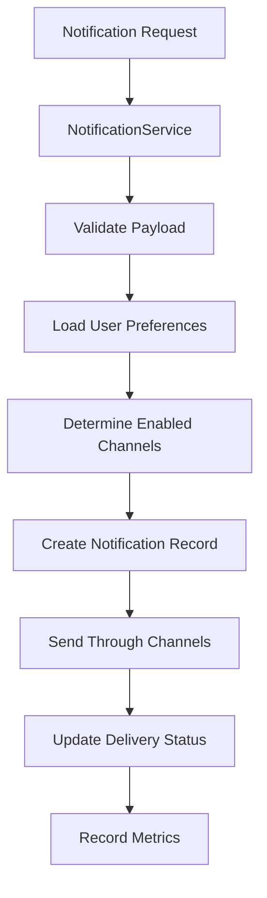

**Key Responsibilities:**
- Request validation and sanitization
- User preference resolution
- Channel coordination and orchestration
- Failure handling and partial success management
- Metrics collection and audit logging

**Flow Details:**
1. **Validation**: Ensures payload completeness and tenant context
2. **Preference Loading**: Retrieves user's channel preferences for the category
3. **Channel Selection**: Filters available channels based on preferences
4. **Record Creation**: Creates notification record in database
5. **Channel Delivery**: Sends through each enabled channel independently
6. **Status Updates**: Updates notification with successful channels
7. **Metrics Recording**: Records success/failure metrics per channel

### Channel Architecture

The channel system implements a pluggable architecture where each channel type implements the `INotificationChannel` interface.

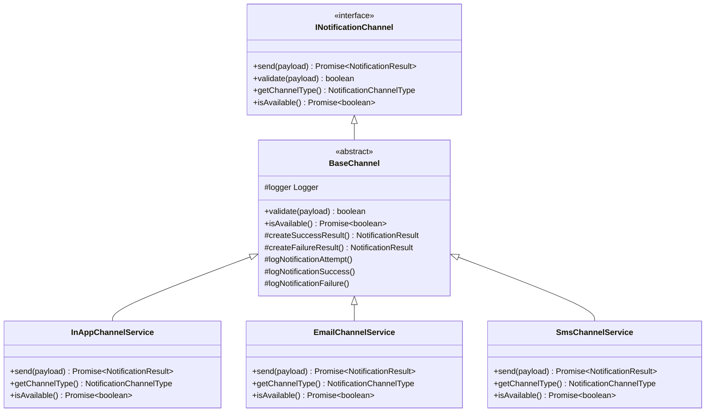

#### In-App Channel
- **Synchronous delivery** to database
- **Real-time WebSocket** emission
- **Immediate feedback** on success/failure
- **No external dependencies**

#### Email Channel
- **Asynchronous delivery** via queue
- **Template rendering** support
- **Provider abstraction** for multiple email services
- **Retry mechanisms** for failed deliveries

#### SMS Channel
- **Asynchronous delivery** via queue
- **Message formatting** and length validation
- **Phone number normalization**
- **Provider abstraction** for multiple SMS services

### Queue Processing Architecture

The system uses BullMQ for reliable, asynchronous processing of email and SMS notifications.

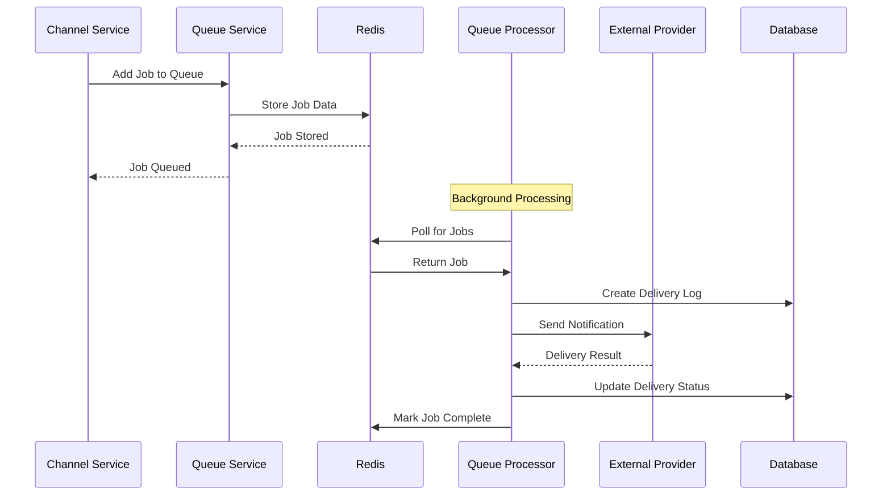

**Queue Features:**
- **Priority-based processing** based on notification priority
- **Automatic retry** with exponential backoff
- **Dead letter queues** for failed jobs
- **Job deduplication** to prevent duplicates
- **Monitoring and metrics** for queue health

#### Email Queue Processor

```typescript
@Processor(QUEUE_NAMES.EMAIL_NOTIFICATIONS)
export class EmailQueueProcessor extends WorkerHost {
  async process(job: Job<EmailJobData>): Promise<void> {
    // 1. Set tenant context
    // 2. Load tenant email configuration
    // 3. Get email provider instance
    // 4. Prepare email content (template rendering)
    // 5. Send via provider
    // 6. Update delivery log
    // 7. Record metrics
  }
}
```

**Processing Steps:**
1. **Context Setup**: Establish tenant context for the job
2. **Configuration Loading**: Load tenant-specific email settings
3. **Provider Selection**: Get appropriate email provider
4. **Content Preparation**: Render templates or format plain text
5. **Delivery Attempt**: Send via external provider
6. **Status Recording**: Update delivery log with results
7. **Metrics Collection**: Record timing and success/failure metrics

#### SMS Queue Processor

Similar to email processing but with SMS-specific handling:
- **Message length validation** and truncation
- **Phone number formatting** and validation
- **Provider-specific configuration** loading
- **Delivery status tracking**

### Provider System Architecture

The provider system abstracts external service integration through factory patterns.

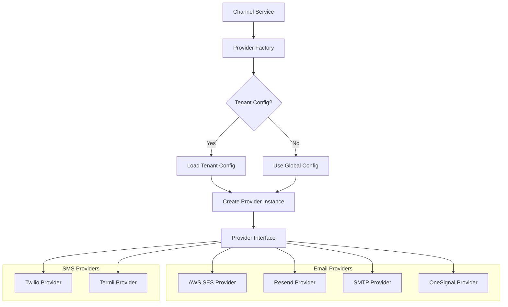

**Provider Features:**
- **Unified interface** across different services
- **Configuration abstraction** for different provider requirements
- **Error handling standardization**
- **Metrics collection** per provider
- **Health checking** and availability monitoring

### Real-Time Communication Architecture

WebSocket-based real-time notifications use Socket.IO for reliable bi-directional communication.

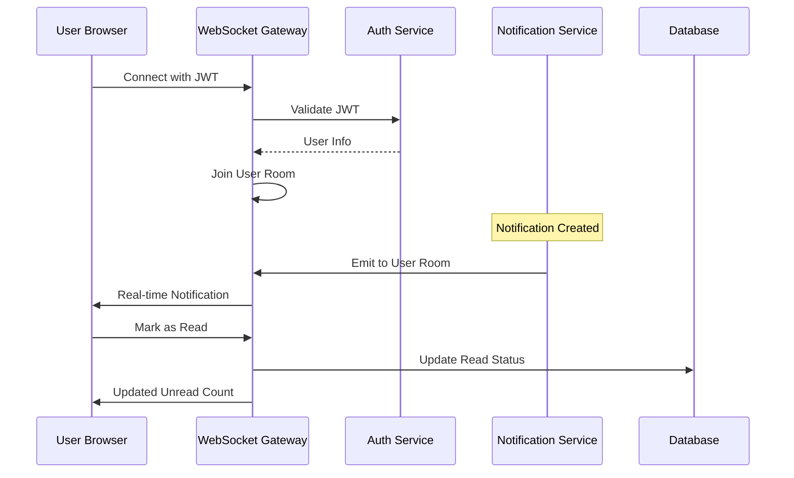

**WebSocket Features:**
- **JWT-based authentication** for secure connections
- **Room-based messaging** for user isolation
- **Automatic reconnection** handling
- **Unread count updates** in real-time
- **Connection state management**

## Data Flow Architecture

### Notification Creation Flow

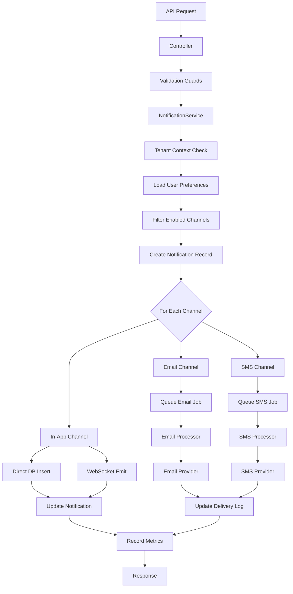

### Preference Resolution Flow

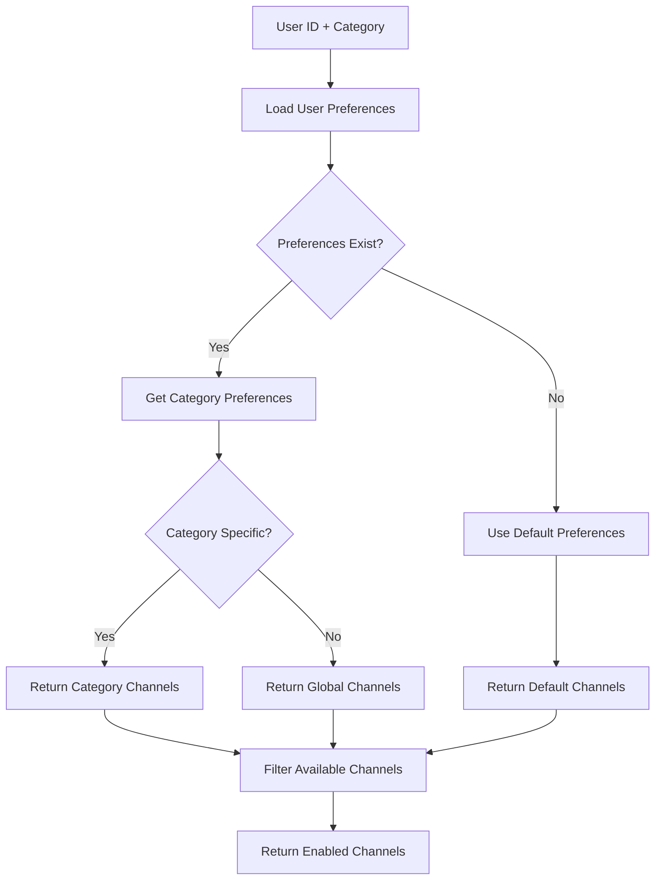

## Security Architecture

### Multi-Tenant Isolation

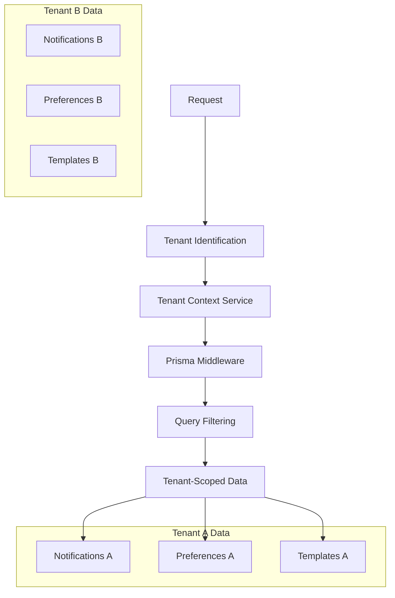

**Isolation Mechanisms:**
- **Middleware-level filtering** in Prisma queries
- **Context propagation** through request lifecycle
- **Queue job isolation** with tenant ID
- **WebSocket room separation** by tenant

### Rate Limiting Architecture

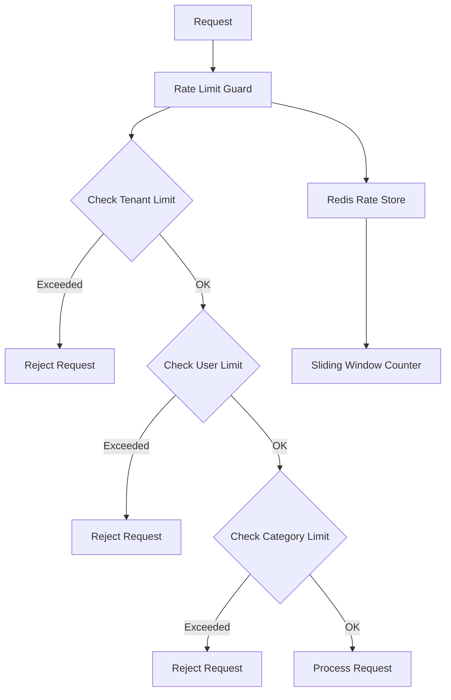

**Rate Limiting Levels:**
- **Global limits** across all tenants
- **Tenant-specific limits** per tenant
- **User-specific limits** per user
- **Category-specific limits** per notification type

## Monitoring and Observability Architecture

### Metrics Collection

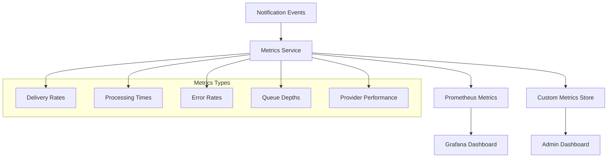

### Logging Architecture

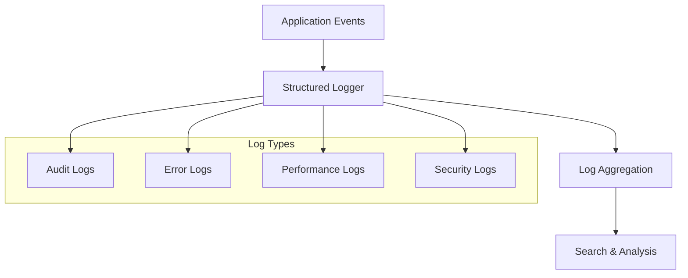

## Scalability Considerations

### Horizontal Scaling

- **Stateless services** for easy horizontal scaling
- **Queue-based processing** for load distribution
- **Database connection pooling** for efficient resource usage
- **Redis clustering** for cache scalability

### Performance Optimization

- **Connection pooling** for database and external services
- **Caching strategies** for frequently accessed data
- **Batch processing** for bulk operations
- **Lazy loading** for optional data

### Resource Management

- **Memory-efficient processing** with streaming where possible
- **Connection limits** to prevent resource exhaustion
- **Graceful degradation** under high load
- **Circuit breakers** for external service protection

## Deployment Architecture

The notification system is designed to be deployed as part of a larger NestJS application with the following considerations:

- **Module isolation** for independent deployment
- **Configuration externalization** via environment variables
- **Health check endpoints** for load balancer integration
- **Graceful shutdown** handling for queue processing
- **Database migration** support for schema updates

This architecture provides a robust, scalable foundation for notification delivery while maintaining security, observability, and multi-tenant isolation requirements.