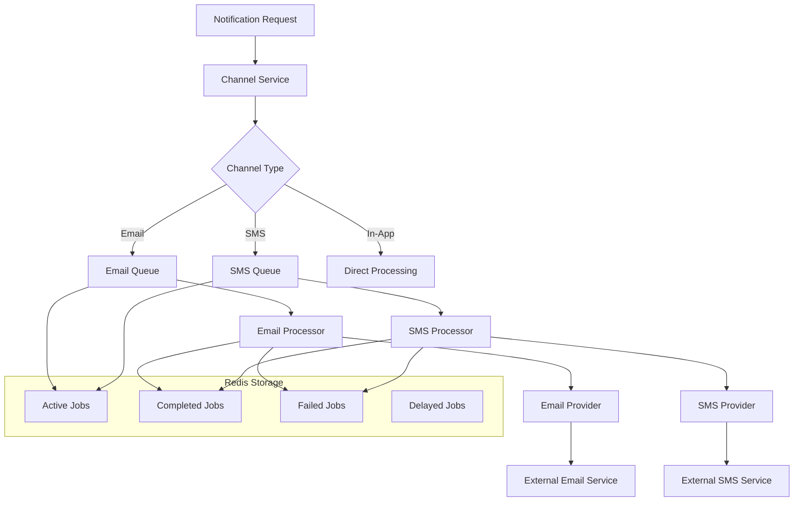
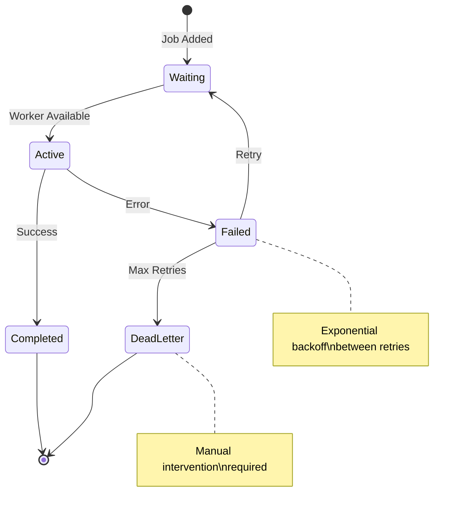

# Notification Queue System

## Overview

The notification system uses BullMQ, a Redis-based queue system, to handle asynchronous processing of email and SMS notifications. This ensures reliable delivery, proper error handling, and scalable processing of notification jobs.

## Architecture

### Queue Structure



### Queue Configuration

The system maintains separate queues for different notification types:

- **Email Notifications Queue**: `email-notifications`
- **SMS Notifications Queue**: `sms-notifications`

Each queue is configured with:
- **Priority-based processing** (URGENT > HIGH > MEDIUM > LOW)
- **Automatic retry** with exponential backoff
- **Dead letter queue** for permanently failed jobs
- **Job deduplication** to prevent duplicate notifications
- **Monitoring and metrics** collection

## Queue Service

The `QueueService` provides a unified interface for adding jobs to different queues.

```typescript
@Injectable()
export class QueueService {
  constructor(
    @InjectQueue(QUEUE_NAMES.EMAIL_NOTIFICATIONS)
    private emailQueue: Queue<EmailJobData>,
    @InjectQueue(QUEUE_NAMES.SMS_NOTIFICATIONS)
    private smsQueue: Queue<SmsJobData>,
  ) {}

  async addEmailJob(data: EmailJobData): Promise<void> {
    const priority = this.getPriorityValue(data.priority);
    
    await this.emailQueue.add('send-email', data, {
      priority,
      jobId: `email-${data.notificationId}`,
      attempts: 3,
      backoff: {
        type: 'exponential',
        delay: 2000,
      },
    });
  }

  async addSmsJob(data: SmsJobData): Promise<void> {
    const priority = this.getPriorityValue(data.priority);
    
    await this.smsQueue.add('send-sms', data, {
      priority,
      jobId: `sms-${data.notificationId}`,
      attempts: 3,
      backoff: {
        type: 'exponential',
        delay: 2000,
      },
    });
  }
}
```

### Job Data Structures

#### Email Job Data
```typescript
interface EmailJobData extends BaseJobData {
  to: string;                    // Recipient email address
  subject: string;               // Email subject line
  message: string;               // Plain text message
  templateId?: string;           // Optional template ID
  templateVariables?: Record<string, any>; // Template variables
}
```

#### SMS Job Data
```typescript
interface SmsJobData extends BaseJobData {
  to: string;                    // Recipient phone number
  message: string;               // SMS message content
}
```

#### Base Job Data
```typescript
interface BaseJobData {
  tenantId: string;              // Tenant context
  userId: string;                // Target user ID
  notificationId: string;        // Notification record ID
  category: string;              // Notification category
  priority: NotificationPriority; // Processing priority
}
```

## Queue Processors

### Email Queue Processor

The `EmailQueueProcessor` handles email notification jobs with comprehensive error handling and monitoring.

```typescript
@Injectable()
@Processor(QUEUE_NAMES.EMAIL_NOTIFICATIONS)
export class EmailQueueProcessor extends WorkerHost {
  async process(job: Job<EmailJobData>): Promise<void> {
    const { data } = job;
    
    // Set tenant context for this job
    this.tenantContextService.setTenantId(data.tenantId);
    
    try {
      // 1. Create delivery log entry
      const deliveryLog = await this.createDeliveryLog(data.notificationId);
      
      // 2. Load tenant-specific email configuration
      const tenantConfig = await this.loadTenantEmailConfig(data.tenantId);
      
      // 3. Get email provider instance
      const provider = this.emailProviderFactory.createProvider(tenantConfig);
      
      // 4. Prepare email content (template rendering)
      const emailContent = await this.prepareEmailContent(
        data.subject,
        data.message,
        data.templateId,
        data.templateVariables,
        data.tenantId,
        data.category
      );
      
      // 5. Send via provider
      const result = await provider.send({
        to: data.to,
        subject: emailContent.subject,
        html: emailContent.html,
        text: emailContent.text,
        from: this.getSenderInfo(tenantConfig)
      });
      
      // 6. Update delivery log and record metrics
      if (result.success) {
        await this.updateDeliverySuccess(deliveryLog.id, result.messageId);
        this.recordSuccessMetrics(data, provider.getProviderName());
      } else {
        throw new Error(result.error);
      }
      
    } catch (error) {
      await this.handleProcessingError(error, data);
      throw error; // Re-throw to trigger retry
    }
  }
}
```

#### Email Processing Steps

1. **Context Setup**: Establish tenant context for database operations
2. **Delivery Logging**: Create initial delivery log entry with PENDING status
3. **Configuration Loading**: Load tenant-specific email provider settings
4. **Provider Selection**: Get appropriate email provider instance
5. **Content Preparation**: Render email templates or format plain text
6. **Delivery Attempt**: Send email via external provider
7. **Status Recording**: Update delivery log with success/failure status
8. **Metrics Collection**: Record timing and delivery metrics

### SMS Queue Processor

The `SmsQueueProcessor` handles SMS notification jobs with similar patterns to email processing.

```typescript
@Injectable()
@Processor(QUEUE_NAMES.SMS_NOTIFICATIONS)
export class SmsQueueProcessor extends WorkerHost {
  async process(job: Job<SmsJobData>): Promise<void> {
    const { data } = job;
    
    // Set tenant context
    this.tenantContextService.setTenantId(data.tenantId);
    
    try {
      // 1. Create delivery log
      const deliveryLog = await this.createDeliveryLog(data.notificationId);
      
      // 2. Get SMS provider
      const provider = await this.smsProviderFactory.createProvider(data.tenantId);
      
      // 3. Prepare SMS content
      const smsContent = this.prepareSmsContent(data.message);
      
      // 4. Format phone number
      const formattedPhone = this.formatPhoneNumber(data.to);
      
      // 5. Get sender information
      const senderInfo = await this.getSenderInfo(data.tenantId);
      
      // 6. Send SMS
      const result = await provider.send({
        to: formattedPhone,
        message: smsContent,
        from: senderInfo.from
      });
      
      // 7. Update status and metrics
      if (result.success) {
        await this.updateDeliverySuccess(deliveryLog.id, result.messageId);
        this.recordSuccessMetrics(data, provider.getProviderName());
      } else {
        throw new Error(result.error);
      }
      
    } catch (error) {
      await this.handleProcessingError(error, data);
      throw error;
    }
  }
}
```

#### SMS Processing Steps

1. **Context Setup**: Establish tenant context
2. **Delivery Logging**: Create delivery log entry
3. **Provider Selection**: Get SMS provider for tenant
4. **Content Preparation**: Format and validate SMS content
5. **Phone Formatting**: Normalize phone number format
6. **Sender Configuration**: Get sender ID or phone number
7. **Delivery Attempt**: Send SMS via provider
8. **Status Recording**: Update delivery status and metrics

## Job Lifecycle Management

### Job States



### Retry Configuration

```typescript
const jobOptions = {
  attempts: 3,                    // Maximum retry attempts
  backoff: {
    type: 'exponential',          // Exponential backoff strategy
    delay: 2000,                  // Initial delay (2 seconds)
  },
  removeOnComplete: 100,          // Keep last 100 completed jobs
  removeOnFail: 50,               // Keep last 50 failed jobs
};
```

### Job Priority Mapping

```typescript
private getPriorityValue(priority: NotificationPriority): number {
  switch (priority) {
    case NotificationPriority.URGENT:  return 10;
    case NotificationPriority.HIGH:    return 5;
    case NotificationPriority.MEDIUM:  return 1;
    case NotificationPriority.LOW:     return 0;
    default:                           return 1;
  }
}
```

## Error Handling

### Error Categories

1. **Temporary Errors** (Retryable)
   - Network timeouts
   - Rate limiting from providers
   - Temporary service unavailability
   - Database connection issues

2. **Permanent Errors** (Non-retryable)
   - Invalid email addresses
   - Invalid phone numbers
   - Authentication failures
   - Malformed requests

3. **Configuration Errors**
   - Missing provider credentials
   - Invalid template IDs
   - Missing required variables

### Error Handling Strategy

```typescript
private async handleProcessingError(error: unknown, jobData: BaseJobData): Promise<void> {
  const errorMessage = this.extractErrorMessage(error);
  
  // Determine if error is retryable
  const isRetryable = this.isRetryableError(error);
  
  // Update delivery log
  await this.updateDeliveryFailure(jobData.notificationId, errorMessage);
  
  // Record failure metrics
  this.metricsService.recordFailure(
    this.getChannelType(),
    jobData.category,
    jobData.tenantId,
    errorMessage,
    'queue_processor'
  );
  
  // Log error details
  this.logger.error(
    `Failed to process ${this.getChannelType()} notification`,
    {
      notificationId: jobData.notificationId,
      tenantId: jobData.tenantId,
      userId: jobData.userId,
      error: errorMessage,
      retryable: isRetryable
    }
  );
  
  // Send alert for critical errors
  if (!isRetryable || this.isCriticalError(error)) {
    await this.alertingService.sendAlert({
      type: 'notification_processing_error',
      severity: 'high',
      message: `Failed to process notification: ${errorMessage}`,
      metadata: jobData
    });
  }
}
```

## Monitoring and Observability

### Queue Metrics

The system collects comprehensive metrics for queue monitoring:

```typescript
interface QueueMetrics {
  // Job counts
  waiting: number;              // Jobs waiting to be processed
  active: number;               // Jobs currently being processed
  completed: number;            // Successfully completed jobs
  failed: number;               // Failed jobs
  delayed: number;              // Delayed jobs (scheduled for future)
  
  // Performance metrics
  processingTime: number;       // Average processing time
  throughput: number;           // Jobs processed per minute
  errorRate: number;            // Percentage of failed jobs
  
  // Resource usage
  memoryUsage: number;          // Memory used by queue
  connectionCount: number;      // Redis connections
}
```

### Health Checks

```typescript
@Injectable()
export class QueueHealthService {
  async checkEmailQueueHealth(): Promise<HealthStatus> {
    try {
      const stats = await this.queueService.getEmailQueueStats();
      
      // Check for concerning metrics
      const concerns = [];
      if (stats.waiting > 1000) concerns.push('High queue backlog');
      if (stats.failed > stats.completed * 0.1) concerns.push('High failure rate');
      
      return {
        status: concerns.length > 0 ? 'degraded' : 'healthy',
        concerns,
        metrics: stats
      };
    } catch (error) {
      return {
        status: 'unhealthy',
        error: error.message
      };
    }
  }
}
```

### Queue Monitoring Dashboard

The system provides monitoring endpoints for queue status:

```typescript
@Controller('monitoring/queues')
export class QueueMonitoringController {
  @Get('email/stats')
  async getEmailQueueStats() {
    return this.queueService.getEmailQueueStats();
  }
  
  @Get('sms/stats')
  async getSmsQueueStats() {
    return this.queueService.getSmsQueueStats();
  }
  
  @Get('health')
  async getQueueHealth() {
    return {
      email: await this.healthService.checkEmailQueueHealth(),
      sms: await this.healthService.checkSmsQueueHealth()
    };
  }
}
```

## Configuration

### Queue Module Configuration

```typescript
@Module({
  imports: [
    BullModule.forRootAsync({
      useFactory: (configService: ConfigService) => ({
        connection: {
          host: configService.get('REDIS_HOST'),
          port: configService.get('REDIS_PORT'),
          password: configService.get('REDIS_PASSWORD'),
        },
        defaultJobOptions: {
          removeOnComplete: 100,
          removeOnFail: 50,
          attempts: 3,
          backoff: {
            type: 'exponential',
            delay: 2000,
          },
        },
      }),
      inject: [ConfigService],
    }),
    BullModule.registerQueue(
      { name: QUEUE_NAMES.EMAIL_NOTIFICATIONS },
      { name: QUEUE_NAMES.SMS_NOTIFICATIONS }
    ),
  ],
  providers: [
    QueueService,
    EmailQueueProcessor,
    SmsQueueProcessor,
    QueueMonitoringService,
  ],
  exports: [QueueService],
})
export class QueueModule {}
```

### Environment Variables

```bash
# Redis Configuration
REDIS_HOST=localhost
REDIS_PORT=6379
REDIS_PASSWORD=your_redis_password

# Queue Configuration
QUEUE_EMAIL_CONCURRENCY=5        # Concurrent email jobs
QUEUE_SMS_CONCURRENCY=3          # Concurrent SMS jobs
QUEUE_MAX_RETRIES=3              # Maximum retry attempts
QUEUE_RETRY_DELAY=2000           # Initial retry delay (ms)

# Monitoring
QUEUE_METRICS_ENABLED=true       # Enable metrics collection
QUEUE_HEALTH_CHECK_INTERVAL=30   # Health check interval (seconds)
```

## Best Practices

### Job Design
- **Idempotent Operations**: Ensure jobs can be safely retried
- **Small Payloads**: Keep job data minimal and focused
- **Timeout Handling**: Set appropriate timeouts for external calls
- **Error Classification**: Distinguish between retryable and permanent errors

### Performance Optimization
- **Concurrency Tuning**: Adjust worker concurrency based on load
- **Connection Pooling**: Use connection pools for external services
- **Batch Processing**: Group related operations where possible
- **Memory Management**: Clean up resources after job completion

### Monitoring and Alerting
- **Queue Depth Monitoring**: Alert on excessive queue backlogs
- **Error Rate Tracking**: Monitor and alert on high failure rates
- **Processing Time Monitoring**: Track job processing performance
- **Dead Letter Queue Monitoring**: Alert on jobs requiring manual intervention

The queue system provides a robust foundation for asynchronous notification processing, ensuring reliable delivery while maintaining system performance and observability.