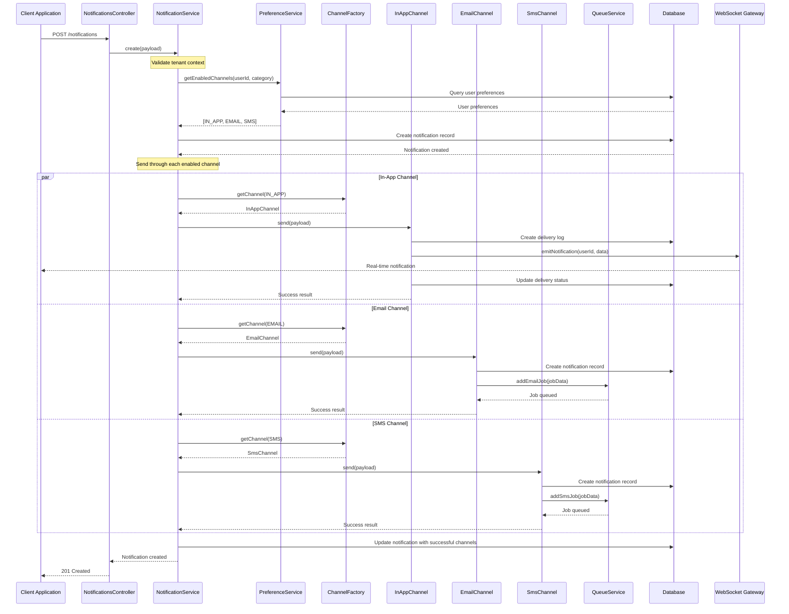
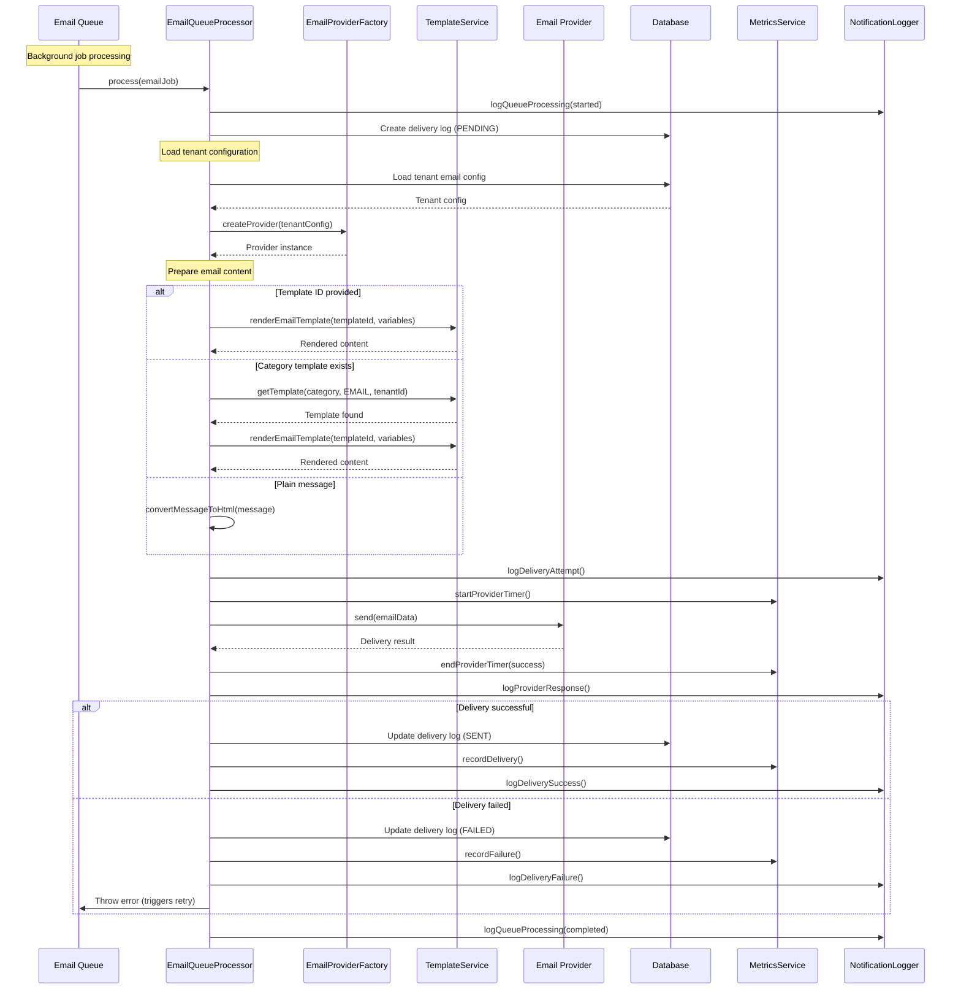
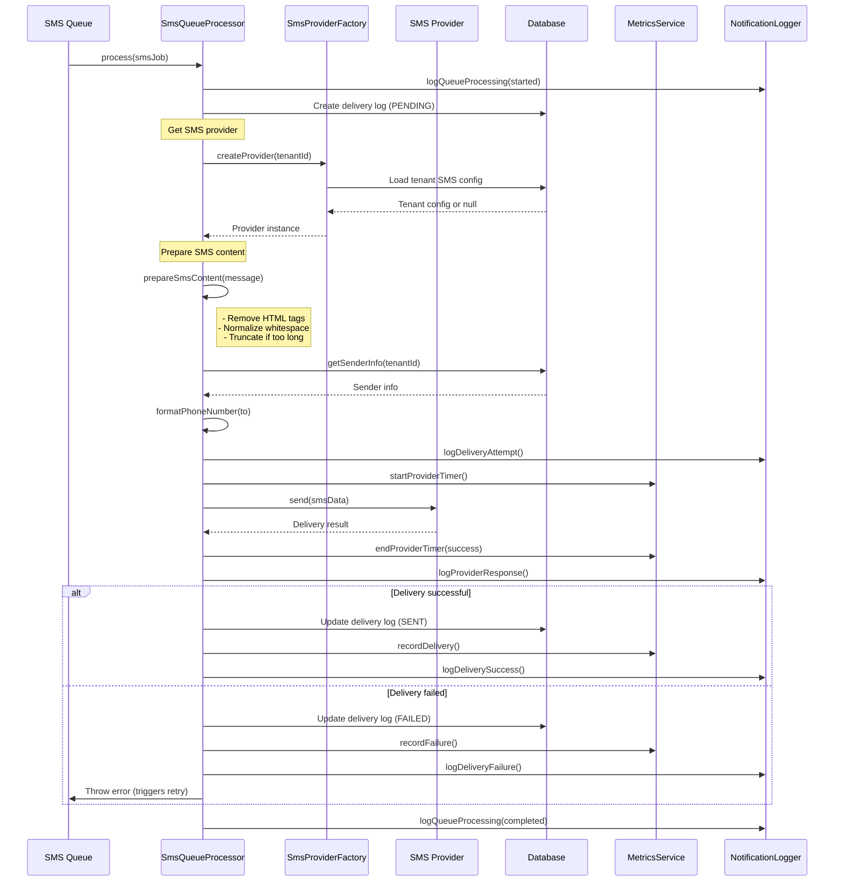
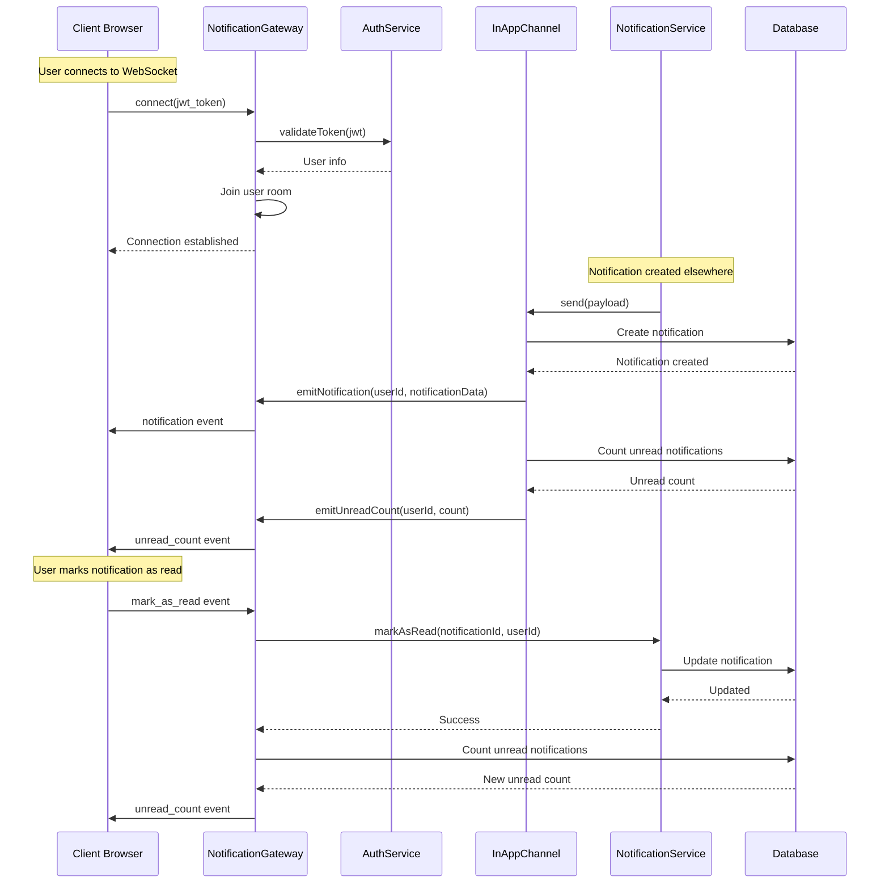
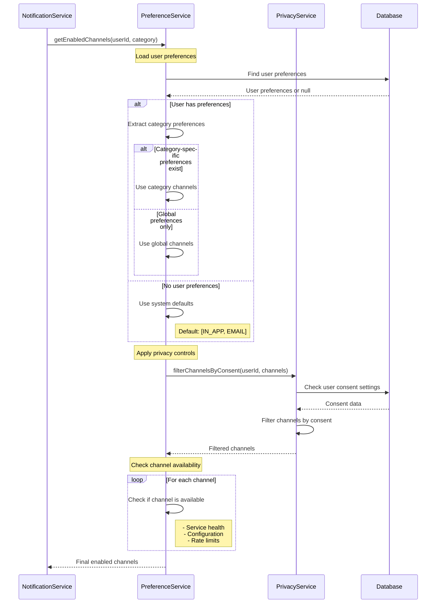
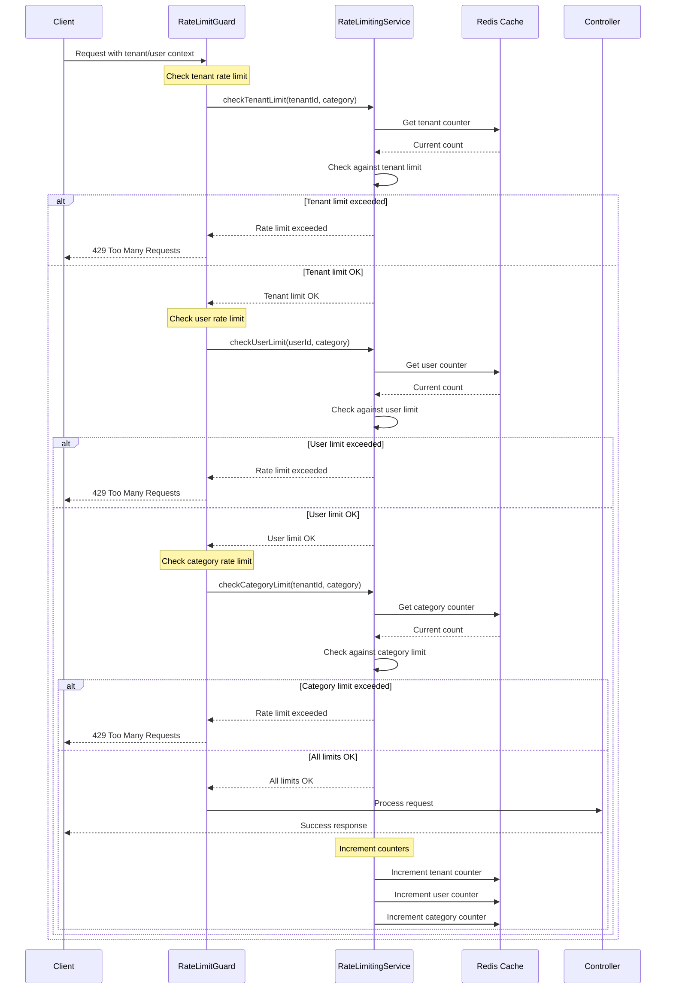
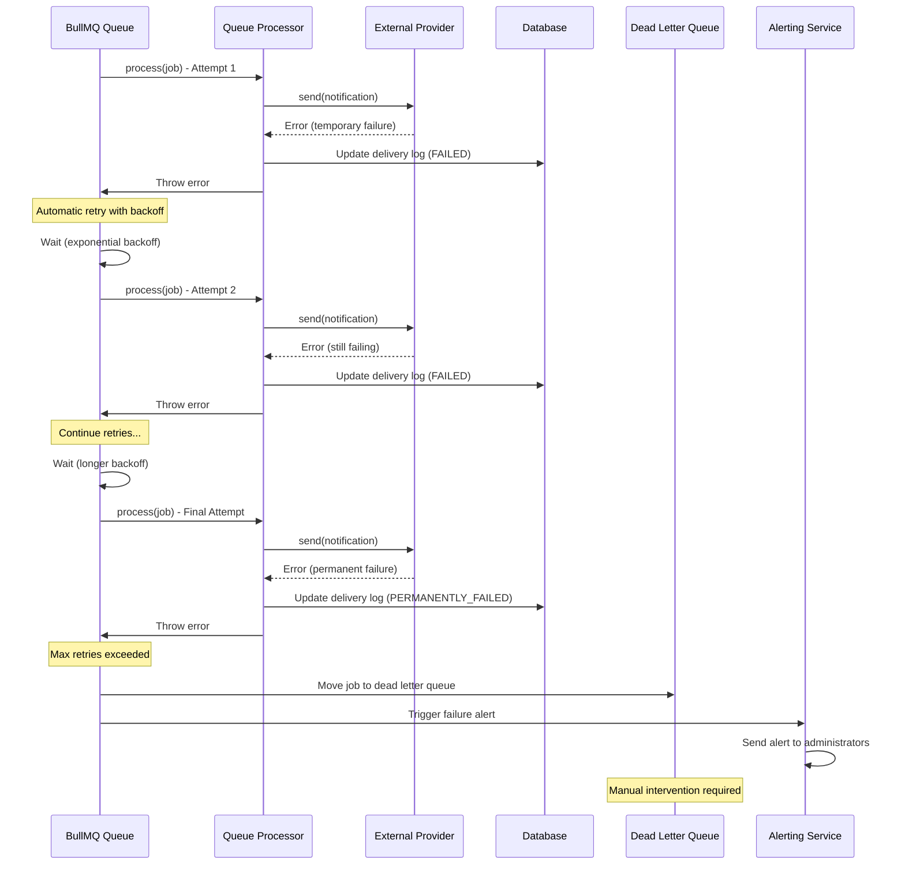
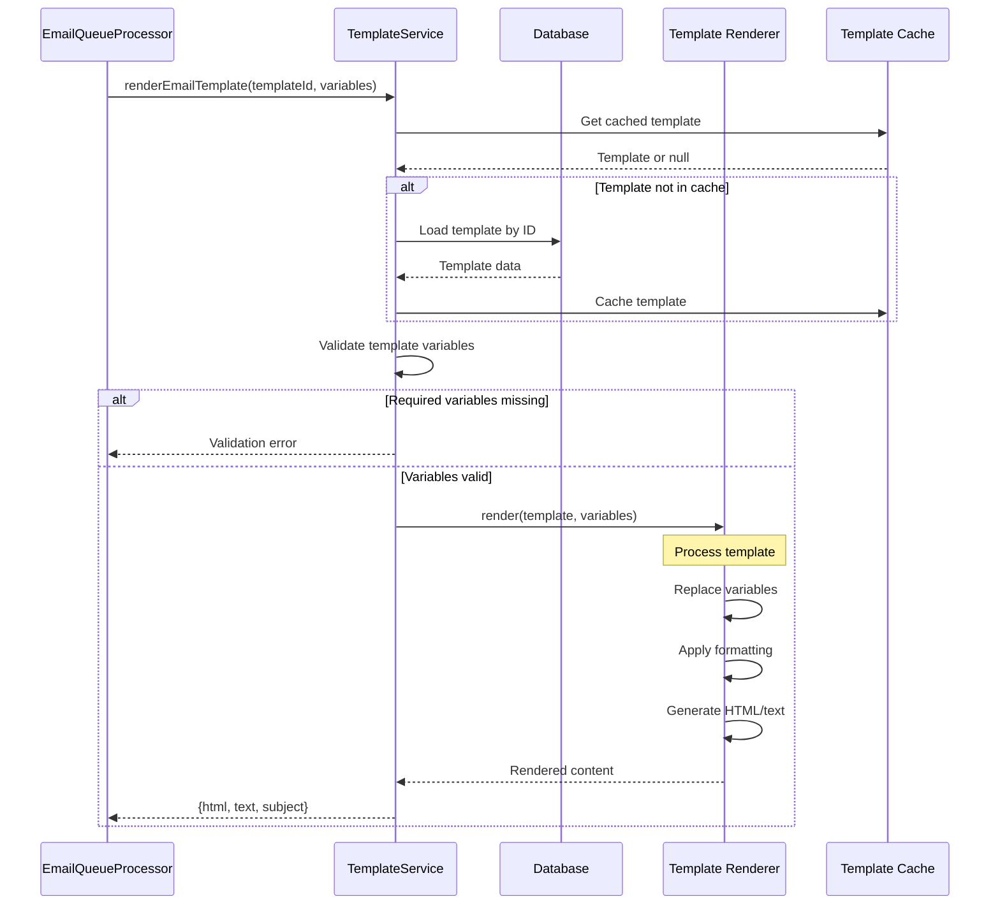

# Notification System Sequence Diagrams

This document provides detailed sequence diagrams showing the flow of notifications through the system for different scenarios.

## 1. Complete Notification Flow

This diagram shows the end-to-end flow of a notification from creation to delivery across all channels.

## 2. Email Queue Processing Flow

This diagram shows the detailed flow of email processing through the queue system.

## 3. SMS Queue Processing Flow

This diagram shows the SMS processing flow with provider-specific handling.

## 4. Real-Time WebSocket Flow

This diagram shows how real-time notifications are delivered via WebSocket.

## 5. User Preference Resolution Flow

This diagram shows how user preferences are resolved for notification delivery.

## 6. Rate Limiting Flow

This diagram shows how rate limiting is applied at different levels.

## 7. Error Handling and Retry Flow

This diagram shows how errors are handled and retries are managed in the queue system.

## 8. Template Rendering Flow

This diagram shows how email templates are processed and rendered.

These sequence diagrams provide a comprehensive view of how notifications flow through the system, from initial creation through final delivery, including error handling and retry mechanisms. Each diagram focuses on a specific aspect of the system to show the detailed interactions between components.