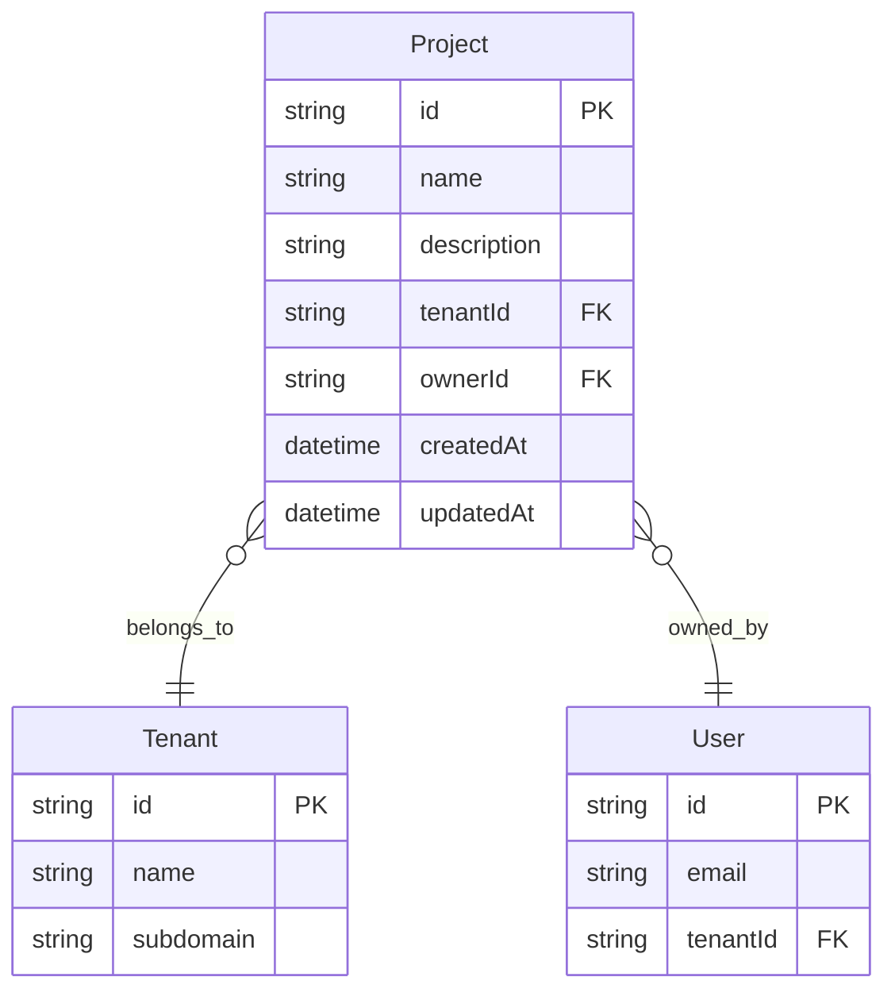

# Project Module Architecture

## Design Patterns

### Repository Pattern
The ProjectService acts as a repository layer, abstracting database operations and providing a clean interface for project management:

```typescript
@Injectable()
export class ProjectService {
  constructor(
    private readonly prisma: PrismaService,
    private readonly tenantContext: TenantContextService,
  ) {}

  async findAll() {
    const tenantId = this.tenantContext.getRequiredTenantId();
    return this.prisma.project.findMany({
      where: { tenantId },
      include: { owner: { select: { id: true, email: true } } }
    });
  }
}
```

### Tenant Context Pattern
All project operations automatically inherit tenant context, ensuring data isolation:

```typescript
async create(createProjectDto: CreateProjectDto, ownerId: string) {
  const tenantId = this.tenantContext.getRequiredTenantId();
  // tenantId is automatically injected into all operations
  return this.prisma.project.create({
    data: { ...createProjectDto, tenantId, ownerId }
  });
}
```

### DTO Pattern
Data Transfer Objects provide input validation and API documentation:

```typescript
export class CreateProjectDto {
  @ApiProperty({ description: 'The name of the project' })
  @IsString()
  @IsNotEmpty()
  name!: string;

  @ApiPropertyOptional({ description: 'Optional description' })
  @IsOptional()
  @IsString()
  description?: string;
}
```

### Ownership Pattern
Projects are automatically assigned to the authenticated user as owner:

```typescript
@Post()
async create(
  @Body() createProjectDto: CreateProjectDto,
  @CurrentUser() user: any,
) {
  return this.projectService.create(createProjectDto, user.id);
}
```

## Data Models

### Project Entity

```typescript
interface Project {
  id: string;                    // Primary key (CUID)
  name: string;                  // Project name (required)
  description?: string;          // Optional description
  tenantId: string;              // Foreign key to Tenant
  ownerId: string;               // Foreign key to User
  createdAt: Date;               // Creation timestamp
  updatedAt: Date;               // Last update timestamp
}
```

### Relationships



### Database Constraints

```sql
-- Foreign key constraints
FOREIGN KEY (tenantId) REFERENCES tenants(id) ON DELETE CASCADE
FOREIGN KEY (ownerId) REFERENCES users(id) ON DELETE CASCADE

-- Indexes for performance
INDEX(tenantId)
INDEX(ownerId)

-- Business rules enforced at application level:
-- - Owner must belong to the same tenant as the project
-- - Project names can be duplicated across tenants but not enforced as unique
```

## Service Layer

### Core Operations

#### Project CRUD
```typescript
class ProjectService {
  // Create project with automatic tenant and owner assignment
  async create(createProjectDto: CreateProjectDto, ownerId: string): Promise<Project>
  
  // Find all projects in current tenant
  async findAll(): Promise<Project[]>
  
  // Find project by ID (tenant-scoped)
  async findOne(id: string): Promise<Project>
  
  // Update project (tenant-scoped)
  async update(id: string, updateProjectDto: UpdateProjectDto): Promise<Project>
  
  // Delete project (tenant-scoped)
  async delete(id: string): Promise<{ message: string }>
}
```

### Business Logic

#### Tenant Isolation
- All database queries automatically filtered by tenant ID
- Cross-tenant operations prevented at service level
- Owner validation ensures users belong to the same tenant

```typescript
async create(createProjectDto: CreateProjectDto, ownerId: string) {
  const tenantId = this.tenantContext.getRequiredTenantId();
  
  // Implicit validation: ownerId must belong to same tenant
  // This is enforced by JWT token validation and user context
  
  return this.prisma.project.create({
    data: {
      ...createProjectDto,
      tenantId,    // Automatically set from context
      ownerId      // From authenticated user
    }
  });
}
```

#### Ownership Management
- Projects are automatically assigned to the authenticated user
- Owner information is included in all project responses
- Owner cannot be changed after creation (business rule)

```typescript
// Owner information is always included in responses
async findAll() {
  return this.prisma.project.findMany({
    where: { tenantId },
    include: {
      owner: {
        select: {
          id: true,
          email: true,
          firstName: true,
          lastName: true,
        },
      },
    },
  });
}
```

#### Validation and Error Handling
```typescript
async findOne(id: string) {
  const tenantId = this.tenantContext.getRequiredTenantId();
  
  const project = await this.prisma.project.findFirst({
    where: { id, tenantId },  // Tenant isolation
    include: { owner: true }
  });

  if (!project) {
    throw new NotFoundException(`Project with ID ${id} not found`);
  }

  return project;
}
```

## Integration Points

### Auth Module Integration
```typescript
// JWT payload provides user context for ownership
interface JwtPayload {
  sub: string;      // User ID (becomes ownerId)
  email: string;    // User email
  tenantId: string; // Tenant ID (for isolation)
}

// Controller extracts user from JWT for ownership assignment
@Post()
async create(
  @Body() createProjectDto: CreateProjectDto,
  @CurrentUser() user: any,  // Extracted from JWT
) {
  return this.projectService.create(createProjectDto, user.id);
}
```

### Tenant Module Integration
```typescript
// Tenant context automatically injected into all operations
async findAll() {
  const tenantId = this.tenantContext.getRequiredTenantId();
  // All queries automatically scoped to this tenant
}
```

### Database Module Integration
```typescript
// Prisma relationships ensure referential integrity
model Project {
  tenant Tenant @relation(fields: [tenantId], references: [id], onDelete: Cascade)
  owner  User   @relation(fields: [ownerId], references: [id], onDelete: Cascade)
}

// Cascade deletion: if tenant or user is deleted, projects are also deleted
```

## Error Handling

### Service-Level Errors
```typescript
// Tenant isolation validation
const project = await this.prisma.project.findFirst({
  where: { id, tenantId }
});

if (!project) {
  throw new NotFoundException(`Project with ID ${id} not found`);
}

// Automatic handling of referential integrity
// If ownerId doesn't exist, Prisma will throw an error
// If tenantId doesn't exist, Prisma will throw an error
```

### Controller-Level Error Handling
```typescript
@ApiResponse({ status: 404, description: 'Project not found' })
@ApiResponse({ status: 400, description: 'Invalid input data' })
async findOne(@Param('id') id: string) {
  return this.projectService.findOne(id);
}
```

## Security Considerations

### Authentication & Authorization
- All endpoints protected by JWT authentication
- Permission-based access control using `@Permissions()` decorator
- User context automatically extracted from JWT token

### Data Protection
- Input validation using class-validator decorators
- Tenant isolation prevents cross-tenant data access
- Owner validation through JWT user context

### Tenant Isolation
- Database-level tenant filtering through service layer
- Automatic tenant context injection from JWT
- Cross-tenant operations prevented by design

### Ownership Security
- Projects automatically assigned to authenticated user
- Owner information validated through JWT token
- No ability to assign projects to other users (prevents privilege escalation)

## Performance Considerations

### Database Optimization
```sql
-- Indexes for common queries
CREATE INDEX idx_projects_tenant_id ON projects(tenant_id);
CREATE INDEX idx_projects_owner_id ON projects(owner_id);

-- Composite index for tenant + owner queries
CREATE INDEX idx_projects_tenant_owner ON projects(tenant_id, owner_id);
```

### Query Optimization
- Selective field inclusion using Prisma's `select` and `include`
- Owner information efficiently loaded through single query
- Tenant filtering applied at database level

```typescript
// Efficient query with selective field loading
async findAll() {
  return this.prisma.project.findMany({
    where: { tenantId },
    include: {
      owner: {
        select: {
          id: true,
          email: true,
          firstName: true,
          lastName: true,
          // Exclude sensitive fields like password
        },
      },
    },
    orderBy: { createdAt: 'desc' }
  });
}
```

### Caching Considerations
- Project lists can be cached per tenant
- Individual projects suitable for caching with tenant+id key
- Cache invalidation needed on project updates/deletions
- Owner information changes require cache invalidation

## Extensibility

### Future Enhancements
The current architecture supports easy extension for:

#### Project Collaboration
```typescript
// Future: Project members/collaborators
model ProjectMember {
  projectId String
  userId    String
  role      String  // 'viewer', 'editor', 'admin'
  
  project Project @relation(fields: [projectId], references: [id])
  user    User    @relation(fields: [userId], references: [id])
}
```

#### Project Categories/Tags
```typescript
// Future: Project categorization
model ProjectTag {
  id        String @id @default(cuid())
  name      String
  tenantId  String
  projects  ProjectTagAssignment[]
}
```

#### Project Templates
```typescript
// Future: Project templates
model ProjectTemplate {
  id          String @id @default(cuid())
  name        String
  description String?
  template    Json    // Template configuration
  tenantId    String
}
```

### API Versioning
The current API design supports versioning through:
- URL versioning: `/v1/projects`, `/v2/projects`
- Header versioning: `Accept: application/vnd.api+json;version=1`
- Backward compatibility through optional fields

### Integration Points
The module is designed to integrate with:
- **File Storage**: Project documents and assets
- **Task Management**: Project tasks and milestones
- **Time Tracking**: Project time logging
- **Reporting**: Project analytics and reporting