# Tenant Module Sequence Diagrams

## Overview

This document provides detailed sequence diagrams for all major tenant-related flows in the multi-tenant NestJS application.

## 1. Tenant Identification and Context Setup

### Header-Based Tenant Identification

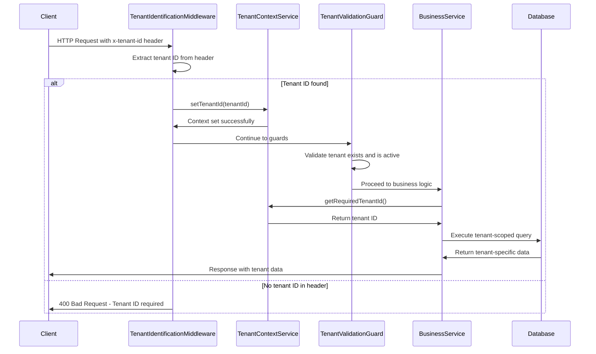

### Subdomain-Based Tenant Identification

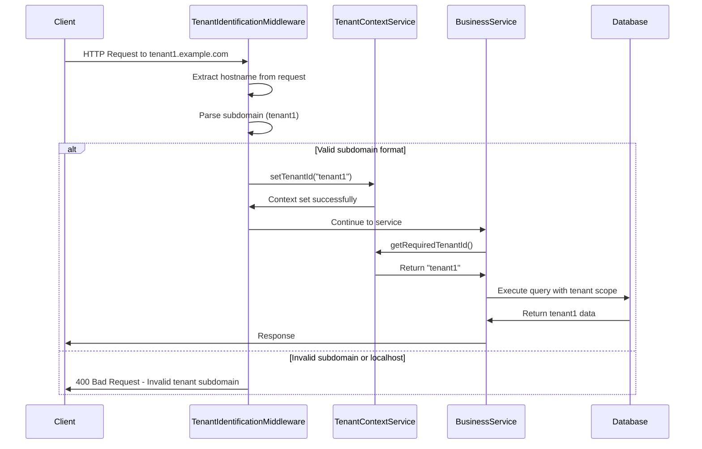

## 2. Tenant Registration Flow

### Complete Tenant Setup Process

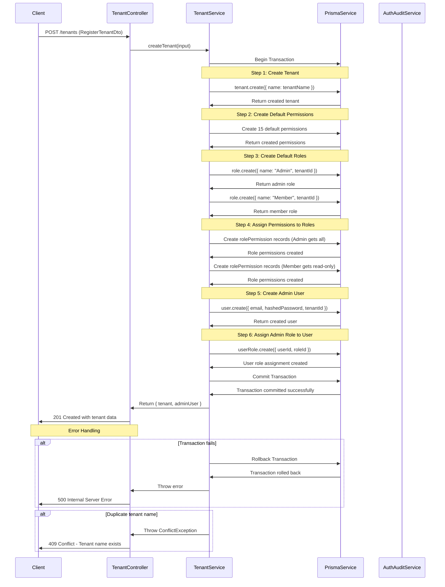

## 3. Database Middleware Tenant Scoping

### Query Transformation Process

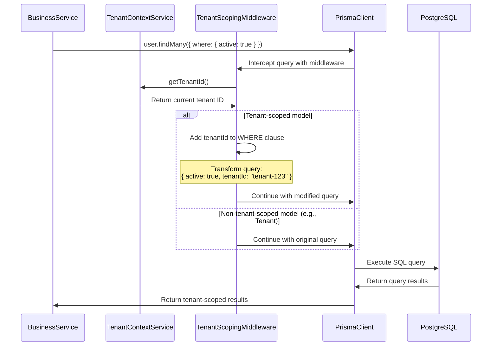

### Create Operation with Tenant Injection

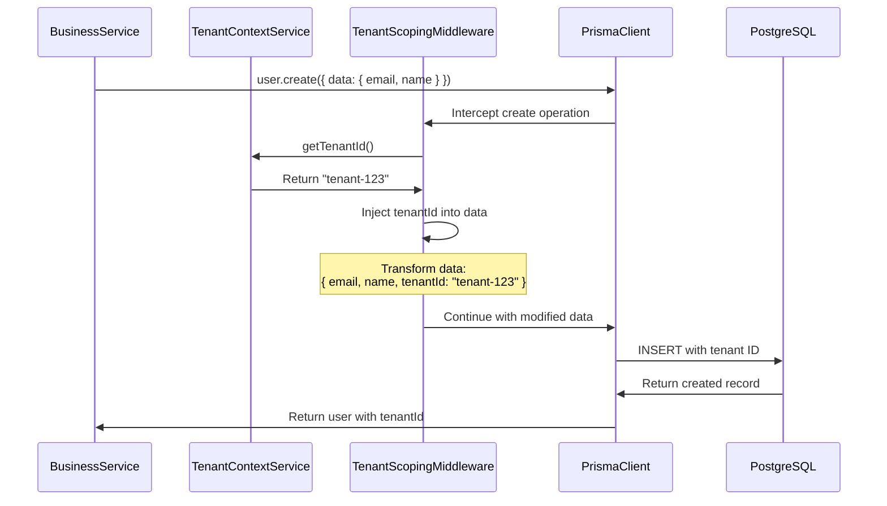

## 4. Google SSO Configuration Flow

### Get Google Settings

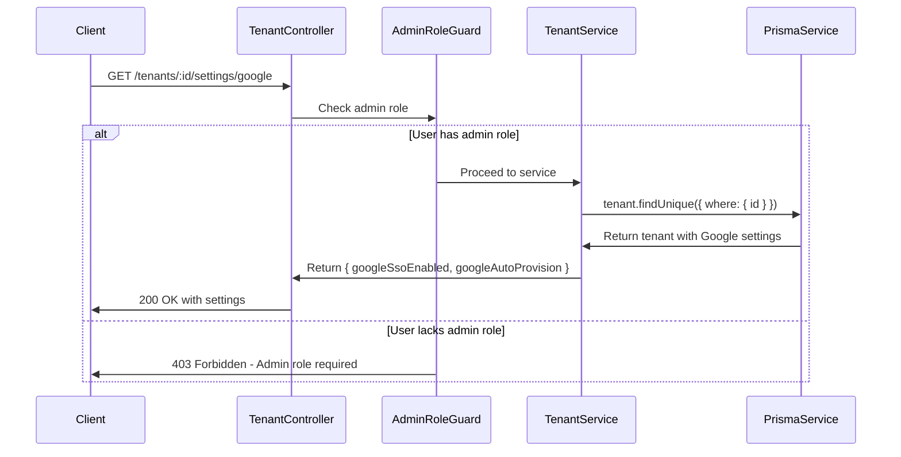

### Update Google Settings with Audit Logging

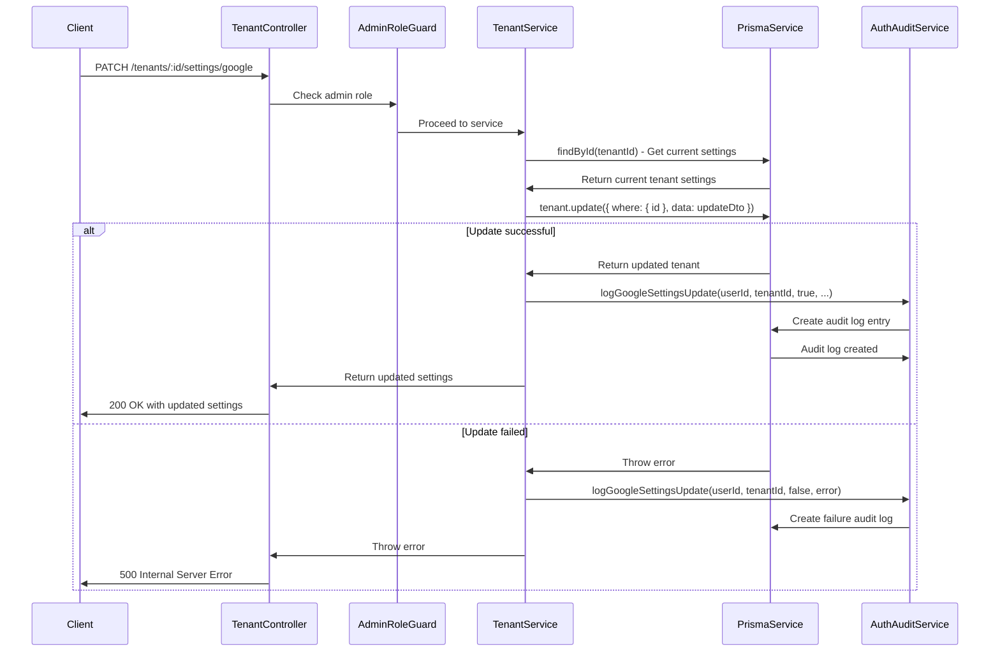

## 5. Authentication with Tenant Context

### JWT Authentication with Tenant Validation

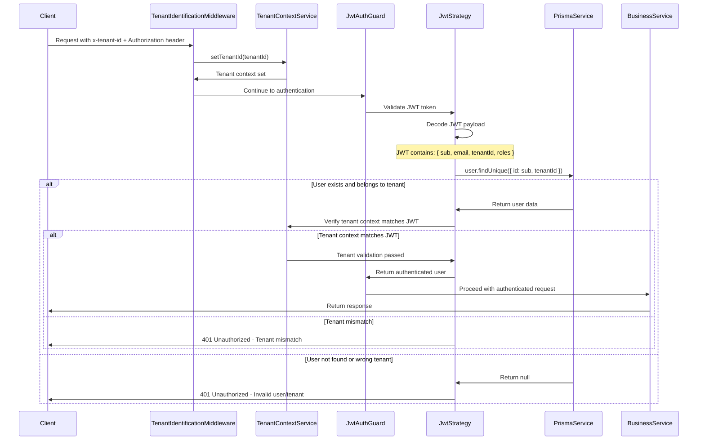

## 6. Cross-Tenant Access Prevention

### Resource Ownership Validation

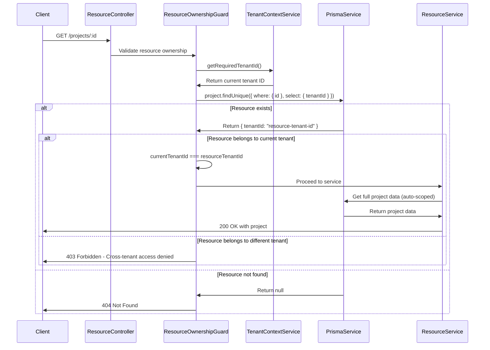

## 7. Tenant Data Isolation Verification

### Isolation Testing Flow

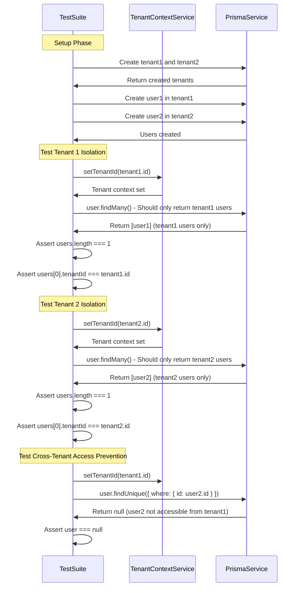

## 8. Error Handling and Recovery

### Tenant Context Error Flow

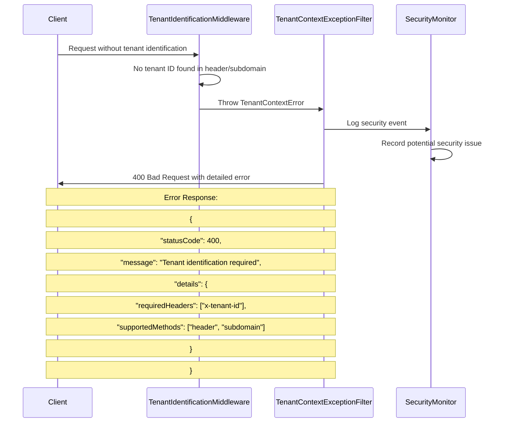

### Database Transaction Rollback

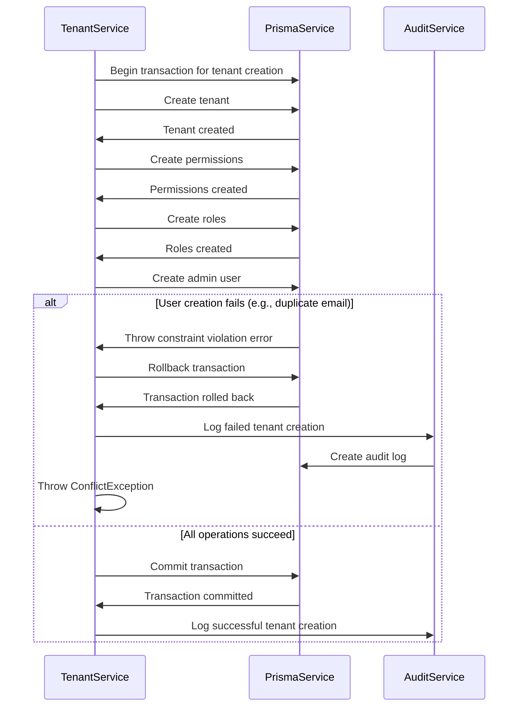

## 9. Performance Optimization Flows

### Tenant-Aware Caching

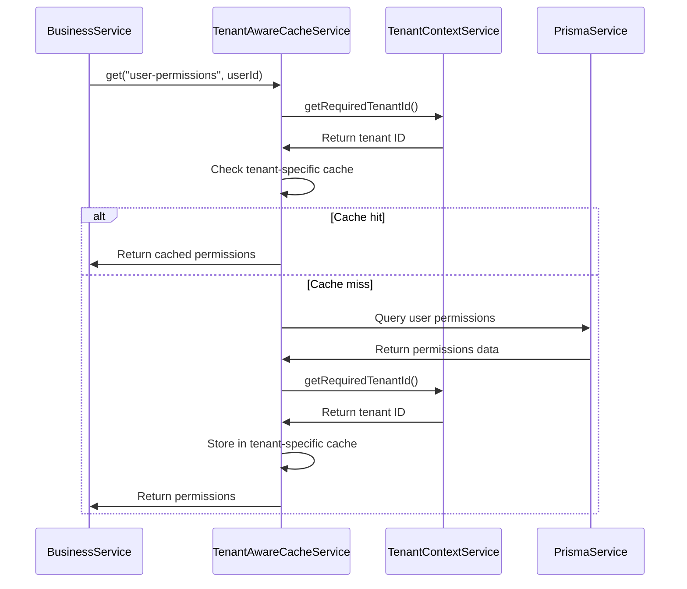

## 10. Monitoring and Alerting

### Security Violation Detection

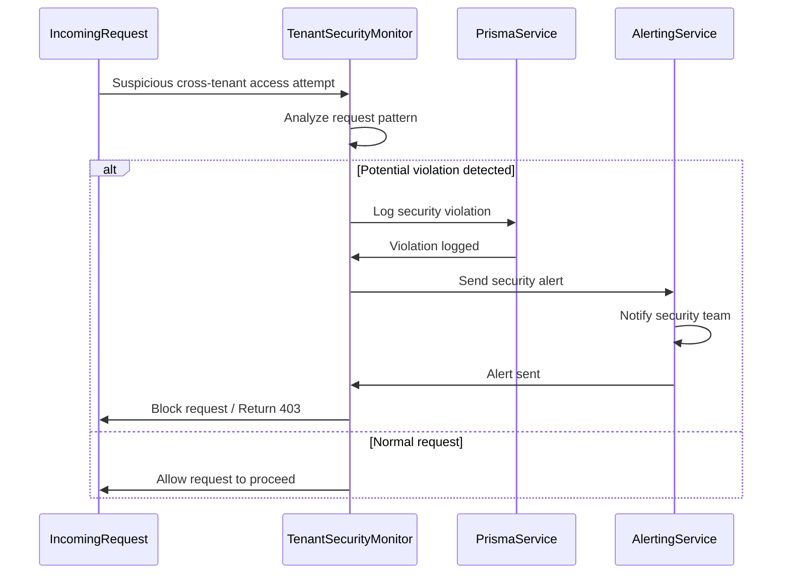

These sequence diagrams provide a comprehensive view of all tenant-related flows, helping developers understand the complex interactions between components in the multi-tenant architecture.