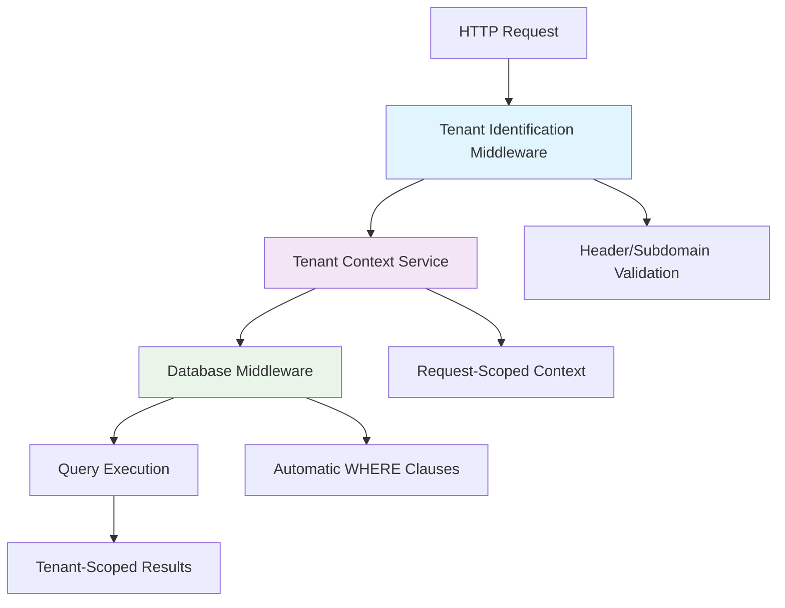

# Tenant Isolation Patterns and Security

## Overview

This document details the tenant isolation patterns and security measures implemented in the multi-tenant NestJS application to ensure complete data separation between tenants.

## Isolation Architecture

### Multi-Level Isolation Strategy



### Isolation Layers

1. **Network Layer**: Tenant identification from headers/subdomains
2. **Application Layer**: Request-scoped tenant context
3. **Service Layer**: Tenant-aware business logic
4. **Data Layer**: Automatic tenant scoping via middleware
5. **Database Layer**: Tenant-scoped queries and constraints

## Tenant Identification Patterns

### 1. Header-Based Identification

**Implementation**:
```typescript
// Default header: x-tenant-id
const tenantId = req.headers['x-tenant-id'] as string;

if (!tenantId) {
  throw new BadRequestException('Tenant ID required in x-tenant-id header');
}
```

**Usage Example**:
```bash
curl -H "x-tenant-id: tenant-123" \
     -H "Authorization: Bearer jwt-token" \
     https://api.example.com/users
```

**Advantages**:
- Simple implementation
- Works with any domain
- Easy to test and debug
- Flexible header name configuration

**Disadvantages**:
- Requires client-side header management
- Potential for header manipulation
- Not user-friendly for browser-based apps

### 2. Subdomain-Based Identification

**Implementation**:
```typescript
private extractTenantFromSubdomain(hostname: string): string | undefined {
  // Skip localhost and IP addresses
  if (hostname === 'localhost' || /^\d+\.\d+\.\d+\.\d+$/.test(hostname)) {
    return undefined;
  }

  const parts = hostname.split('.');
  
  // Extract first part as tenant ID: tenant1.example.com -> tenant1
  if (parts.length >= 3) {
    return parts[0];
  }

  return undefined;
}
```

**Usage Example**:
```bash
# tenant1.example.com -> tenant ID: "tenant1"
# tenant2.example.com -> tenant ID: "tenant2"
curl https://tenant1.example.com/api/users
```

**Advantages**:
- User-friendly URLs
- Natural tenant separation
- SEO-friendly
- Automatic tenant identification

**Disadvantages**:
- Requires DNS configuration
- SSL certificate management complexity
- Limited to web-based applications

### 3. Hybrid Approach

**Implementation**:
```typescript
use(req: Request, res: Response, next: NextFunction) {
  let tenantId: string | undefined;

  // Priority 1: Header-based (for API clients)
  tenantId = req.headers[this.tenantHeaderName] as string;

  // Priority 2: Subdomain-based (for web clients)
  if (!tenantId && this.enableSubdomainRouting) {
    tenantId = this.extractTenantFromSubdomain(req.hostname);
  }

  // Priority 3: JWT token (for authenticated requests)
  if (!tenantId) {
    tenantId = this.extractTenantFromJWT(req);
  }

  if (!tenantId) {
    throw new BadRequestException('Tenant identification required');
  }

  this.tenantContextService.setTenantId(tenantId);
  next();
}
```

## Context Management Patterns

### Request-Scoped Context

```typescript
@Injectable({ scope: Scope.REQUEST })
export class TenantContextService implements ITenantContext {
  private tenantId?: string;

  setTenantId(tenantId: string): void {
    this.tenantId = tenantId;
  }

  getTenantId(): string | undefined {
    return this.tenantId;
  }

  getRequiredTenantId(): string {
    if (!this.tenantId) {
      throw new Error('Tenant context is required but not set');
    }
    return this.tenantId;
  }
}
```

**Key Features**:
- **Request Isolation**: Each request gets its own context instance
- **Memory Safety**: Automatic cleanup after request completion
- **Thread Safety**: No shared state between concurrent requests
- **Error Handling**: Clear error messages for missing context

### Context Validation Patterns

```typescript
// Pattern 1: Defensive Programming
async getUserData(userId: string) {
  const tenantId = this.tenantContext.getTenantId();
  
  if (!tenantId) {
    throw new BadRequestException('Tenant context not available');
  }
  
  return this.prisma.user.findUnique({
    where: { id: userId }
    // tenantId automatically added by middleware
  });
}

// Pattern 2: Required Context
async getUserData(userId: string) {
  const tenantId = this.tenantContext.getRequiredTenantId(); // Throws if not set
  
  return this.prisma.user.findUnique({
    where: { id: userId }
  });
}

// Pattern 3: Context Validation Decorator
@RequireTenantContext()
async getUserData(userId: string) {
  // Decorator ensures tenant context is available
  return this.prisma.user.findUnique({
    where: { id: userId }
  });
}
```

## Database Isolation Patterns

### Automatic Tenant Scoping Middleware

```typescript
export function createTenantScopingMiddleware(tenantContext: ITenantContext) {
  return (params: any, next: any) => {
    // Skip non-tenant-scoped models
    if (!params.model || NON_TENANT_SCOPED_MODELS.includes(params.model)) {
      return next(params);
    }

    const tenantId = tenantContext.getTenantId();
    
    if (!tenantId) {
      return next(params); // Skip if no tenant context (e.g., tenant registration)
    }

    // Add tenant scoping to queries
    if (QUERY_ACTIONS.includes(params.action)) {
      params.args = params.args || {};
      params.args.where = params.args.where || {};
      params.args.where.tenantId = tenantId;
    }

    // Add tenant ID to create operations
    if (CREATE_ACTIONS.includes(params.action)) {
      if (params.action === 'create') {
        params.args.data = params.args.data || {};
        params.args.data.tenantId = tenantId;
      }
      // Handle createMany, upsert, etc.
    }

    return next(params);
  };
}
```

### Query Transformation Examples

```typescript
// Original query
const users = await prisma.user.findMany({
  where: { active: true }
});

// Automatically transformed to
const users = await prisma.user.findMany({
  where: { 
    active: true,
    tenantId: 'current-tenant-id' // Added by middleware
  }
});

// Original create
const user = await prisma.user.create({
  data: { email: 'user@example.com', name: 'John' }
});

// Automatically transformed to
const user = await prisma.user.create({
  data: { 
    email: 'user@example.com', 
    name: 'John',
    tenantId: 'current-tenant-id' // Added by middleware
  }
});
```

### Non-Tenant-Scoped Models

```typescript
// Models that should NOT be tenant-scoped
const NON_TENANT_SCOPED_MODELS = [
  'Tenant',           // Root tenant entity
  'SystemConfig',     // Global system configuration
  'AuditLog',        // Global audit logs (if needed)
];
```

## Security Patterns

### 1. Tenant Validation Guards

```typescript
@Injectable()
export class TenantValidationGuard implements CanActivate {
  constructor(
    private tenantContext: TenantContextService,
    private tenantService: TenantService,
  ) {}

  async canActivate(context: ExecutionContext): Promise<boolean> {
    const tenantId = this.tenantContext.getTenantId();
    
    if (!tenantId) {
      throw new UnauthorizedException('Tenant context required');
    }

    // Verify tenant exists and is active
    const tenant = await this.tenantService.findById(tenantId);
    
    if (!tenant) {
      throw new UnauthorizedException('Invalid tenant');
    }

    if (tenant.status === 'suspended') {
      throw new ForbiddenException('Tenant account suspended');
    }

    return true;
  }
}
```

### 2. Cross-Tenant Access Prevention

```typescript
@Injectable()
export class ResourceOwnershipGuard implements CanActivate {
  constructor(
    private tenantContext: TenantContextService,
    private prisma: PrismaService,
  ) {}

  async canActivate(context: ExecutionContext): Promise<boolean> {
    const request = context.switchToHttp().getRequest();
    const resourceId = request.params.id;
    const currentTenantId = this.tenantContext.getRequiredTenantId();

    // Verify resource belongs to current tenant
    const resource = await this.prisma.project.findUnique({
      where: { id: resourceId },
      select: { tenantId: true },
    });

    if (!resource) {
      throw new NotFoundException('Resource not found');
    }

    if (resource.tenantId !== currentTenantId) {
      throw new ForbiddenException('Access denied: Resource belongs to different tenant');
    }

    return true;
  }
}
```

### 3. Tenant-Aware JWT Tokens

```typescript
// JWT Payload with tenant information
interface JwtPayload {
  sub: string;      // User ID
  email: string;    // User email
  tenantId: string; // Tenant ID
  roles: string[];  // User roles
  iat: number;      // Issued at
  exp: number;      // Expires at
}

// JWT Strategy with tenant validation
@Injectable()
export class JwtStrategy extends PassportStrategy(Strategy) {
  async validate(payload: JwtPayload) {
    const { sub, email, tenantId, roles } = payload;

    // Verify user still exists and belongs to tenant
    const user = await this.prisma.user.findUnique({
      where: { 
        id: sub,
        tenantId: tenantId,
      },
    });

    if (!user) {
      throw new UnauthorizedException('User not found or invalid tenant');
    }

    // Set tenant context from JWT
    this.tenantContext.setTenantId(tenantId);

    return {
      id: sub,
      email,
      tenantId,
      roles,
    };
  }
}
```

## Data Isolation Verification

### Isolation Testing Patterns

```typescript
describe('Tenant Isolation', () => {
  let tenant1: Tenant;
  let tenant2: Tenant;
  let user1: User;
  let user2: User;

  beforeEach(async () => {
    // Create two separate tenants
    tenant1 = await createTestTenant('Tenant 1');
    tenant2 = await createTestTenant('Tenant 2');
    
    user1 = await createTestUser(tenant1.id);
    user2 = await createTestUser(tenant2.id);
  });

  it('should isolate user data between tenants', async () => {
    // Set context to tenant 1
    tenantContext.setTenantId(tenant1.id);
    const tenant1Users = await prisma.user.findMany();

    // Set context to tenant 2
    tenantContext.setTenantId(tenant2.id);
    const tenant2Users = await prisma.user.findMany();

    // Verify isolation
    expect(tenant1Users).toHaveLength(1);
    expect(tenant2Users).toHaveLength(1);
    expect(tenant1Users[0].tenantId).toBe(tenant1.id);
    expect(tenant2Users[0].tenantId).toBe(tenant2.id);
  });

  it('should prevent cross-tenant data access', async () => {
    tenantContext.setTenantId(tenant1.id);
    
    // Try to access user from different tenant
    const user = await prisma.user.findUnique({
      where: { id: user2.id } // user2 belongs to tenant2
    });

    // Should return null due to tenant scoping
    expect(user).toBeNull();
  });
});
```

### Runtime Isolation Monitoring

```typescript
@Injectable()
export class TenantIsolationMonitor {
  private violations: Array<{
    tenantId: string;
    query: string;
    timestamp: Date;
    stackTrace: string;
  }> = [];

  logPotentialViolation(tenantId: string, query: string) {
    // Check if query might access cross-tenant data
    if (this.detectCrossTenantAccess(query)) {
      this.violations.push({
        tenantId,
        query,
        timestamp: new Date(),
        stackTrace: new Error().stack || '',
      });

      // Alert monitoring system
      this.alertMonitoringSystem({
        type: 'TENANT_ISOLATION_VIOLATION',
        tenantId,
        query,
      });
    }
  }

  private detectCrossTenantAccess(query: string): boolean {
    // Simple heuristics to detect potential violations
    return (
      query.includes('WHERE') &&
      !query.includes('tenant_id') &&
      !query.includes('tenantId')
    );
  }
}
```

## Performance Optimization Patterns

### 1. Tenant-Aware Caching

```typescript
@Injectable()
export class TenantAwareCacheService {
  private cache = new Map<string, Map<string, any>>();

  set(key: string, value: any, tenantId?: string): void {
    const effectiveTenantId = tenantId || this.tenantContext.getRequiredTenantId();
    
    if (!this.cache.has(effectiveTenantId)) {
      this.cache.set(effectiveTenantId, new Map());
    }
    
    this.cache.get(effectiveTenantId)!.set(key, value);
  }

  get(key: string, tenantId?: string): any {
    const effectiveTenantId = tenantId || this.tenantContext.getRequiredTenantId();
    
    return this.cache.get(effectiveTenantId)?.get(key);
  }

  clearTenant(tenantId: string): void {
    this.cache.delete(tenantId);
  }
}
```

### 2. Optimized Database Indexes

```sql
-- Critical indexes for tenant isolation performance
CREATE INDEX CONCURRENTLY idx_users_tenant_id ON users(tenant_id);
CREATE INDEX CONCURRENTLY idx_projects_tenant_id ON projects(tenant_id);
CREATE INDEX CONCURRENTLY idx_notifications_tenant_user ON notifications(tenant_id, user_id);

-- Composite indexes for common query patterns
CREATE INDEX CONCURRENTLY idx_users_tenant_email ON users(tenant_id, email);
CREATE INDEX CONCURRENTLY idx_projects_tenant_owner ON projects(tenant_id, owner_id);
CREATE INDEX CONCURRENTLY idx_notifications_tenant_created ON notifications(tenant_id, created_at DESC);
```

### 3. Query Optimization Patterns

```typescript
// ❌ Inefficient: Multiple queries
async getUserProjects(userId: string) {
  const user = await this.prisma.user.findUnique({
    where: { id: userId }
  });
  
  const projects = await this.prisma.project.findMany({
    where: { ownerId: userId }
  });
  
  return { user, projects };
}

// ✅ Efficient: Single query with include
async getUserProjects(userId: string) {
  return this.prisma.user.findUnique({
    where: { id: userId },
    include: {
      projects: {
        orderBy: { createdAt: 'desc' }
      }
    }
  });
}

// ✅ Efficient: Pagination with tenant scoping
async getProjectsPaginated(cursor?: string, take = 10) {
  return this.prisma.project.findMany({
    take,
    skip: cursor ? 1 : 0,
    cursor: cursor ? { id: cursor } : undefined,
    orderBy: { createdAt: 'desc' },
    // tenantId automatically added by middleware
  });
}
```

## Error Handling and Recovery

### Tenant Context Errors

```typescript
@Catch(TenantContextError)
export class TenantContextExceptionFilter implements ExceptionFilter {
  catch(exception: TenantContextError, host: ArgumentsHost) {
    const ctx = host.switchToHttp();
    const response = ctx.getResponse<Response>();
    const request = ctx.getRequest<Request>();

    const status = HttpStatus.BAD_REQUEST;

    response.status(status).json({
      statusCode: status,
      timestamp: new Date().toISOString(),
      path: request.url,
      message: 'Tenant identification required',
      details: {
        requiredHeaders: ['x-tenant-id'],
        supportedMethods: ['header', 'subdomain'],
      },
    });
  }
}
```

### Cross-Tenant Access Attempts

```typescript
@Injectable()
export class SecurityAuditService {
  async logCrossTenantAttempt(
    userId: string,
    requestedTenantId: string,
    actualTenantId: string,
    resource: string,
  ) {
    await this.prisma.securityAuditLog.create({
      data: {
        userId,
        action: 'CROSS_TENANT_ACCESS_ATTEMPT',
        resource,
        metadata: {
          requestedTenantId,
          actualTenantId,
          timestamp: new Date(),
          severity: 'HIGH',
        },
      },
    });

    // Alert security team
    await this.alertSecurityTeam({
      type: 'CROSS_TENANT_ACCESS',
      userId,
      details: { requestedTenantId, actualTenantId, resource },
    });
  }
}
```

## Best Practices Summary

### 1. Always Use Tenant Context

```typescript
// ✅ Good
const tenantId = this.tenantContext.getRequiredTenantId();

// ❌ Bad
const tenantId = 'hardcoded-tenant-id';
```

### 2. Validate Tenant Access

```typescript
// ✅ Good
@UseGuards(TenantValidationGuard, ResourceOwnershipGuard)
async updateProject(@Param('id') id: string, @Body() data: UpdateProjectDto) {
  return this.projectService.update(id, data);
}
```

### 3. Test Isolation Thoroughly

```typescript
// ✅ Good
it('should prevent cross-tenant data leakage', async () => {
  // Create data in tenant A
  tenantContext.setTenantId(tenantA.id);
  await createTestData();
  
  // Switch to tenant B
  tenantContext.setTenantId(tenantB.id);
  const data = await fetchData();
  
  // Verify no data from tenant A is visible
  expect(data).toHaveLength(0);
});
```

### 4. Monitor and Alert

```typescript
// ✅ Good
@Injectable()
export class TenantSecurityMonitor {
  @Cron('0 */5 * * * *') // Every 5 minutes
  async checkTenantIsolation() {
    const violations = await this.detectIsolationViolations();
    
    if (violations.length > 0) {
      await this.alertSecurityTeam(violations);
    }
  }
}
```

This comprehensive guide ensures robust tenant isolation and security in the multi-tenant NestJS application.