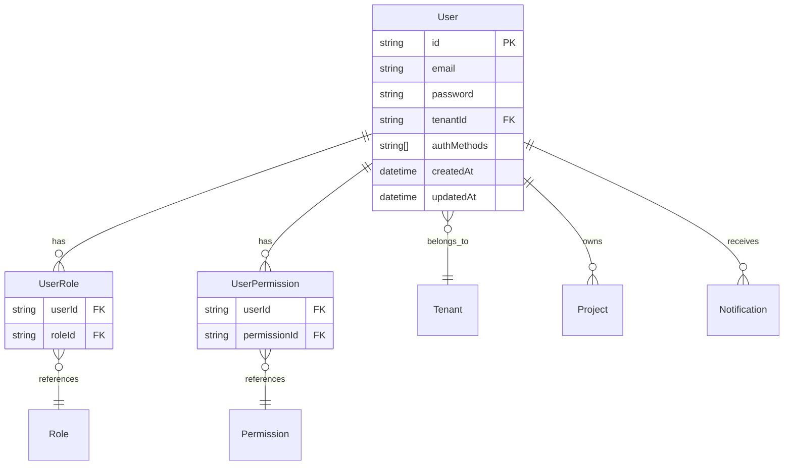

# User Module Architecture

## Design Patterns

### Repository Pattern
The UserService acts as a repository layer, abstracting database operations and providing a clean interface for user management. This pattern allows for:
- Centralized business logic
- Easy testing through service mocking
- Consistent error handling
- Transaction management

```typescript
@Injectable()
export class UserService {
  constructor(
    private readonly prisma: PrismaService,
    private readonly tenantContext: TenantContextService,
  ) {}

  async findAll() {
    const tenantId = this.tenantContext.getRequiredTenantId();
    return this.prisma.user.findMany({
      where: { tenantId },
      // ... additional query logic
    });
  }
}
```

### Tenant Context Pattern
All user operations automatically inherit tenant context, ensuring data isolation:

```typescript
async create(createUserDto: CreateUserDto) {
  const tenantId = this.tenantContext.getRequiredTenantId();
  // tenantId is automatically injected into all operations
}
```

### DTO Pattern
Data Transfer Objects provide:
- Input validation using class-validator
- API documentation through Swagger decorators
- Type safety between layers

```typescript
export class CreateUserDto {
  @ApiProperty({ description: 'User email address' })
  @IsEmail()
  email!: string;

  @ApiProperty({ minLength: 8 })
  @IsString()
  @MinLength(8)
  password!: string;
}
```

### Guard Pattern
Authorization is handled through NestJS guards:
- **JwtAuthGuard**: Validates JWT tokens
- **PermissionsGuard**: Checks required permissions
- Automatic tenant context extraction from JWT

## Data Models

### User Entity

```typescript
interface User {
  id: string;                    // Primary key (CUID)
  email: string;                 // Unique within tenant
  password: string;              // Bcrypt hashed
  firstName?: string;            // Optional profile data
  lastName?: string;             // Optional profile data
  tenantId: string;              // Foreign key to Tenant
  googleId?: string;             // Google OAuth identifier
  googleLinkedAt?: Date;         // Google linking timestamp
  authMethods: string[];         // Supported auth methods
  createdAt: Date;               // Creation timestamp
  updatedAt: Date;               // Last update timestamp
}
```

### Relationships



### Database Constraints

```sql
-- Unique email per tenant
UNIQUE(email, tenantId)

-- Indexes for performance
INDEX(tenantId)
INDEX(authMethods) USING GIN  -- For array queries

-- Foreign key constraints
FOREIGN KEY (tenantId) REFERENCES tenants(id) ON DELETE CASCADE
```

## Service Layer

### Core Operations

#### User CRUD
```typescript
class UserService {
  // Create user with tenant isolation
  async create(createUserDto: CreateUserDto): Promise<UserResponse>
  
  // Find all users in current tenant
  async findAll(): Promise<UserResponse[]>
  
  // Find user by ID (tenant-scoped)
  async findOne(id: string): Promise<UserResponse>
  
  // Update user (tenant-scoped)
  async update(id: string, updateUserDto: UpdateUserDto): Promise<UserResponse>
  
  // Delete user (tenant-scoped)
  async delete(id: string): Promise<{ message: string }>
}
```

#### Role Management
```typescript
class UserService {
  // Replace user's roles
  async assignRoles(id: string, assignRolesDto: AssignRolesDto): Promise<UserResponse>
  
  // Replace user's direct permissions
  async assignPermissions(id: string, assignPermissionsDto: AssignPermissionsDto): Promise<UserResponse>
  
  // Calculate effective permissions (roles + direct)
  async getEffectivePermissions(id: string): Promise<EffectivePermissionsResponse>
}
```

#### Authentication Support
```typescript
class UserService {
  // Find users by authentication method
  async findByAuthMethod(authMethod: string): Promise<UserResponse[]>
  
  // Check if user has specific auth method
  async hasAuthMethod(userId: string, authMethod: string): Promise<boolean>
  
  // Get user's authentication methods
  async getAuthMethods(userId: string): Promise<string[]>
}
```

### Business Logic

#### Password Security
- Passwords hashed using bcrypt with 10 salt rounds
- Original passwords never stored or returned in responses
- Password validation enforced at DTO level (minimum 8 characters)

#### Tenant Isolation
- All database queries automatically filtered by tenant ID
- Cross-tenant operations prevented at service level
- Role and permission assignments validated for tenant membership

#### Permission Calculation
Effective permissions are calculated as the union of:
1. **Role-based permissions**: Inherited from assigned roles
2. **User-specific permissions**: Directly assigned to user

```typescript
async getEffectivePermissions(id: string) {
  // Get user with roles and permissions
  const user = await this.prisma.user.findFirst({
    where: { id, tenantId },
    include: {
      roles: { include: { role: { include: { permissions: true } } } },
      permissions: { include: { permission: true } }
    }
  });

  // Combine and deduplicate permissions
  const rolePermissions = user.roles.flatMap(/* ... */);
  const userPermissions = user.permissions.map(/* ... */);
  
  return deduplicatePermissions([...rolePermissions, ...userPermissions]);
}
```

## Integration Points

### Auth Module Integration
```typescript
// JWT payload includes user and tenant information
interface JwtPayload {
  sub: string;      // User ID
  email: string;    // User email
  tenantId: string; // Tenant ID
  iat: number;      // Issued at
  exp: number;      // Expires at
}

// Guards extract user context from JWT
@UseGuards(JwtAuthGuard, PermissionsGuard)
@Permissions('read:user')
async findAll() {
  // tenantId automatically available through TenantContextService
}
```

### Database Module Integration
```typescript
// Prisma middleware automatically applies tenant filtering
prisma.$use(async (params, next) => {
  if (params.model === 'User') {
    // Inject tenant filter for all User operations
    params.args.where = {
      ...params.args.where,
      tenantId: getCurrentTenantId()
    };
  }
  return next(params);
});
```

### Role/Permission Module Integration
```typescript
// Validate role assignments
async assignRoles(id: string, assignRolesDto: AssignRolesDto) {
  // Ensure all roles belong to the same tenant
  const roles = await this.prisma.role.findMany({
    where: { id: { in: roleIds } }
  });
  
  const invalidRoles = roles.filter(r => r.tenantId !== tenantId);
  if (invalidRoles.length > 0) {
    throw new BadRequestException('Cannot assign roles from different tenant');
  }
}
```

## Error Handling

### Service-Level Errors
```typescript
// Tenant isolation validation
if (!user || user.tenantId !== tenantId) {
  throw new NotFoundException(`User with ID ${id} not found`);
}

// Unique constraint violations
if (error.code === 'P2002') {
  throw new ConflictException(`User with email "${email}" already exists`);
}

// Cross-tenant operation prevention
const invalidRoles = roles.filter(r => r.tenantId !== tenantId);
if (invalidRoles.length > 0) {
  throw new BadRequestException('Cannot assign roles from different tenant');
}
```

### Controller-Level Error Handling
```typescript
@ApiResponse({ status: 404, description: 'User not found' })
@ApiResponse({ status: 409, description: 'Email already exists' })
@ApiResponse({ status: 400, description: 'Invalid role assignments' })
async create(@Body() createUserDto: CreateUserDto) {
  return this.userService.create(createUserDto);
}
```

## Security Considerations

### Authentication & Authorization
- All endpoints protected by JWT authentication
- Permission-based access control using `@Permissions()` decorator
- Tenant context automatically extracted from JWT token

### Data Protection
- Passwords hashed using bcrypt with appropriate salt rounds
- Sensitive data excluded from API responses
- Input validation using class-validator decorators

### Tenant Isolation
- Database-level tenant filtering through Prisma middleware
- Service-level validation for cross-tenant operations
- Role and permission assignments validated for tenant membership

### Audit Trail
- Creation and update timestamps automatically maintained
- User operations can be logged through audit interceptors
- Google OAuth linking tracked with timestamps

## Performance Considerations

### Database Optimization
```sql
-- Indexes for common queries
CREATE INDEX idx_users_tenant_id ON users(tenant_id);
CREATE INDEX idx_users_auth_methods ON users USING GIN(auth_methods);
CREATE INDEX idx_user_roles_user_id ON user_roles(user_id);
CREATE INDEX idx_user_permissions_user_id ON user_permissions(user_id);
```

### Query Optimization
- Selective field inclusion using Prisma's `select` and `include`
- Pagination support for large user lists
- Efficient permission calculation with single database query

### Caching Considerations
- User permissions can be cached after calculation
- Role assignments relatively stable, suitable for caching
- Cache invalidation needed on role/permission changes