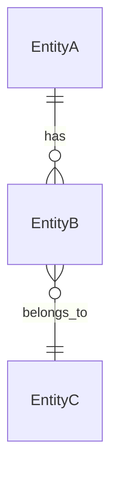
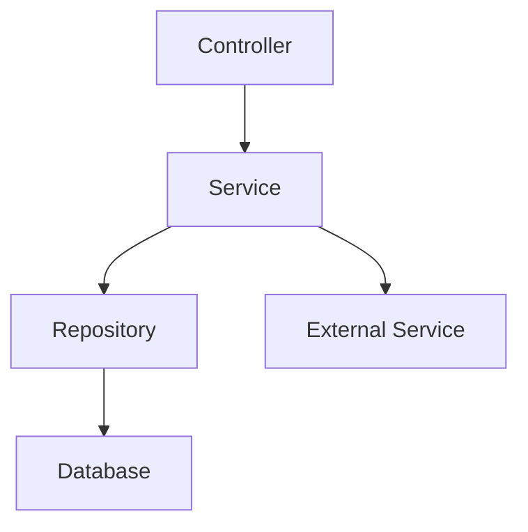

# [Module Name] Architecture

## Overview

High-level architectural overview of the module and its role in the system.

## Design Patterns

### Pattern Name
- **Purpose**: Why this pattern is used
- **Implementation**: How it's implemented in this module
- **Benefits**: Advantages of using this pattern

## Data Models

### Entity Relationships



### Data Validation

```typescript
// Validation schemas and rules
class EntityDto {
  @IsString()
  @IsNotEmpty()
  name: string;

  @IsOptional()
  @IsEmail()
  email?: string;
}
```

## Service Layer

### Service Architecture



### Key Services

#### ServiceName
- **Purpose**: What this service does
- **Dependencies**: What it depends on
- **Public Methods**: Key methods exposed

```typescript
@Injectable()
export class ServiceName {
  constructor(
    private readonly dependency: DependencyService,
  ) {}

  async keyMethod(param: ParamType): Promise<ReturnType> {
    // Implementation overview
  }
}
```

## Integration Points

### Internal Integrations
- **Module A**: How it integrates and what data is exchanged
- **Module B**: Integration patterns and dependencies

### External Integrations
- **Service A**: External service integration details
- **Service B**: API contracts and error handling

## Security Considerations

### Authentication
- How authentication is handled in this module
- Token validation and user context

### Authorization
- Permission checks and role-based access
- Tenant isolation implementation

### Data Protection
- Sensitive data handling
- Encryption and sanitization

## Performance Considerations

### Caching Strategy
- What is cached and for how long
- Cache invalidation patterns

### Database Optimization
- Query optimization techniques
- Index strategies

### Scalability
- Horizontal scaling considerations
- Resource usage patterns

## Error Handling

### Exception Types
- Custom exceptions defined in this module
- Error propagation patterns

### Logging Strategy
- What events are logged
- Log levels and structured logging

## Testing Strategy

### Unit Testing
- Service testing patterns
- Mock strategies

### Integration Testing
- Database integration tests
- External service mocking

### End-to-End Testing
- User journey testing
- API contract testing